同事给我发来类似下面的代码片段<sup>[[1](https://www.cnblogs.com/yugege/p/9598265.html)]</sup>，让我猜测代码的输出顺序。

```javascript
console.log('script start');

setTimeout(function() {
  console.log('setTimeout');
}, 0);

Promise.resolve().then(function() {
  console.log('promise1');
}).then(function() {
  console.log('promise2');
});

console.log('script end');
```

猜测的结果与实际运行的结果不一致，但是又不知道原因，直到了解了事件循环<sup>[[2](https://developer.mozilla.org/zh-CN/docs/Web/JavaScript/EventLoop)]</sup>才能解释实际运行的结果：`script start`、`script end`、`setTimeout`、`promise1`、`promise2`。

在解释上面的代码之前我们需要一些背景知识。第一个知识点是，在 JavaScript 中任务分成了两类：宏任务和微任务。

常见的宏任务| 浏览器 | Node
---|---|---
run &lt;script> | &#10003; | &#10005;
setTimeout | &#10003; | &#10003;
setInterval | &#10003; | &#10003;
setImmediate | &#10005; | &#10003;
requestAnimationFrame | &#10003; | &#10005;
I/O | &#10003; | &#10003;
UI rendering | &#10003; | &#10005;

有的作者并不把 `<script>` 标签作为宏任务，在这里还是把它看作一种宏任务，方便解释上面的代码。

常见的微任务| 浏览器 | Node
---|---|---
process.nextTick | &#10005; | &#10003;
Promise callback | &#10003; | &#10003;
Object.observe | &#10003; | &#10003;
MutationObserver | &#10003; | &#10005;

`Promise callback` 的 `callback` 包含了 `then`、`catch` 和 `finally` 方法。

JavaScript 代码在从上往下执行时，如果是宏任务则将它放入*宏任务队列*中，如果是微任务则将它放入*微任务队列*中。

第二个知识点是，同步代码和异步代码。同步代码由主线程从上往下加入*栈*中依次执行。异步代码将在称为 *Web API* 的构件上执行，异步代码执行完成后会将回调函数加入宏任务队列等待调用。

第三个知识点是，事件循环会在栈为空时，检查微任务队列是否为空，如果不为空取出微任务队列加入到栈中执行。微任务队列中的任务执行完成后继续从宏任务队列中取出宏任务执行。

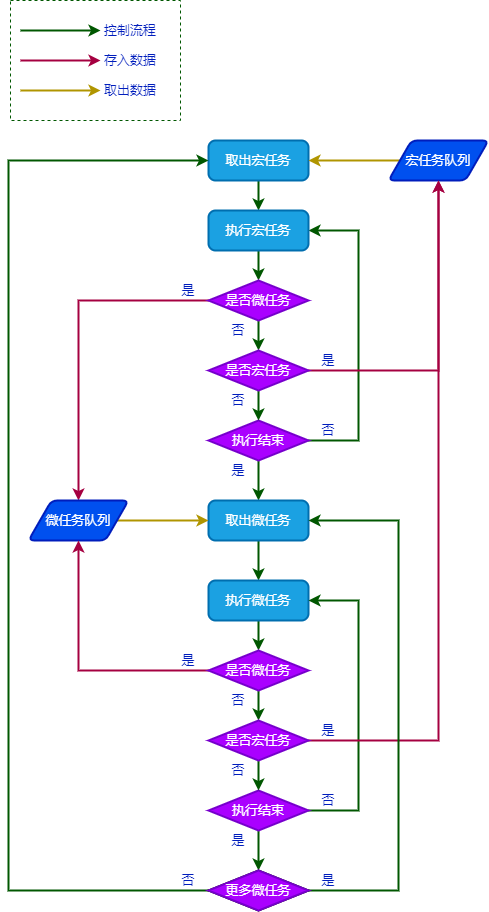

在这个流程图中有两个地方有些疑问。一个是在执行宏任务时又遇到宏任务，此时是否应该加入宏任务队列。另一个疑问是在执行微任务时又遇到微任务，此时是否应该加入微任务队列。先把这两个疑问放一边，先来看下根据这个流程图，如何一步一步输出执行结果。总共有 17 个步骤，为了方便记忆执行过的代码或任务用虚线表示，表示已经不在该区域存在。

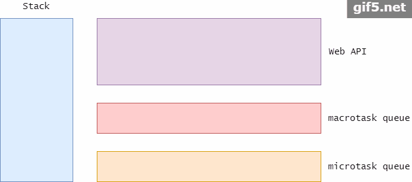

第 1 步

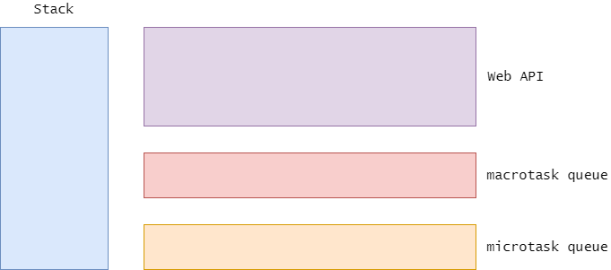

第 2 步

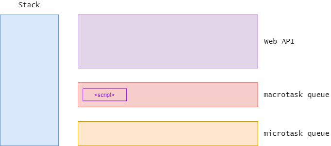

第 3 步

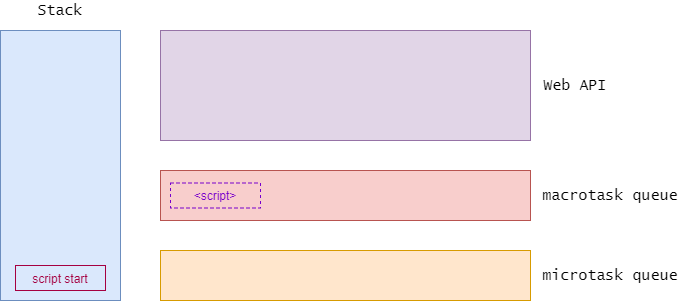

第 4 步

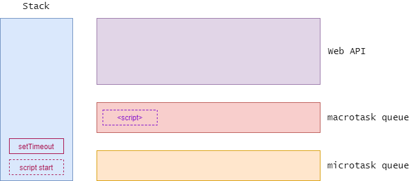

第 5 步


第 6 步

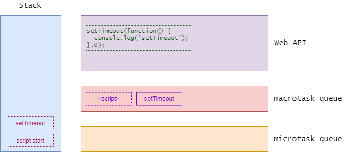

第 7 步

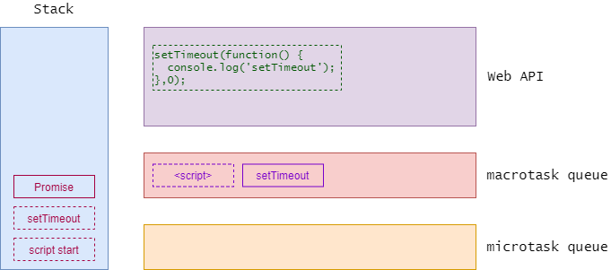

第 8 步

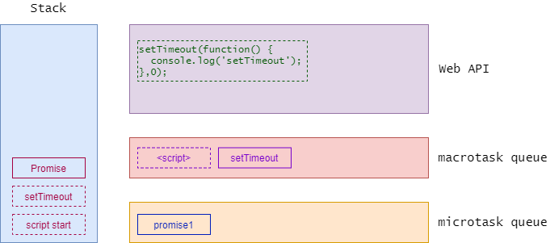

第 9 步

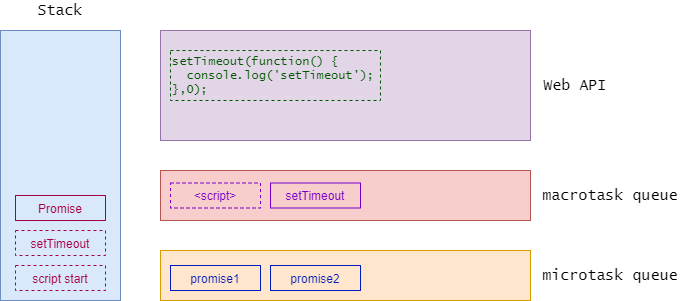

第 10 步

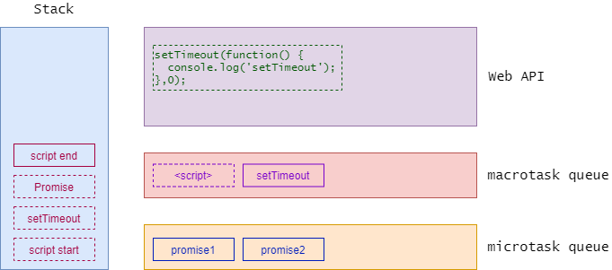

第 11 步

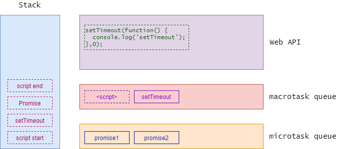

第 12 步

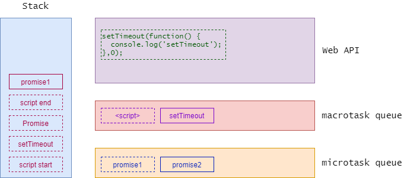

第 13 步


第 14 步

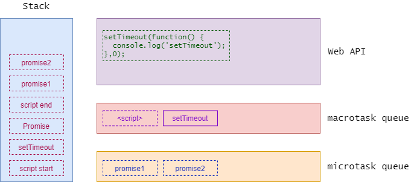

第 15 步

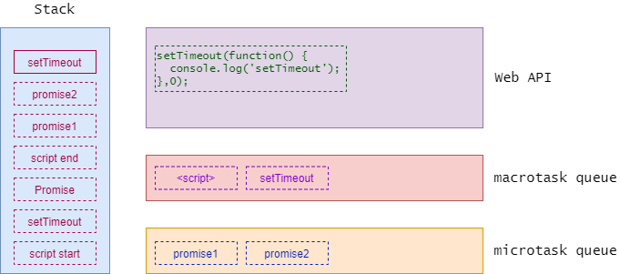

第 16 步

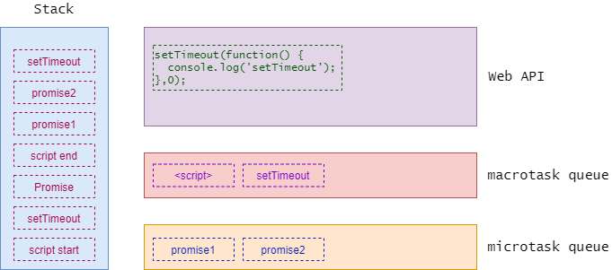

第 17 步


参考资料

1. [深入理解JavaScript事件循环机制](https://www.cnblogs.com/yugege/p/9598265.html)
2. [并发模型与事件循环](https://developer.mozilla.org/zh-CN/docs/Web/JavaScript/EventLoop)
3. [JavaScript Visualized: Event Loop](https://dev.to/lydiahallie/javascript-visualized-event-loop-3dif)，中文翻译：[[译] JavaScript可视化：事件循环](https://zhuanlan.zhihu.com/p/137276025)
4. [js-执行机制之同步、异步、宏任务、微任务](https://www.cnblogs.com/adanxiaobo/p/11660899.html)
5. [深入理解JavaScript的事件循环（Event Loop）](https://blog.csdn.net/tzllxya/article/details/92674042)
6. [JavaScript Event Loop](https://www.javascripttutorial.net/javascript-event-loop/)
7. [带你彻底弄懂Event Loop](https://juejin.im/post/5b8f76675188255c7c653811)
8. [JavaScript Event Loop Explained](https://medium.com/front-end-weekly/javascript-event-loop-explained-4cd26af121d4)
9. [Event loop: microtasks and macrotasks](https://javascript.info/event-loop)
10. [The JavaScript Event Loop: Explained](https://blog.carbonfive.com/the-javascript-event-loop-explained/)
11. [The JavaScript Event Loop](https://flaviocopes.com/javascript-event-loop/)
12. [How JavaScript works: Event loop and the rise of Async programming + 5 ways to better coding with async/await](https://blog.sessionstack.com/how-javascript-works-event-loop-and-the-rise-of-async-programming-5-ways-to-better-coding-with-2f077c4438b5)
13. [What is the Event Loop in JavaScript](https://levelup.gitconnected.com/what-is-an-event-loop-69e1581ecdcc)
