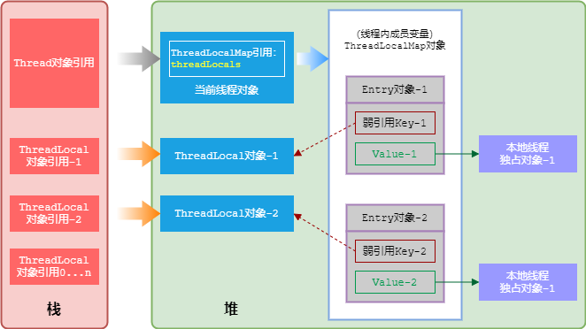

## 第 1 章 计算机基础

这一章总体偏理论，除了 TCP/IP 部分其他的讲解得不怎么样，但有一些与实践相关的观点和结论还是值得借鉴和参考。

由于二进制无法精确的表示浮点数，因此在要求绝对精度的业务场景中，在小数保存、计算、转型的过程种需要谨慎对待。

* 金融行业的货币表示，推荐使用整形存储起最小单位的值。比如人民币使用分存储，美元使用美分存储。
* 在要求精确表示小数点 n 位的业务场景下，推荐采用数组保存小数部分的数据。比如圆周率要求存储小数点后 1000 位数字。
* 禁止通过判断两个浮点数是否相等来控制有些业务流程。
* 在数据库中保存小数时，推荐使用 decimal 类型，禁止使用 float 类型和 double 类型。

乱码的本质是字符集不兼容。数据流从数据库到应用层，到 Web 服务器，再到客户端显示，都可能遇到乱码问题，这个链路也是排查问题的一个方向。数据库是存储字符之源，可以在服务器级别、schema 级别、表级别和列级别设置字符集。将字符集设置成一致的可以减少麻烦。

TCP/IP 是当前流行的网络传输协议框架。TCP 建立连接需要 3 次握手，目的是信息对等和防止超时。*3 次握手后收发数据的双方才能确认自己的发报能力和对方的收报能力是正常的*。TCP 断开连接则需要 4 次挥手。

## 第 2 章 面向对象

面向对象基本特征

`this` 和 `supper` 的异同点

类关系

类关系 | 英文名 | 描述 | 权力强侧 | 类图示例 | 示例说明
---|---|---|---|:---:|---|
继承 | Generalization | 父类与子类之间的关系：is-a | 父类方 |  | 小狗继承与动物，完全符合里氏代换
实现 | Realization | 接口与实现类之间的关系：can-do | 接口方 |  | 小狗实现了狗叫的接口行为
组合 | Composition | 比聚合更强的关系：contains-a | 整体方 |  | 头只能是身体强组合的一部分，两者完全不可分，具有相同的生命周期
聚合 | Aggregation | 暂时组装的关系：has-a | 组装方 |  | 小狗和狗绳之间是暂时聚合关系，狗绳完全可以复用在另一条小狗上
依赖 | Dependency | 一个类用到另一个类：depends-a | 被依赖方 |  | 人喂养小狗，小狗作为参数传入，是一种依赖关系
关联 | Association | 类与类之间存在互相平等的使用关系：links-a | 平等 |  | 人可以用信用卡消费，信用卡可以提取到人的信息

在画类图时，棱形、箭头、三角形放在那一侧呢？有一个规律，有形状的图形符号一律放在权力强的一侧。

对象头的内部结构

GC 标记和 GC 次数与垃圾回收有关；同步锁标记和偏向锁持有者与锁的实现有关。

包装类的存在解决了基本数据类型无法做到的事情：泛型类型参数、序列化、类型转换、高频区间数据缓存。除 `Boolean` 外，其他包装类型默认的缓存区间为 -128 ~ 127，可以通过 `-XX:AutoBoxCacheMax` 参数修改。

## 第 3 章 代码风格

团队统一风格就行。

## 第 4 章 走进 JVM

## 第 5 章 异常与日志

异常

日志

## 第 6 章 数据结构与集合

## 第 7 章 并发与多线程

线程状态图

对象的引用类型

ThreadLocal 的弱引用路线图

## 第 8 章 单元测试

使用 `JUnit` 和 `AssertJ` 进行单元测试。

## 第 9 章 代码规约

概述《阿里巴巴 Java 开发手册》。
