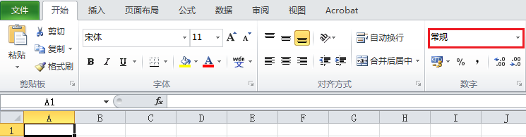
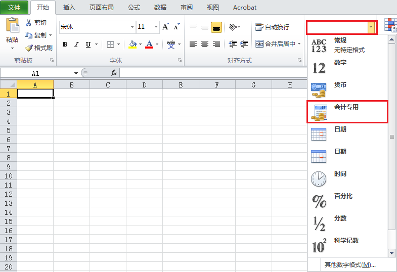
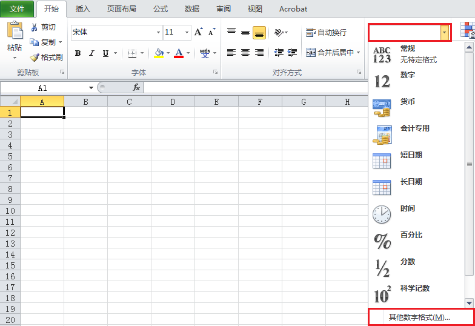
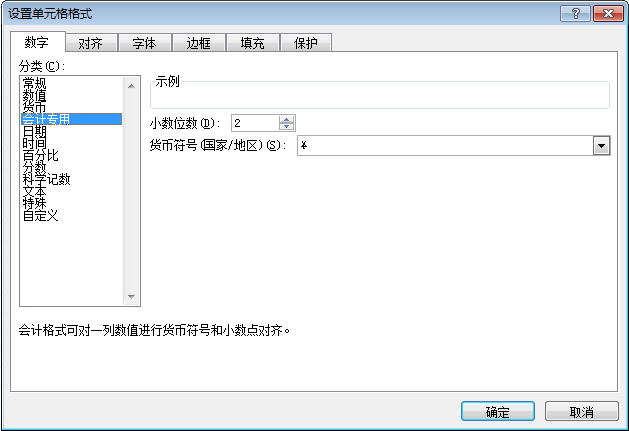
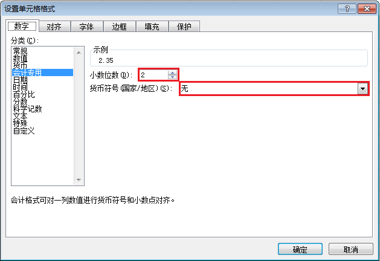
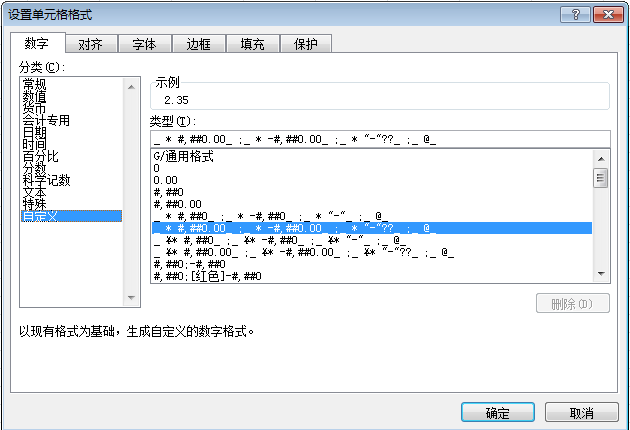

## 提出问题

报表一般作为会计专用，金额上会按照会计专用的形式进行展示，那么，在我们生成表格的时候该如何处理呢<sup>[[1](https://www.cnblogs.com/xingyuejava/p/6419495.html)]</sup>？

## 分析问题

以 Microsoft Excel 2010 为例。在 Excel 中我们可以按照下面的步骤将单元格的格式设置为“会计专用”<sup>[[4](https://jingyan.baidu.com/article/7f766dafd62e2c4101e1d026.html)][[5](https://jingyan.baidu.com/article/e5c39bf579d9a178d660336e.html)]</sup>。

第 1 步：打开 Excel 文件，选中一个单元格，比如 A1。默认的数字格式是“常规”。



第 2 步：点击旁边的下拉三角形，选择“会计专用”。



第 3 步：可以选择“其他数字格式”。



第 4 步：在“设置单元格格式”对话框中选择“会计专用”并可以微调“小数位数”和“货币符号”。



在代码中我们又该怎么做呢？以 [Apache POI](http://poi.apache.org/) 为例。

我们需要将数据的格式定义好，放到单元格的格式里<sup>[[1](https://www.cnblogs.com/xingyuejava/p/6419495.html)]</sup>。

```java
cellStyle.setDataFormat(dataFormat.getFormat("_ * #,##0.00_ ;_ * -#,##0.00_ ;_ * "-"??_ ;_ @_ "));
```

其中 `_ * #,##0.00_ ;_ * -#,##0.00_ ;_ * "-"??_ ;_ @_ ` 即为会计专用的转换代码。它是怎么得来的呢？

在第 4 步微调会计专用格式。



然后点击分类中的“自定义”选项。



默认选中，背景色为蓝色的那一串代码就是我们想要的。

## 解决问题

```java
Workbook workbook = new XSSFWorkbook();

DataFormat format = workbook.createDataFormat();

CellStyle style = workbook.createCellStyle();
style.setDataFormat(format.getFormat("_ * #,##0.00_ ;_ * -#,##0.00_ ;_ * \"-\"??_ ;_ @_ "));

Sheet sheet = workbook.createSheet();
Row row = sheet.createRow(0);
Cell cell = row.createCell(0);

cell.setCellStyle(style);
cell.setCellValue(3.14);

try (OutputStream output = new FileOutputStream("workbook.xlsx")) {
    workbook.write(output);
}
```

在我们的项目中使用了一个第三方库来实现 Excel 的导出功能。

```xml
<dependency>
    <groupId>cn.afterturn</groupId>
    <artifactId>easypoi</artifactId>
    <version>4.2.0</version>
</dependency>
```

使用这个库实现会计专用单元格格式有两种方式。

第一种是使用模板导出。使用模板就可以按照前面的方法提前设置好单元格的格式，导出文件后单元格格式就是预设的格式。这种方式适用于表头固定的场景，对于表头是动态生成的场景不适用。

第二种是在导出后，即调用 `Workbook wb = ExcelExportUtil.exportExcel()` 后，重置相应单元格的格式，因为 easypoi 没有提供相应的方法。

```java
public void resetCellStyle(Workbook workbook, int startRowNum, Set<Integer> columnIndexSet) {
    DataFormat dataFormat = workbook.createDataFormat();

    CellStyle cellStyle = workbook.createCellStyle();
    cellStyle.setDataFormat(dataFormat.getFormat("_ * #,##0.00_ ;_ * -#,##0.00_ ;_ * \"-\"??_ ;_ @_ "));
    cellStyle.setBorderBottom(BorderStyle.THIN);
    cellStyle.setBorderRight(BorderStyle.THIN);
    cellStyle.setAlignment(HorizontalAlignment.CENTER);
    cellStyle.setVerticalAlignment(VerticalAlignment.CENTER);

    Sheet sheet = workbook.getSheetAt(0);
    for (Row row : sheet) {
        if (row.getRowNum() < startRowNum) {
            continue;
        }
        for (Cell cell : row) {
            if (!columnIndexSet.contains(cell.getColumnIndex())) {
                continue;
            }
            String value = cell.getStringCellValue();
            cell.setCellStyle(cellStyle);
            cell.setCellValue(StringUtils.isBlank(value) ? 0.00 : Double.parseDouble(value));
        }
    }
}
```

这种方式可适用于表头可动态生成的场景，但是它的效率会低一些。如果想要提高效率，应该使用原生的 API 导出 Excel。

这里需要注意一个问题，`ExcelExportUtil.exportExcel()` 默认单元格格式是文本，因此需要在重置样式后重新设置单元格的值。

## 参考资料

1. [java 单元格格式 会计专用](https://blog.csdn.net/qq_44927883/article/details/106196532)
2. [poi表格的解析与生成](https://www.cnblogs.com/xingyuejava/p/6419495.html)
3. [NPOI中单元格如何设为“会计专用”格式？](https://www.cnblogs.com/downmoon/archive/2013/02/22/2922531.html)
4. [excel 2010如何设置会计专用格式](https://jingyan.baidu.com/article/7f766dafd62e2c4101e1d026.html)
5. [excel怎么设置为会计专用格式](https://jingyan.baidu.com/article/e5c39bf579d9a178d660336e.html)