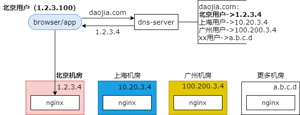

## 9、接入层：如何实现就近访问，CDN架构趣谈

### 什么是 CDN（Content Delivery Network）

CDN 即内容分发网络，它主要依靠部署在各地的服务器，通过内容分发，访问调度等技术，使用户就近获取所需的内容，降低网络拥塞，提高用户的访问速度。

要说 CND，不得不提的就是斯塔尔报告。什么是斯塔尔报告呢？斯塔尔报告是 1998 年美国国会通过的向公众发布关于克林顿与莱温斯基调查细节的报告。它的内容堪比严肃的 HS 小说，各自调情细节与 xxoo 细节。一部关于总统的 HS 小说发布，会导致什么样的后果呢？没错，就是下载的人超级多。服务器会怎样？也没错，国会的服务器就挂了。

上述高并发大流量下载 HS 小说的难题，引发了技术上的变革，于是 CDN 就出现了。CDN 的出现是业务需求推动技术革新的经典案例。

CDN 适合静态资源的加速访问（js，css，jpg，flash，静态 html 等）。

CDN 的核心，是“就近访问”。

### 什么是“就近访问”？

举个例子，CDN 的网络节点是部署在全国各地的，你看，有北京的机房，上海的机房，广州的机房等等，它们都会存储这些静态的资源。比如说三个机房都存储了一个静态的资源 abc.jpg，然后，在用户访问这个资源的时候会选择就近的服务器去访问。北京的用户访问这个 abc.jpg 他会访问北京的机房，上海的用户访问这个 abc.jpg 会自动的访问上海的机房，以此来降低网络拥塞，提升访问速度，提升用户体验。

大伙想一想，这个就近访问是怎么做到的？在用户向服务器发起请求之前用户和服务器是没有任何交互的呀，一旦发起请求，却连了最近的服务器，是不是有点意思？

在用户和服务器进行交互之前，真的没有发起过请求吗？其实是有的，是不是需要进行一次 dns 的解析呢？daojia.com 解析出 nginx 的外网 ip 对吧。

### 就近访问，是通过“智能 DNS”来实现的！

什么是智能 DNS？对于同一个域名的 dns 解析智能 dns 可以依据用户的位置，这里的位置主要是指用户的 ip，来决定返回的域名 ip。北京的用户访问返回北京的机房的 ip，联通的用户访问返回联通的机房的 ip，移动的用户访问返回移动机房的 ip，教育网的用户访问返回教育网的机房的 ip。是通过智能 dns 实现的。

如图所示，北京的用户，假设用户的 ip 是 1.2.3.100，他要访问到家域名下的一个静态文件，这个文件部署在了多地的服务器的机房内，在用户访问服务器之前会首先进行一次 dns 解析，智能 dns 上配置了一些解析规则，北京的用户就将到家域名解析为 1.2.3.4，上海的用户就将到家域名解析为 10.20.3.4，广州的用户就将到家域名解析为 100.200.3.4，什么用户解析为什么。

用户的 ip 是 1.2.3.100，智能 dns 它判断说这个用户是北京的用户，于是将到家域名解析为 1.2.3.4，北京机房的 nginx 的外网 ip，然后用户再访问静态资源的时候会把到家域名解析为 1.2.3.4 会访问北京的机房。这就是智能 dns，是不是很有意思呀？

### CND 架构中，“智能 DNS”是最重要的一环，除此之外呢？

如图所示，cdn 的架构主要由三部分构成，除了最核心的部分智能 dns，还有“源”和“镜像”两个部分。

**源**：数据库

**镜像**：多个“穿透缓存”

**智能 DNS**：决定我们访问哪一个

为了方便我们理解，我是这么比喻的，源好比数据库，最新的数据一定存储在这里。镜像好比多个穿透缓存，目的是为了加速用户访问，不必每次都请求访问源，既然是缓存，那么缓存里可能没有相关的数据，此时就要去数据库（源）里取相关的数据了，这个叫“回源”。既然是穿透缓存，那么去数据库（源）里取静态文件的这个动作不用麻烦用户，而是由镜像来做的，所以对于用户来说镜像里一定有他要的静态资源，具体是镜像本地存储还是镜像回源去取的，对用户来说是透明的。

智能 dns 上一页材料已经介绍了，根据用户的 ip 来实施就近访问，看是访问源还是访问哪一个最近的镜像。

**数据冗余（存多份），一定会有一致性问题！**

既然进行了数据冗余，也就是说数据存储了多份，一定会有一致性的问题。假设所有的 cdn 节点，不管是源还是镜像都包含了一个 abc.js，此时源的 abc.js 升级了，发布了一个新的版本，用户通过智能 dns 却访问了镜像，镜像里存储的还是旧版本，此时会出现数据不一致，那要如何解决呢？

刚刚提到的应用场景是

**源里的 abc.js 更新了，镜像里的 abc.js 没更新，数据不一致，怎么办？**

方案一：源更新的时候，过期掉镜像里的 abc.js（缓存淘汰）

方案二：等待镜像里的 abc.js 过期（缓存过期）

这两种方案好还是不好呢？

方案一源淘汰镜像，大家想一想如果你要实施，你会怎么做？首先，你在源里要维护一个镜像 list 的配置，每次源有静态文件更新的时候都需要 for 循环 list 配置里的所有镜像节点去挨个淘汰相关的镜像资源。这是一个典型的“反向依赖”的耦合设计，也就是说源他依赖了镜像。当有镜像节点扩展的时候，你会发现要修改的却是源的配置（镜像 list），源依赖于镜像。好的方案，解耦的方案是源它不需要知道镜像节点的存在，源只依赖于源自己的配置文件。

所以实际上如果你没有做过什么特殊的操作，常见的方案确实是等待镜像里的文件过期才会去源里拉取最新的文件，也就是说这段时间你使用的都是静态资源的旧版本。当然，你可以手动过期。是不是觉得实际的方案非常的坑？

方案三：版本号，升级为 abc_v1.2.3.js，就能解决

行业的最佳实践是使用版本号。我们对于 abc.js 实际上我们会使用 abc_v1.2.3.js 就能够解决这个问题。对于需要经常升级的静态资源，例如 js，要带上版本号，源和镜像都有这个版本号，当源升级为新版本时，版本会升级为 abc_v1.2.4.js，此时，就只有源有这个资源，而镜像没有，通过智能 dns 导入到镜像的流量会回源更新 abc_v1.2.4.js，就能够解决数据不一致的问题了。

是不是很帅气？大家的公司是使用版本号这个方案吗？

### 资源更新，是源推送，还是镜像拉取？

下一个问题，当资源更新的时候是源推送，还是镜像拉取呢？

方案一：资源更新的时候，源一次性推送所有镜像

方案二：发现资源缺失时，镜像主动去源拉取

这是一个推送和拉取的折衷，到底使用哪一种方案呢？试想一下，如果要实现源一次性推送所有的镜像，细节是怎样的？还是像之前一样的，源需要维护一个镜像 list 的配置，当有静态资源更新的时候 for 循环配置里的所有镜像节点，实施资源的推送，还是那个典型的“反向依赖”耦合设计，源依赖于镜像，不合理。

好的方案是方案二，镜像的配置文件里配置源的 ip，只有镜像依赖于源，镜像在扩展的时候只要将镜像的所有配置复制一份就可以，它保存的是源的配置，这是好的设计，所以实际上资源更新的时候使用的是，镜像主动去源拉取的方案。

### 总结

（1）CDN 的核心是就近访问，降低网络拥塞，提高用户访问速度；

（2）CDN 适合静态资源（js，css，jpg，flash，静态 html 等）加速；

（3）CDN 的核心是“智能 DNS”；

（4）CDN 由智能 DNS，源，镜像构成；

（5）常更新的静态资源，建议加上版本号，防止数据不一致；

（6）资源更新，使用镜像拉取；

（7）答应我，不要去百度搜索“斯塔尔报告”；