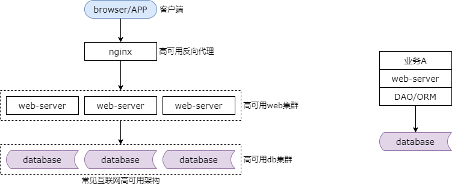
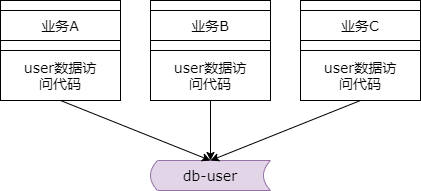
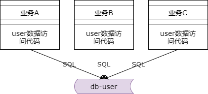
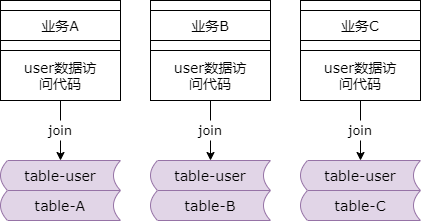
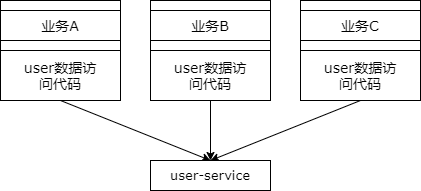
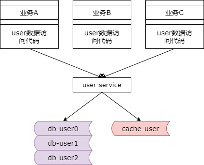
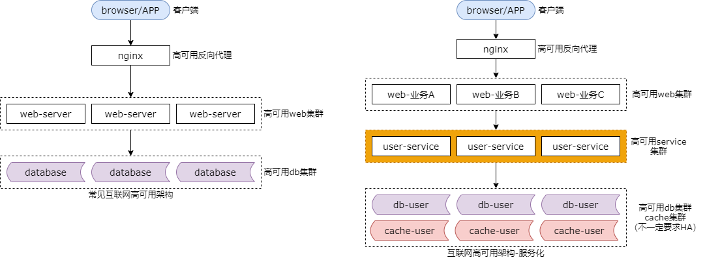

## 14、服务化：微服务架构，究竟解决什么问题？

微服务的话题非常之火，很多朋友都在问我，说怎么样做服务化。在解答怎么做之前，得先了解为什么要做。做技术千万不能是这种思路，别人都在做，所以我们也要搞。并不是所有的业务都适合服务化的，互联网架构服务化到底解决什么问题呢？

### 上一阶段，简易的分层架构图

在服务化之前，互联网的典型结构是什么样的呢？



如图所示，最上面是端，中间有高可用的反向代理层，然后是高可用的站点集群，底层是高可用的数据库集群。更典型的如右图所示，web 集群里站点业务代码通过 DAO 和 ORM 拼装 SQL 语句访问数据库。可以看到，最初是没有服务层的，那么此时架构会有怎么样的痛点呢？

### 痛点一：代码到处拷贝



举一个最常见的例子，用户数据的访问。绝大部分公司都有一个数据库存储用户相关的数据，每个子业务也都有访问用户的需求，在有用户服务之前每个业务都是通过自己的 DAO 写 SQL 访问 user 库来存取用户数据的。这就无形中导致了代码的拷贝。第二块业务也需要存取用户的数据，于是就找第一个业务拷贝了一份代码。第三个业务也需要存取用户数据，于是找第二个业务又拷贝了一份用户数据访问的代码。无形中导致了代码的拷贝。

### 痛点二：底层复杂性扩散


随着并发的越来越高，用户数据的访问，数据库成了瓶颈，需要加入缓存层来降低数据库的压力，于是可能在架构中要引入一个缓存层，如果没有统一的服务，第一个业务，第二个业务，第三个业务，都需要升级自己的代码来关注缓存层的引入导致的架构复杂性。各个业务都需要访问缓存，对于写请求，各个业务都要升级代码，淘汰缓存，读写数据库。对于读请求，各个业务线也需要升级代码，读缓存没有命中 db 再把数据放入缓存。这个复杂性是典型的业务无关的复杂性，因为系统的要求各个业务方被迫升级。

同时，随着数据量的越来越大，数据库需要进行水平拆分，于是架构中又引入了分库分表，如果没有统一的服务层，各个业务线都需要关注分库分表导致的架构复杂性，业务 a，业务 b，业务 c，都需要进行升级。这也是一个典型的业务无关的复杂性，业务方需要被迫的升级。

还有典型的耦合是 bug 的修改，发现了 bug，多个地方可能都需要修改。这是痛点二。

### 痛点三：公共库耦合

服务化并不是解决上述两个痛点的唯一方法，抽象出一层统一的公共库是最容易，也最先想到的方法去解决代码拷贝以及复杂性扩散的一个方案。

抽象出一个 user.so 或者 user.jar 从而避免代码拷贝。但是，公共库会引入新的问题，维护公共库的多个版本会导致各个业务线之间的耦合。

比如说 user.jar 由版本一升级到版本二，如果不兼容业务线的代码会导致业务线出问题。如果一个业务线要升级 user.jar，要通知其他的所有业务线，其他所有业务线也会引入一些与自身业务无关的升级，此时就非常非常的郁闷。当然，如果各个业务线都是拷贝了一份代码，则不存在这个问题。

所以可以看到有时候代码拷贝也是有好处的。代码拷贝有时候也是一种解耦。一份代码各个业务线都自己拷一份，那么各个业务线再升级这套代码的时候就不需要通知其他的业务线，而如果大家都共用一个 user.jar，则会相互耦合，而且需要相互周知。

### 痛点四：SQL质量无法保证



在引入用户服务之前，各个业务线都是通过 DAO 去访问数据库，但本质上 SQL 语句还是由各个业务线拼装的。资深的工程师写出高质量的 SQL，经验没有那么丰富的工程师可能写出一些低效的 SQL。比如说第一个业务线写了一个全表扫描的 SQL 导致数据库 cpu 100%，影响的可不只是你一个业务线，所有的业务线都会受影响。此时，各个业务线拼装的访问数据库的 SQL （质量）是没有办法得到保障的。

### 痛点五：不易扩展，数据库耦合



业务线不只是会访问 user 数据，它还会结合自己的业务做自己的用户的个性化数据的存储。比如说，除了大家都公共访问的 user 表，业务线 a 还会建立 user biz a 的表，它也是用 uid 来做主键的。当业务线 a 需要访问通用的用户数据与个性化的用户数据的时候，往往会使用 join 的方式。公共的表和业务线个性化的表 join 在一起，然后再加上一个 uid 的条件来存取通用的属性和个性化的属性。如果业务线 b 也这么做，如果业务线 c 也这么做，会导致公共的用户数据与个性化的用户数据，使用的个性化的数据都必须耦合在一个库里（否则，没法 join）。随着数据量的越来越大，你会发现此时各个业务的这个数据是无法进行垂直拆分的，必须使用一个大库，因为它们都与公共的这个表 join 在了一起。这个时候，数据库层面就无法进行扩展了，db 就耦合在了一起。

### 服务化，可以解决上述问题


引入一个通用的服务层，是可以解决上述问题的。最早是站点 web 层直接调用数据库。现在是引入一个用户服务层，由他去调用数据库，而 web 站点层直接调用服务。你会发现分层架构多了一层，服务层。

为什么引入服务层可以解决上述的一些痛点呢？服务化之后有什么好处？

### 好处一：复用性，消除代码拷贝



所有用户数据的存储都通过用户服务来进行，代码只此一份，不存在代码拷贝。如果出现 bug，此处一处升级，所有 bug 都修复，不像之前，代码是拷贝在各个业务方的，代码有多份，如果 bug 要升级，多个地方都需要升级。

### 好处二：专注性，防止复杂性扩散



在没有服务层之前，所有的业务方都需要关注缓存以及分库分表这些细节。在有了服务层之后，只有服务层需要关注底层的复杂性了，向上游屏蔽了底层的各种技术细节。上游专注在业务代码的编写里，底层由服务层来保证性能，扩展性，读取量，存储量，缓存等技术细节。

### 好处三：解耦合，消除公共库耦合

有了服务化之后，业务站点不再依赖公共库了，改为依赖服务。

### 好处四：高质量，SQL稳定性有保障


原来是由业务上游直接拼接 SQL 访问数据库，在有了服务层之后，所有的 SQL 都是由服务提供的，调用方不能再为所欲为了。服务层对于接口的稳定性，SQL 的质量能够更加收口的控制。核心的一些服务，比如说用户服务可以由更为资深的工程师来维护，而不是像原来的 SQL 难以收口，难以控制。SQL 是由服务层控制的，调用方是通过 rpc 接口的方式去调用原来的服务，SQL 收口且稳定

### 好处五：易扩展，消除数据库解耦合


原来各个业务的数据库都耦合在一个大库里，相互 join，难以拆分。服务化之后与服务相关的底层数据库就被隔离开了，任何调用方都无法去访问这个服务私有的数据库，更没有办法去 join 服务底层的数据库了，因为底层的数据库对于上游是不透明的，是不可见的。底层的数据库具备非常好的隔离性，如果性能成为瓶颈的时候，可以很方便的拆分出来进行扩容，增加一个数据库实例，然后服务的数据库直接迁移过去可以了。

最重要更重要的是服务化之后有一个什么极大的优点呢？

**高效率，业务调用方，代码写得更爽了，业务研发效率提升了！！！**

在有服务之前业务方访问用户的数据需要关注 redis，需要关注分库分表，需要关注 SQL 语句，需要关注资源池，断开，建立连接，游标等等等等。有了服务层之后，业务通过 rpc 接口去访问数据库，就像调用一个本地函数一样，非常之爽。

```php
User = UserService::GetUserById(uid);
```

传入一个 uid 参数可以拿到一个用户的实体。底层是这么实现的，调用方完全不需要关注，不需要关注序列化，网络传输，后端执行，数据库缓存，反序列化等等复杂性。调用方专注于业务代码的编写，像调用本地函数一样去调用远端的服务，整个复杂性全部屏蔽了，效率极高，代码写的极其清爽。



架构，就这样演进了。原来没有服务层，现在中间抽象了一个服务层，有上述很多种优势，能够解决前面提到的各种问题。

### 任何架构方案，都有好坏。服务化，存在什么问题呢？

你去用一个第三方的服务，厂商永远会说产品好，但实际好不好，怎样你用过才知道。很多技术大会都只分享光鲜的表面，说服务化好，但踩过的坑只有你用过之后才知道。服务化究竟会带来什么问题呢？

**服务化，潜在的问题？**

（1）系统复杂性上升

（2）层次间依赖关系变得复杂

（3）运维，部署更麻烦

（4）监控变得更复杂

（5）定位问题更麻烦

等等...

这边简单的列了一些引入服务化之后系统可能出现的问题。

首先整个系统的复杂性会上升，毕竟中间多了一个分层。而且层次之间的依赖关系会变得复杂，因为除了站点层调用服务之后，如果你服务越来越多，服务之间也会相互的调用，可能会形成网状的依赖关系。运维和部署也会更加的麻烦。监控会变得更加复杂。定位问题也会更加的麻烦。所以总之，服务化之后，有好处，也有复杂性。

**服务化，并不是简单的引入一个 RPC 框架（容易）**

**他需要，一系列基础设施（难）**

服务化，并不是简单的引入一个 rpc 框架，就是服务化。引入一个 rpc 框架，其实是很容易的，他其实需要一系列的基础设施来配合，工具和平台来配合才能够整体的完成一个服务化。像统一的访问框架呀，统一的数据访问层，配置中心，服务治理，监控，调用链分析，自动化运维等等等等，很多服务化相关的技术后续再和大家一一介绍。

### 总结，服务化有什么好处？

（1）复用性，消除代码拷贝

（2）专注性，防止复杂性扩散

（3）解耦合，消除公共库耦合

（4）高质量，SQL稳定性有保障

（5）易扩展，消除数据库解耦合