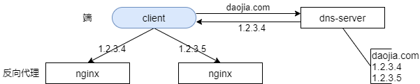
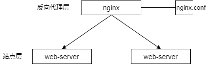
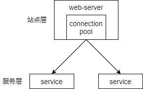
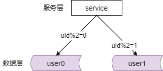
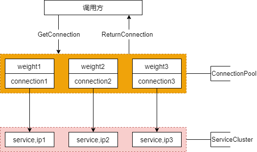
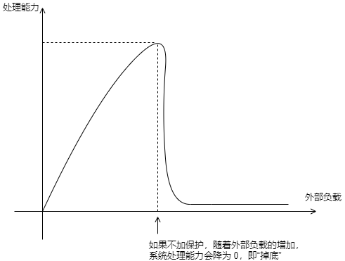
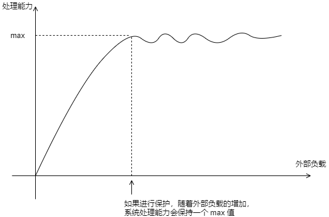

## 18、服务化：微服务架构，必须搞定负载均衡！

### 什么是负载均衡？

load balance 是分布式系统架构设计中必须考虑的一个因素。他通常是指将请求或者是数据均匀的分摊到多个操作单元上执行。

### 负载均衡的方法论？

（1）同构，重点在于“均匀”

（2）异构，重点在于“负载与能力匹配”

它的重点是在于均匀。那此时其实是在同构的服务器中，均匀是最重要的。也就是说，当服务器的处理能力一致的时候，我们只需要考虑平均分配负载即可。

但是异构的服务器，此时它的重点在于，我们的负载分配必须与异构服务器的能力相匹配。

我们先说同构的服务器，重点在于均匀。

常见微服务分层架构

互联网的微服务分层架构，我们的端，反向代理，站点应用，微服务，缓存，数据库的读写。可以看到，每一个下游，都有多个上游调用，我们只需要做到每一个上游对下游的调用，都均匀的访问，就能够实现系统整体的均匀分摊。

### 第一部分：反向代理层的负载均衡

在每台 nginx 处理能力相同的情况下，此时通过 dns server 对于同一个域名设置不同的外网域名解析，使用 dns 轮询的方式，就可以实现每个 nginx 都负载均衡。

### 第二部分：站点应用层的负载均衡

站点应用的负载均衡他是通过反向代理去实现的。反向代理他配置了多个后端，和 dns 轮询类似，他也可以使用轮询的方式将请求路由到多个站点应用的后端。在多个站点应用后端的机器处理能力相同的情况下，这样分配请求是最均匀的。

### 第三部分：微服务的负载均衡

微服务的负载均衡，是通过连接池去实现的。在多个后端微服务处理能力相同的情况下，连接池只需要通过类似于随机，轮询，这样的方式就能够保证多个微服务的下游他的请求分配是均匀的。

### 第四部分：数据层（缓存，数据库）的负载均衡

（1）数据，均衡

（2）请求，均衡

数据层的负载均衡，又分为两个方面的均衡，一方面是数据层面的均衡。一方面是请求方面的均衡。

数据的均衡是指，水平切分之后，每个节点的数据量是均匀的。请求的均衡是指，水平切分之后，每个节点的请求量是均衡的。

**数据层负载均衡：范围水平切分**

按照范围来进行水平切分，此时他的数据的负载是相对均衡的。但是请求的负载未必均衡。新注册的用户他可能更为活跃。所以大号段的节点他可能的负载会更高。

**数据层负载均衡：哈希水平切分**

除了范围水平切分，还有 hash 水平切分的方式。

使用 hash 来进行水平切分，他的好处是，首先数据的负载是均衡的，多个节点的数据量差不多。其次他的请求负载也是比较均衡的，每个节点的请求量，读写请求量都是差不多的。

同构服务器节点的负载均衡相对来说是比较容易的，你只要注意均匀就行了。今天的重点想说一说异构服务器的负载均衡。

**异构服务器负载均衡的重点在于负载的分配应该与服务器的处理能力相匹配**。

### 异构服务器，如果“均匀”分配请求，会有什么问题？

如果异构服务器我们还均匀的分配请求，那么就有可能出现，低配的服务器可能会扛不住。那如果你此时增加节点，降低平均负载，那么高配的服务器，他可能利用率会不足。所以我们必须根据服务器的处理能力来动态的，自适应的进行负载均衡，同时实施过载保护。

那么其核心关键，负载均衡也不例外，他是实施在**连接池**组件上的。我们一起来看一下连接池组件如何能够实现异构服务器的负载均衡呢？

### 异构服务器负载均衡，方案一：静态权重

方案一，我们可以使用静态权重。我们为下游的每一个微服务节点设置一个权重，设置一个静态权重，表示这个微服务的处理能力，来调配连接池分配到每一个连接，也就是每一个微服务下游的概率。

比如说现在有三个 ip 的微服务，ip1，ip2，ip3，我们如果将连接池这三个微服务对应的连接的权重设置为 1 比 1 比 1，那么他的请求的分配，就是完全均匀的。那么如果我把这三台服务器的权重，假设我设为 1 比 1 比 2，那么在取连接的时候，那可能就有 2/4 的概率，也就是 50% 的概率会落到第三台服务器上。为什么你将他的权重设置为 2 呢？因为他的处理能力可能是其他两台服务器的两倍。

nginx 也具备类似的能力。所以在实施站点层的异构服务器的负载均衡的时候，nginx 可以静态的配置权重。

在实现微服务的异构服务器的负载均衡的时候，连接池也可以设置静态的权重。

那么这个方案的优点是，简单粗暴。我们根据自己的经验去评估服务器的处理能力，静态的配置权重。

但是他的不足是，无法自适应的进行动态调节。因为很多的时候，服务器的处理能力是一个很难用固定的数值来量化的一个值。

下一个方法，那就是动态权重调节。

### 异构服务器负载均衡，方案二：动态权重

（1）如何标识服务的处理能力？

（2）如何设计动态权重？

下一种方法，那就是动态权重调节，那么我们要解决的两个问题是：第一，如何标识服务器的处理能力呢？服务器能不能处理的过来，理论上是由调用方说了算的。如果调用你的服务能够快速的处理，说明处理能力跟得上。如果调用服务超时处理，那么很有可能处理能力跟不上了。所以一台下游服务器的处理能力，理论上是由调用方来评估的。

那么如何计算动态权重呢？和静态权重类似，我们对于每一个微服务的连接，可以用一个权重来标识。这个权重决定分配给每个微服务的请求的概率，获得相应连接的概率。当下游每成功处理一个请求的时候，我就认为下游的微服务他的处理能力足够。这个时候我的权重相应的就增加。当微服务超时处理一个请求的时候，我就认为该连接的下游的处理能力，可能要跟不上了，我的权重就减少。权重的增加，理论上是一个缓慢的过程。权重的减少，理论上是一个更加快速的过程。

为了方便的进行权重的处理，我们可以将权重的范围限定在 0 到 100 的一个范围之内，可以将权重的初始值设定为类似于比如说像 60 分，然后成功处理请求涨分，失败处理请求降分。

大概是这样的一给个思路。为了方便大家理解，我举一个更具体的例子。

>假设 service-ip1，service-ip2，service-ip3 动态权重初始值：
>
>* weight1 = 60
>* weight2 = 60
>* weight3 = 60
>
>刚开始时，请求分配给这 3 台 service 的概率分别是 60/180，60/180，60/180，即负载是均衡的。
>
>随着时间的推移：
>
>* 处理能力强的 service 成功处理的请求越来越多
>* 处理能力弱的 service 偶尔有超时
>
>随着动态权重的增减，权重会发生变化：
>
>* weight1 = 100
>* weight2 = 60
>* weight3 = 40
>
>那么此时，请求分配给这 3 台 service 的概率分别是 100/200，60/200，40/200，即处理能力强的 service 会被分配到更多的流量。

假设有三个微服务，ip1，ip2，ip3，最早他的上游连接池会对这三台微服务都建立连接，我们对于每一条连接设置一个初始的这个动态权重，60，60，60，所以刚开始分配给这三台微服务的概率是完全相同的，也就是说负载是均匀的，或者叫平均的。随着时间的推移处理能力强的 service 他成功处理的请求越来越多，而处理能力弱的 service 他偶尔会有超时。那成功处理一个我们 +1 分，失败或者超时处理一个我们 -10 分。随着时间的推移，权重可能会发生变化。比如说第一台微服务的处理能力更强，他的权重涨到了 100，第二台还是保持 60，第三台降到了 40。那么此时我们分配给这三台微服务的概率就是 100/200，60/200 和 40/200，它们得到的处理请求和它们的处理能力成正比，实现了一个动态权重的调节。

聊到异构服务器的负载均衡，不得不说是“过载保护”。

### 什么是过载保护？

过载保护是给什么意思呢？如上图所示，如果我们不对微服务进行过载保护，那么随着上游的负载越来越高，如果在该微服务的处理范围之内，处理能力之内，他其实每秒钟处理的请求，他的处理能力是越来越高的。但是当达到一个他负载的极限的时候，处理能力的极限的时候，你外部的负载持续的增加，他的处理能力会掉底，会瞬间降为零，我们经常也说雪崩这个词，就像你外部加压到一定的程度，整个服务就处理不过来了，卡死了，死锁了，网络无连接了。如果你不实施过载保护，持续的任由外部的负载增加，微服务会慢慢的挂掉。

如果你实施了过载保护，那么随着外部负载的增加，你的处理能力达到一个 max 值之后，会保持相对稳定的一个值，会达到一个临界值，系统不会被完全压垮，而是持续的保持一个处理能力，外部的负载无限大，系统的处理能力也不会进行掉底。

### 如何实施过载保护？

（1）静态权重（粗暴，不优雅）

（2）动态权重

静态权重，顾名思义，我们给一个微服务节点的处理能力设置一个阈值，如果他的负载超过这个阈值，我们就将后续的请求全部抛弃。

那么动态权重法和前面的这个动态负载均衡是非常非常类似的。

过载保护，动态权重的实施细节

（1）连接代表服务，分值代表服务（连接）处理能力

（2）处理成功加小分，处理失败扣大分

（3）临界边界喘小口气

（4）死亡状态喘大口气

我们也是通过一个连接代表一个服务，通过一个分值代表服务的处理能力，处理成功加小分，失败处理扣大分，那么达到一个临界的边缘值，比如说有请求超时的时候我们可能判断他快要处理不过来了，让他在有请求处理失败的时候，让他休息一会，我们可能在接下来的十秒钟之内不再给这个超时的服务器进行负载分配，让他喘一口小气，十秒钟之后继续跟他分配负载，如果他仍然连续的超时，那么我们可能判定这个服务器完全处理不过来了，比如说 fullGC，那么我们可能需要给他喘一口大气，比如说根据我们的经验 full GC 差不多一分钟之后能够回过神来，那么我们可能在一分钟之内，对于这种连续超时的微服务节点一分钟都不会给他分配请求，让他来进行一个自我恢复，自我保护，一分钟之后再给他分配请求，如此能够在客户端层面更加优雅的实施过载保护，但是如果整体的负载超过了微服务集群的整体负载，那么我们需要注意防止引起雪崩，也就是说整体的负载都处理不过来了，此时最终还是要抛弃部分的请求来进行集群的自我保护。

所以这里面特别要注意的是单个节点的保护与集群保护的策略是不一样的。单个节点的保护我们将流量分到其他的节点，整体的保护最终还是要通过抛弃请求。

### 总结：负载均衡，是分布式系统架构设计必须考虑的因素

（1）反向代理层，站点应用层，微服务层，数据层如何实施负载均衡

（2）**连接池**很重要，高可用/扩展性/负载均衡，都和它有关

（3）**过载保护**不掉底，静态权重， 动态权重