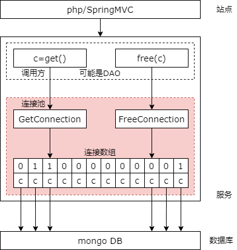
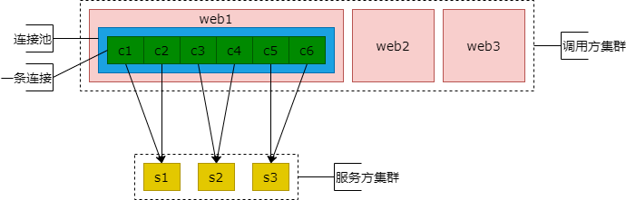
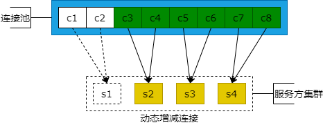
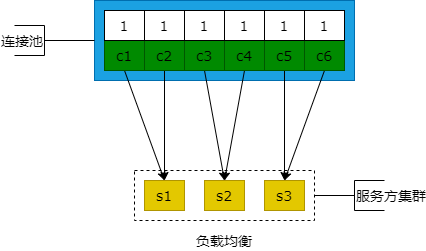
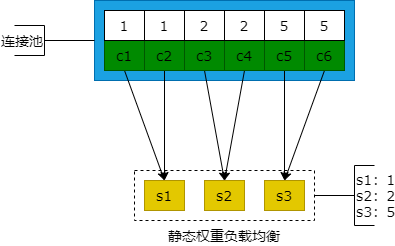
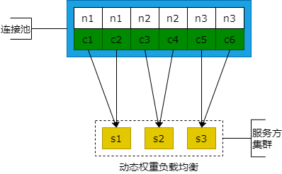

## 20、服务化：连接池，高可用可扩展负载均衡都离不开他

### 连接池

（1）两个核心数据结构

（2）三个核心接口



简单的回顾一下上一节的内容。上一节讲解了连接池内核的基础实现细节。连接池内部包含两个核心的数据结构，一个是连接数组，另外一个是锁数组，连接数组与锁数组是一一对应的，锁数组表示这个连接可以被使用还是不能够被使用。以及连接池的三个核心接口：初始化接口，所有锁和连接的初始化；以及获取连接接口，找到一个没有被锁的连接返回调用方，并锁住；最后一个是放回连接接口，将使用完的连接放回连接池组件，将锁释放，给其他的线程使用。

### 高可用 + 可扩展 + 负载均衡，是如何通过连接池实现的呢？

在微服务的分层架构中，连接池是非常非常重要的组件，高可用，可扩展，负载均衡都或多或少与连接池有关。比如高可用，他需要连接池实施连接的可用性检测，如果连接失效，需要重新建立连接；如果下游出现了故障，必须剔除失效的连接，实现故障的自动转移。高性能及可扩展这一块，如果下游新增的连接需要动态的扩充连接池实现服务的自动发现。负载均衡就更好理解了，每条连接被取到的概率要相同，实现下游同构服务器的负载均衡。

下面我们来一个一个的看一下。

### 微服务分层架构中，连接池的位置



首先看一下微服务分层架构中连接池的位置，他扮演着极其重要的角色。如上图的这个虚线框所示，它是调用方的 web 站点集群，下游的虚线框它是微服务集群，中间三个粉色的节点是调用方站点集群中的三个站点实例，蓝色的框是站点实例通过连接池调用下游的微服务，绿色的一个一个的小框他代表上下游建立的一条一条的连接。这个例子里面，调用方下游有三个微服务节点，每个微服务节点建立两条连接，连接池中总共有六条连接，从 connection1 到 connection6，c1 到 c6。连接池在微服务分层架构中是在微服务的调用方的一个内部。

### 高可用，故障转移，连接池的实现



具体到高可用的故障转移，连接池内部是怎么实现的呢？调用方获取连接池中的一个连接之后，会尝试的进行发包，所以其实是使用正常的请求来做包探测的。

比如说上游取到了 c1 这条连接，发送失败了，他会尝试着重连，如果连接成功，会将新的连接替换失效的连接。连接成功，说明是原来的旧连接失效，并不是说明服务失效，所以连接成功之后会替换掉失效的连接。

那如果重连失败，那大概率说明服务失效了，那么失效的服务节点所建立的相关连接必须全部剔除。比如说，微服务节点 s1 出现了故障，那么拿到 c1 和 c2 的连接即使重连也重连不上，所以此时连接池需要把 c1 和 c2 这两条连接从连接池中剔除，那后续的请求在获取连接的时候就会从 c3 c4 c5 c6 这些连接中取连接以保证故障的自动转移。

高可用故障转移是这么实现的。连接的重试与替换，如果连接出问题；连接的剔除，如果下游的服务节点出问题。

### 扩展性，服务发现，连接池的实现

关键点：

（1）自动载入新服务节点配置

（2）动态连接池

扩展性与服务发现与连接池有说明关系呢？这里面有两个关键的点，第一个关键的点是，如果你想实现自动的服务发现，需要自动的载入新微服务节点的配置。同时动态的扩充连接池。

那如何实现自动载入新微服务节点的配置呢？常见的有两种方法。

### 自动载入新服务节点配置

**方案一：监控配置文件，并重新载入**

```cpp
//启动一个进程，监控文件变化
CFileMonitor::start() {
    while(1) { //循环检查
        //获取最新md5
        now_md5 = xxx;
        //比对md5是否变化，如果变化
        if (now_md5 != old_md5) {
            //读取新服务节点的ip与port配置
            //动态连接池，新增连接
        }
        //下一秒再检查
        sleep(1000);
    }
}
```

第一种是监控配置文件，当配置文件发生变化的时候重新载入微服务节点的配置。可以看下这个伪代码。首先我们启动一个进程（线程），观察这个站点集群连接下游微服务集群的一个配置文件，通过一个循环不断的检测这个配置文件的 md5 有没有发生变化。如果发生了变化，会重新读取服务节点的下游微服务节点的 ip 和端口，域名和端口。然后再传给动态的连接池，新增连接。完成之后，可能沉睡一段时间再做检测。以此来动态的加载下游微服务，新增或者是减少或者是修改的微服务节点的域名和端口，动态的加载连接池，实现服务的自动发现。

**方案二：配置中心回调，并重新载入**

```cpp
void callback_NodeChange(Node) {
    //读取新服务节点的ip与port配置
    //动态连接池，新增连接
}
```

更常见的方案是使用配置中心回调，这样的话，会更简单一些。每当你的调用方站点集群向配置中心注册了下游所依赖的微服务集群的配置，如果微服务集群的节点发生了变化，比如说新增节点，删除节点，修改节点，配置中心会给调用方的站点集群进行回调，会将变化后的节点通知站点集群，再实施动态连接池，新增节点，删除节点，修改节点来实现这个微服务集群的一个扩展。所以扩展性，这个高性能这一块跟连接池也是非常非常相关的。

### 负载均衡，连接池的实现（同构服务器）

**方案一：随机/轮询**



最后一个是负载均衡。负载均衡跟连接池的关系就更加紧密了，同构的服务器可以使用随机或者轮询的方式来实现这个负载均衡。

轮询的策略非常好理解，现在上游和下游建立了六条连接，连接池中有六条连接。所谓轮询，第一次用第一条连接，第二次用第二条连接，第三次用第三条连接，如此反复的使用这些连接来保证下游的负载是均衡的。

随机的方式也能够实现同构服务器的完全的负载均衡。所谓随机，那就是每一个连接他其实是有权重为 1 的一个权重，比如说有六条连接，那么我们有一个权重数组，采用随机的一个方法，比如说你取“纳秒”，然后你模六加一，看这个随机值落在哪一个格子上，如果落在 1 到 2 这个格子上，那么他其实访问的是微服务 s1，落到 3 到 4 访问的是微服务 s2，落到 5 和 6 他访问的是微服务的 s3。三个区间的宽度完全相同，落到某一个微服务的节点的概率相同，所以下游三个同构服务器的负载是完全均匀的。

### 负载均衡，连接池的实现（异构服务器）

**方案二：静态权重法**



那么对于异构服务器呢？连接池他可以使用静态权重算法。此时下游的每一个服务器他的处理能力不同，他有一个静态处理能力的权重配置，比如说 s1 他的处理能力是 1，s2 的服务器的处理能力是 2，s3 他的服务器的处理能力是 5。上游在载入微服务集群的配置的时候会把这些权重也载入，那 s1 建立的连接的权重是 1，1；s2 是 2，2；s3 是 5，5。你看现在的权重之和是 16 了对吧，1，1，2，2，5，5 是 16，那么仍然采用一个随机“纳秒”，模 16 再加 1，看他落在哪一个区间，如果落在 1 到 2，那么他访问的就是 s1，如果落到了这个区间是 3 到 6 那么他就会访问 s2，如果落到了 7 到 16，那么他访问的是 s3。由于他的区间宽度的比是 1 比 2 比 5，所以流量分配到 s1，s2，s3 他的比例也是 1 比 2 比 5，完全符合你的静态权重的配置。

但是静态权重实在是太粗暴了，有没有一种方法能够根据下游微服务的实际处理能力来动态的分配负载呢？前两节的异构服务器的负载均衡其实讲过一种动态权重法。

**方案三：动态权重法**



动态权重法他就不需要在微服务集群的配置中配置他的负载权重了，而是在连接池中，最早有一个权重的默认值，最开始可能所有的权重是相同的，分配到 s1，s2，s3 的负载是均匀的。当连接成功处理请求时权重上升，超时处理或者是失败处理请求时权重快速的下降，来动态的调整分配到每一个微服务节点的宽度，权重的宽度，来调整这个概率。如此一来就能够根据服务的实际处理能力来分配负载。其中的算法细节在前两节的负载均衡中有详细的介绍，这里就不展开了，他也是通过连接池的权重宽度去决定流量的分配的。

**连接池，微服务分层架构中很重要的基础组件**

**高可用，扩展性，负载均衡都和他相关**

**强烈建议，找一个源码来阅读！**

除了他的两个基础的数据结构，三个这个接口，高可用是怎么实现的，扩展性是怎么实现的，负载均衡是怎么实现的，强烈建议找一个源码来看一看。

### 总结

（1）高可用，故障自动转移

（2）扩展性，服务发现：自动载入新服务节点配置 + 动态连接池

（3）负载均衡：轮询，随机，静态权重，动态权重

不知不觉已经讲了七节微服务了，在数据量逐步的增加，吞吐量逐步增加的时候，其实站点层很容易通过集群化来扩容，微服务层也很容易通过集群化来扩容，然而数据库层则没有那么好弄，数据库有大量的磁盘 io，最容易成为系统的瓶颈，然后做好数据库的架构，突破系统瓶颈呢？下一节开始我们讲这个数据库的这个架构设计。