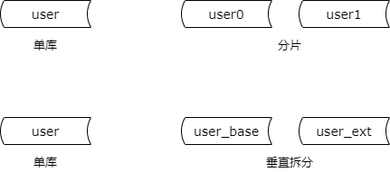
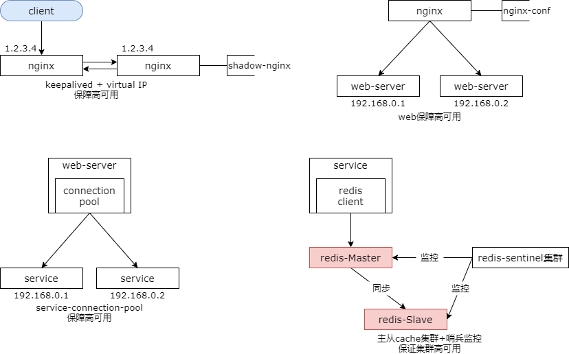

## 22、数据库：垂直拆分与高可用

### 回顾

**数据库要设计什么？**

（1）依据“业务模式”设计库表结构

（2）依据“访问模式”设计索引结构

**数据库工程架构设计，必须考虑什么？**

（1）<span style="color:#FA6800;">读性能提升</span>

（2）高可用

（3）一致性保障

（4）扩展性

（5）垂直拆分

**读性能提升，常见方法与实践？**

（1）**增加索引**，不同实例不同索引

（2）**增加从库**，使用数据库分组架构

（3）**增加缓存**，注意防止雪崩

首先来对上一节进行一个简要的回顾。上一节主要是对接下来的级长数据库的讲解做了一个总起。

数据库要设计些什么呢？我们主要依据业务模式来设计库表的结构。依据访问模式来设计索引的结构。

数据库工程架构除了要设计库表结构索引结构之外，以下的五点是必须要考虑的。分别是数据库读性能的提升，数据库高可用，数据库一致性保障，数据库扩展性，数据库垂直拆分。

其中上一节主要讲了读性能的提升。其中主要提了三种方法与实践。

第一种是增加索引。提到的一点是不同的实例可以建立不同的索引。主库只提供写服务，不建立索引。线上从库建立线上从库访问索引。线下从库建立线下从库访问索引。

还可以通过增加从库和增加缓存的方式来提升数据库与系统的读性能。

增加缓存时需要注意的是，要防止雪崩。缓存挂了，不能把数据库压垮。此时缓存要么做高可用，要么做水平切分。

今天的章节重点和大家聊一聊数据库的垂直拆分，顺带手介绍一下数据库的高可用。

### 数据库垂直拆分

（1）什么是数据库垂直拆分？和水平切分有什么区别？

（2）解决什么问题？

（3）带来什么问题？

（4）没有解决什么问题？



什么是数据库的垂直拆分？他与数据库的水平切分有什么区别呢？

水平切分，他是以某一个字段为依据，例如用户 id，按照一定的规则，比如说取模，将一个库（表）中的数据拆分到多个库（表）中去，以降低单库数据量大小的目的来提升数据库的性能。

水平切分可以用分库，也可以用分表的方式来实现。以分库为例介绍。水平切分之后每个库有什么样的特点呢？每个库的表结构都一样，并且每个库的数据都不一样，没有交集，所有库的并集是全量的数据。这是水平切分。他的目的是降低单库或者单表的数据量，提升性能。

那什么是垂直拆分呢？垂直拆分是指将一个属性较多，一行数据较大的表，将不同的属性拆分到不同的表中去，以降低单表的大小，达到提升性能的目的。

垂直拆分之后，每一个表的结构都不一样，每个表属性至少有一列交集，一般来说是主键，比如说用户的 id。所有表的并集是全部的数据。

引入一个技术方案我们需要问自己他解决什么问题，他带来的什么问题，他没有解决什么问题。

对于垂直拆分来说他本身是一种扩展方案，他能够降低单表的数据量，能够提升读写的性能。数据量少了，磁盘 io 会减少，读写性能会提升。

他带来什么问题呢？他会带来数据存取的复杂性。原来一个表，存取数据在这一个表中进行就行，现在变成了多个表，你要取一些属性，可能要有多次访问，并在内存应用程序做一些拼接。他带来的问题是数据存储复杂性的提升。

他没有解决什么问题呢？他没有解决数据可用性的问题以及水平拆分扩展性的问题。他没有解决这些问题。

那我们一般如何来实施数据库的垂直拆分呢？

### 如何实施数据库垂直拆分？

数据库垂直拆分，方法论，尽量把：

（1）长度较短；

（2）访问频率较高；

（3）经常一起访问；

的属性放在主表里；

他的方法论是我们尽量把长度较短，访问频度较高，经常一起访问的属性，放在一个主表里。这是我们进行数据库垂直拆分的方法论。

举一个更为具体的例子，比如说，我们有一个用户的大表，他其中有非常多的属性，比如说用户的 id，用户名，登录密码，年龄，性别，一些标签标记，签名和自我介绍等等，用户表有非常非常多的属性。

```sql
user {
    uid bigint,
    name varchar(16),
    pass varchar(16),
    age int,
    sex tinyint,
    flag tinyint,
    sign varchar(64),
    intro varchar(256),
    ...
};
```

进行垂直拆分我们把长度较短的，访问频度较高，且经常一起访问的属性放在主表里。比如说用户的 id，用户名，用户的登录密码，年龄，性别，一些标记，长度比较短的属性，并且它们在登录的时候一定会访问。所以我们可以把他放在主表里。像签名 varchar 64，自我介绍 varchar 256，这些属性并不会经常的访问，并且字段较长，256 个字节或者是 64 个字节，我们通常把这些属性放在扩展表里。你会看到他其中有一个 user_base 表，基础表主表，一个 user_ext 表，扩展表。如果属性非常多，我们可以有多个扩展表。

```sql
user_base {
    uid bigint,
    name varchar(16),
    pass varchar(16),
    age int,
    sex tinyint,
    flag tinyint,
    ...
};

user_ext {
    uid bigint,
    sign varchar(64),
    intro varchar(256),
    ...
}
```

**为什么要将字段短，访问频率高的属性放在一个表内呢？**

**原因是：数据库缓冲池，逻辑上，以 row 为单位缓冲数据。**

物理上是以页为单位缓冲数据的。

为什么这么垂直拆分可以提升性能呢？

数据库他有自己的内存缓冲池，会将磁盘上的数据载入到缓冲池里。数据库的缓存池他以行为单位缓存数据。在内存有限的情况下，如果缓冲池里缓存的行短，则能够缓存更多的数据。在数据库缓冲池里，高频访问的行能够提升缓存的命中率，减少磁盘的访问。

所以把短的行放在一个表内，他可以缓存更多的行数。把访问频度高的属性放在主表内，缓冲池能够更多的命中，访问能够更多的命中缓冲池，减少磁盘 io。

我们再来举一个更具体的例子。

**举个例子，假设缓冲池 1G**

**Case1，未拆分：**

user 表，1 行记录为 1k，只能缓存 100w 行数据

**Case2，垂直拆分：**

user_base 表，1 行记录为 0.1k，能缓存 1000w 行数据

user_ext 表，1 行记录为 0.9k，但访问频率较低

假设数据库缓冲池大小为 1G，未拆分的 user 表，他的一行记录的大小是 1k，那么此时我的缓冲池则只能缓冲 100 万行的数据。

如果我们垂直拆分成 base 表和 ext 表，其中 base 表他的记录较短，一行是 0.1k，他就能够缓存 1000 万行数据，并且这些数据这些属性他的访问频率高，能够更多的命中缓冲池。而 ext 表他的记录较长，一行为 0.9k，但访问频度较低，所以很少 ext 表中的行会被载入到内存缓冲池里，内存缓冲池更多的载入的是高频访问的 user base 表里的行数据。那么绝大部分的记录就被放入到了内存里，访问磁盘的概率就会大大的降低。数据库访问的时延也会大大的降低，吞吐量就会增加。这也是为什么垂直拆分能够提升数据库读写性能。

### 至于高可用？



说完了垂直拆分，数据库设计还有一个章节是高可用。高可用在微服务的小节中提过，其中有两条方法论。

一条是要做集群的冗余。一条是要做故障的自动转移。

前面的章节介绍了反向代理层的高可用，keepalived 加 vip。站点层的高可用通过反向代理。服务层的高可用通过连接池建立。缓存的高可用我们冗余数据，然后通过 sentinel 集群去监控他的可用性，实现流量的自动故障转移。

对于数据库层的高可用也不例外。

**数据库的高可用设计，也是冗余 + 故障自动转移！**

**但是，方法论上：数据库的冗余，会引发一致性问题！**

数据库的高可用也是通过冗余，加故障自动转移实现的。但是在方法论上今天要强调的是数据库的冗余一定会引发一致性的问题，他（数据库）本身存储的就是状态。你进行了冗余之后，多个节点的设计没有办法同时修改，多个节点的数据要达到一个相同的状态有一个时间差，这个时间差就有可能引发一致性的问题。更具体的我们来看一看读库冗余数据引发的一致性问题，以及写库冗余数据引发的一致性问题。

### 从库，高可用？冗余从库，but...


数据库的读库要想做到高可用我们必须冗余从库。所以分组架构中一主多从，一般来说是有多个从库。一个节点提供写服务，多个节点提供读服务。一个读节点挂了，其他读节点依然能够提供读服务。

为什么说冗余会引发一致性的问题呢？分组架构中主库会将在主库上操作的写序列通过 binlog 的方式同步给从库，从库执行相同的序列，以求达到和主库相同的数据，保证数据的一致性。但是这个同步的过程中是有时延的，比如说需要 500 毫秒，那么在这 500 毫秒之内主从的数据就会不一致。这些一致性的问题，后续一致性的章节跟大家来介绍。这里要说的是从库的高可用是通过冗余从库的方式去实现的。

### 写库，高可用？冗余写库，but...


写库的高可用是通过冗余写库的方式去实现的。冗余写库又有两种方法。

第一种方法，双主同步。一个节点对外提供读写服务，另外一个节点是一个备份主节点，它们之间使用相同的 vip 对外提供服务，通过 keepalived 去监测主节点的可用性。一旦对外提供服务的主节点挂了，流量将自动迁移到另外一个主节点。这是在微服务的章节介绍过的一种方式。

还有一种方式是在分组架构中加入一个双主节点，也是冗余了写库，两边进行相互的同步。为了提高服务的资源利用率，两个主库同时对线上提高服务。既然冗余了数据他就一定会出现数据一致性的问题。两个写库有可能造成相互的冲突，引发数据不一致。这个写写的数据不一致也是需要我们进行解决的，后续在一致性的章节会重点的介绍。

### 总结

**垂直拆分？**尽量把：

（1）长度较短；

（2）访问频率较高；

（3）经常一起访问；

的属性放在主表里；

**高可用，冗余 + 故障自动转移**。

**数据库有状态，冗余一定会引发一致性问题**。

**数据库工程架构设计，必须考虑什么？**

（1）读性能提升

（2）<span style="color:#FA6800;">高可用</span>

（3）一致性保障

（4）扩展性

（5）<span style="color:#FA6800;">垂直拆分</span>