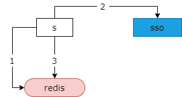
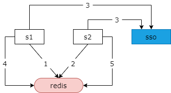
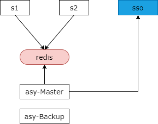

## 31、缓存：并发更新的大坑！

**大部分时候，数据存储在DB，缓存应该淘汰。**

**有些时候，数据不在数据库，缓存需要更新！**

之前介绍了 cache aside pattern，绝大部分的时候数据存储在数据库里，所以缓存我们应该淘汰而不是修改。但有些时候数据他不存在数据库里，缓存则可能需要更新。

### 业务场景说明

（1）调用第三方服务，例如微信，一般会分配一个 token，每次访问接口需要带上这个 token；

（2）这个 token 是有有效期的，当 token 过期时，需要去重新认证申请；

（3）也可以在 token 过期前重新申请，但此时旧 token 会失效；

举一个最典型的例子，当我们需要调用第三方服务的时候，例如微信服务，一般微信会分配给我们一个 token，每次访问微信的接口需要带上这个 token。这个 token 是有有效期的，当 token 过期的时候我们需要重新去微信申请新的 token，后续的请求带上新的 token。当然，也可以在 token 过期之前重新申请新的 token，但此时旧的 token 会失效。

### 常见解决方案？

对于这一种业务场景最常见的实践方式是，将已经生成的 token 放在缓存中。如图所示，当需要调用第三方接口的时候，第一步，从缓存中取出 token，然后带上 token 去调用接口，如果发现此时 token 过期，第二步，需要申请新的 token，然后（第三步）把新的 token 写回到缓存里，以便今后的第三方接口的访问能够从缓存中取出最新的 token。这是访问第三方接口，存取 token 的最常见方案，token 不会存储在数据库里，会放到缓存里。

在这种情况下有可能出现什么样的问题呢？

### 并发更新怎么办？

当系统存在并发访问第三方接口的时候，在 token 过期的极限时间内并发更新有可能导致 token 相互的失效，有可能导致 token 递归的失效。

如图所示，服务集群并发的发起了第三方接口的访问。第一步，取旧的 token 访问接口，发现 token 过期了。同时（第二步），并发的请求取旧的 token，访问接口也发现 token 过期了。第三步，第一个请求取访问新的 token（得到 token1），同时并发的请求也去访问 token（得到 token2）。第四步，把 token1 放入缓存，同时使用 token1 去访问接口，但把 token1 放入缓存时，其实 token1 已经过期，因为 token1 是第三步申请的 token，而后续立刻发起了第二次申请 token2 的请求，token2 的请求申请下来之后，token1 会过期，第四步把 token 写回 redis 然后带着 token1 去访问第三方的接口又会提示 token 失效。可能服务一会重新的发起新 token 的申请（得到 token3)，新 token 一旦申请，之前并发生成的 token2 又会失效。第二次的并发访问，带着 token2 去访问新的接口会发现 token2 又失效，如此递归可能并发的接口会一直相互的申请 token3，token4，token5，token6，每一次申请新的 token 都会导致并发申请的 token 失效。

### 如何进行优化？

在这种情况下，如何来进行优化呢？常见的解决方案如图所示。

线上的服务 s1 和 s2，只从缓存中读取 token，token 的更新由一个异步的服务 asy master 定期的更新 token，避免并发的更新，同时使用 shadow master 的方案，保证更新 token 的服务的高可用，如果更新 token 的服务的 master 挂了，shadow master backup 立即顶上，也就是说他实现了缓存 token 读写的分离，线上服务只从缓存中读取 token，异步的服务来负责 token 的更新，从而避免了 token 的并发更新。

但是这个方案潜在的缺点是（读取）服务与更新的服务他会直接调用同一个缓存实例，如果缓存实例变更，可能需要读的服务和写的服务配置同步变更，导致耦合，他其实违背了两个服务不宜访问同一个缓存实例的通用设计原则，同时他还违反了 cache aside pattern 的淘汰缓存而不是更新缓存的通用设计准则。

当然任何脱离业务的架构设计都是耍流氓，在这个业务方案里，读写服务耦合于同一个缓存是更好的设计，他避免了并发更新带来的 token 相互失效的问题。同时由于 token 数据并不存储在数据库里，所以采用更新缓存的方式并没有任何问题，而不需要每一次访问之前都去第三方申请新的 token。

### 总结

（1）如果最新的数据不在数据库，缓存里要存数据；

（2）并发更新可能出现每次相互失效；

（3）异步更新，是一个常见的策略；