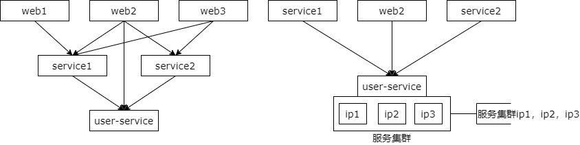
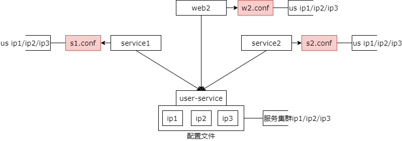
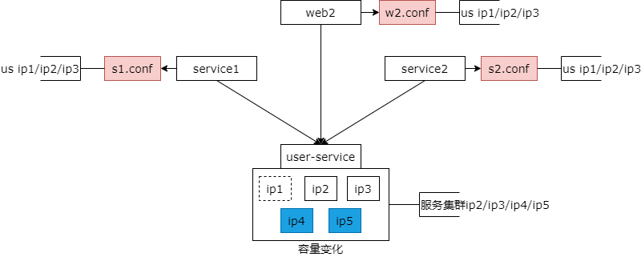
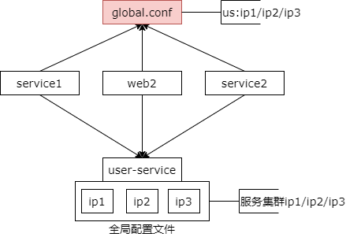
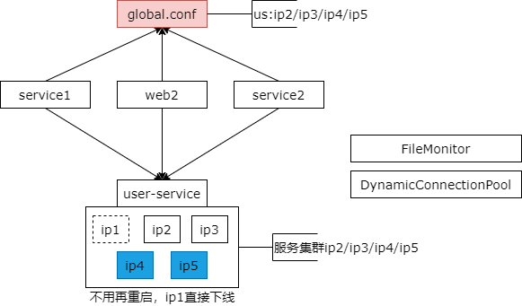
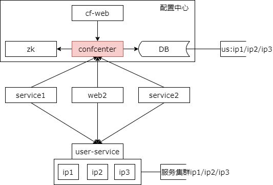

## 34、解耦：配置中心，与配置架构演进

在上一个阶段玩好了服务化、数据库、缓存，基本上架构就不会有什么太大的问题，随着数据量的进一步增长，流量的进一步增长，架构越来越复杂，解耦是我们这一阶段需要重点关注的内容。架构哪些地方需要解耦，我们一步一步来看。

### 存在什么问题？

服务化分层是架构演进的必由之路，如上图所示，我们会有多个站点应用，也会有多个服务，服务与服务之间，站点应用与服务之间，依赖关系会变得非常的复杂，对于同一个服务来说，他往往有多个上游调用，为了保证高可用，他往往是若干个节点组成的集群提供服务，比如说用户中心服务，user-service，它有三个节点，ip1，ip2，ip3 向上游提供服务，任何应该节点宕机都不会影响服务的可用性。

那么问题来了，调用方如何维护下游服务的集群配置，当集群节点增减时调用方是否有感知呢。

### 有什么核心痛点？

**上游痛：扩容的是下游，改配置重启的是上游（耦合，典型反向依赖）**

**下游痛：不知道谁依赖于自己（难以实施服务治理）**

在里面有两大核心的痛点，上游非常的痛，当扩容是下游的时候，修改配置重启的往往是上游，在里面是经典的耦合与典型的反向依赖的问题。第二点是下游痛，他不知道谁依赖了自己，难以实施服务治理。

我们可以来看一下，我们的配置架构是如何演进的，这些痛点是如何一步一步得到解决的。

### 阶段一：配置私藏

最初的阶段是配置私藏的阶段。

#### 什么是配置私藏？

配置私藏是配置的最初阶段，上游调用下游，每一个上游都有一个专属的私有配置文件，记录被调用的节点的信息。

如上图所示，用户中心 user-service 有 ip1 ip2 ip3 三个节点，s1 调用了用户中心，它有一个专属的配置文件 s1.conf，他记录了 user-service 的 ip1 ip2 ip3 的配置。s2 也调用了用户中心，同理他也有一个配置文件 s2.conf 记录了 user-service 的 ip1 ip2 ip3 的节点。站点应用 web2 他也调用了用户中心，他也有 web2.conf 记录了 user-service 集群的三个 ip 的配置。

是不是非常的熟悉，绝大部分的公司在初期都是这么玩配置文件的，他叫配置私藏。

#### 配置私藏有什么不足？

配置私藏架构的缺点是什么呢？来看一个容量变化的需求。当运维检测出 user-service 的 ip1 节点可能因为硬盘性能下降，需要通知上游要将 ip1 节点下线，同时扩容了两个节点 ip4 和 ip5，此时要怎么做呢？

#### 此时要怎么做？

此时用户中心的负责人要通知所有的上游调用方去修改各自私藏的配置并重启上游，将连接连到新的集群（节点）上去，将流量从下线的节点上迁走。

这种方案存在什么问题呢？当业务复杂度较高，研发人数较多，依赖关系非常复杂的时候，这个通知上游修改配置并重启的过程会异常的复杂。调用方非常的痛，容量变化的是你，凭什么修改配置重启的是我。服务方也非常的痛，他根本就不知道有多少个上游调用了自己，往往只能通过发邮件，一个一个询问，通过连接找到上游的调用 ip 并询问运维的负责人这个 ip 的所属人是谁，再通过机器找到负责人，找到对应的调用服务。整个过程非常的麻烦非常的复杂，扩容的时间节点基本上要以几周甚至几个月才能通知所有的调用方修改配置重启，而且不管以哪种方式都很有可能遗漏，导致 ip1 节点一直有流量，难以下线，ip4 和 ip5 流量难以均匀的分摊过来，是不是整个过程似曾相识，不断地推动上游去修改各自的配置文件并重启。

### 阶段二：全局配置文件

如何进化呢？接着会进化到配置文件的第二个阶段叫做全局配置文件。

#### 什么是全局配置文件？

架构的升级并不是一步到位的，首先我们会用最低的成本来解决上述修改配置重启的问题，是所谓的全局配置架构。

对于通用的服务建立全局配置文件，消除配置私藏。首先运维层面得制定规范，新建全局配置文件。对于通用的服务，这些服务的配置会放到 global.conf 里，比如说用户服务 user-service 它是一个通用的服务，user-service 的配置就必须放到 global.conf 里。对于调用方而言，如果调用的是通用的服务，必须读取全局配置文件里的下游的服务的配置信息，而不能够私藏在自己的配置文件里。对于调用方，必须读取全局配置文件，对于服务方，相关的配置必须维护在全局配置文件里。

#### 全局配置文件有什么好处？

如此一来有什么好处呢？如果下游的容量变化，只需要修改一个地方的配置，也就是 globa.conf，而不需要去逐步的寻找各个上游一个一个的修改，在调用方下一次重启的时候就会自动的读取全局配置文件，流量自动的会迁移到扩容之后的集群上来。而且这个方案的对架构的影响修改非常的小，只是增加了一些配置文件的规范，读取配置文件的目录变了而已，原来你是读取本地私藏的配置文件，选择你是读取全局的配置文件，所以对架构的冲击是非常的小的。

#### 全局配置文件有什么不足？要如何优化？

全局配置文件有什么不足呢？如果调用方一直不重启，那就没有办法读取全局的配置文件中的新的 ip，将流量迁移到扩容的这个服务提供方的节点上。

那有没有办法实现流量的自动迁移呢？答案是肯定的。只需要引入两个并不复杂的组件就能够实现调用方的流量自动迁移。第一个组件是 file monitor 文件监控组件，它能够实现配置文件变化（的监控），当配置文件发生变化的时候会回调相关的关注方。第二个组件是 dynamic connection pool 动态连接池组件，它是 rpc client 中的一个子组件，用来维护与多个 server 之间的连接。所谓动态连接池就是指连接池中的连接可以动态的增加或者是减少，具体的细节在前序章节连接池中有介绍过。引入了这两个组件之后，一旦下游的服务扩容修改了全局配置文件，调用方能够监测到配置文件发生了变化立刻发生回调，并使用动态连接池组件将删除的节点的连接消除掉，新增的节点的连接建立起来，就自动的完成了服务发现与下游节点的增容与缩容。

这是配置架构的第二个阶段，全局配置文件。

### 阶段三：配置中心

第三个阶段，配置中心。

#### 还存在什么问题？

全局配置文件他还存在什么问题呢。全局配置架构它是一个能够快速落地的方案，他能够解决上游调用方不用再修改配置重启的问题，但是他依然解决不了服务方不知道有多少个上游调用了自己这个问题。如果他不知道有多少个上游调用了自己，你服务方按照调用方限流，绘制全局架构依赖图这类需求是非常难实现的。

这个时候怎么办呢。

#### 什么是配置中心？

配置架构的进一步演化，最后会升级到配置中心的阶段。对比全局配置与配置中心的架构图，你会发现配置由原来的静态配置文件 global.conf 升级为了动态的配置中心服务。当然整个配置中心的服务也是非常复杂的，他由服务，zookeeper，后台配置文件以及落地的数据库组成。所有的下游服务的配置会通过配置中心的后台维护在配置中心的数据库里，而所有的调用方他要获取下游节点的配置必须去配置中心注册，拉取相关的配置文件。

#### 当扩容时？

当下游的服务需要扩容或者缩容的时候，比如说用户中心需要减掉 ip1 节点，新增 ip4 和 ip5 节点，需要通过配置中心的后台进行操作，删除掉一个 ip，新增的两个 ip。这个时候配置中心服务它能够知道哪一些节点注册了被调用的 user-service 并将节点的变化通知推送给相关的注册方，相关的注册方再配合动态连接池组件能够完成服务的发现，服务的缩容扩容，动态连接池组件删除掉 ip1 节点上的连接，增加 ip4 与 ip5 的节点，自动的完成扩容与缩容。

#### 配置中心有什么优点？

配置中心有什么好处呢？首先调用方他不再需要重启了，同时服务方能够从配置中心很清楚的知道上游的依赖关系，从而实施按照调用方限流，也很容易从配置中心获取全局架构的依赖关系。

配置中心有什么不足呢？配置中心的系统架构建设是一个相对中长期的过程，系统的复杂性会相对的提升。而且对配置中心的可靠性的要求会比较高，如果配置中心挂了，可能全局都会挂。当然可以结合本地配置，如果配置中心挂了，降级到读取本地配置。

### 总结

**有什么核心痛点？**

（1）**上游痛**：扩容的是下游，改配置重启的是上游（耦合，典型反向依赖）

（2）**下游痛**：不知道谁依赖于自己（难以实施服务治理）

**怎么解耦，怎么解决？**

（1）“**配置私藏**”架构

（2）“**全局配置文件**”架构

（3）“**配置中心**”架构

最后我们来做一个简要的总结。配置文件架构曾经有一些什么核心痛点呢？上游痛，扩容明明是下游修改配置重启的却是上游，这是一个典型的耦合与反向依赖的问题。下游痛，下游服务提供方他不知道谁依赖了自己，难以实现服务治理。

如何来解耦，如何来升级呢。整个配置文件的架构升级有三个阶段。配置私藏的阶段，上游把下游的配置私藏在自己单独的配置文件里，很难够解决反向依赖与服务治理。第二个阶段是全局配置文件阶段，他的升级过程是相对比较容易的，通过运维制定一系列的配置文件规范，将通用的服务的配置放到 global.conf 全局配置文件里，调用方升级不再读取本地的私有配置文件，而通过读取全局配置文件去获取通用服务的配置。在配合上，文件监控组件和动态连接池组件能够实现自动的扩容与缩容，但他依然解决不了下游服务治理的问题。最终会升级到配置中心，所有服务提供方的配置维护在配置中心里，所有调用方需要通过注册配置中心去配置中心拉取相关的配置，此时全局依赖关系的绘制图以及服务治理以及按照上游的调用方来限流就非常非常容易的实现了。

不知道大家的公司的配置现在进化到哪一个阶段了，对于配置架构的演进，以及配置中心希望大家有了一点点新的认识。