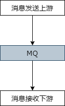
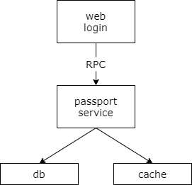
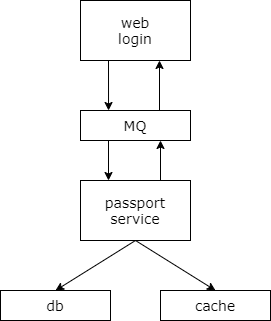
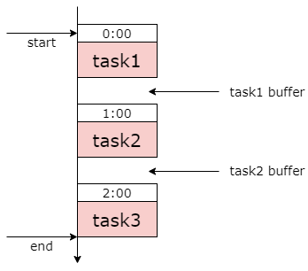
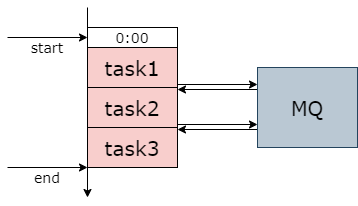
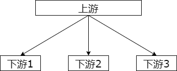
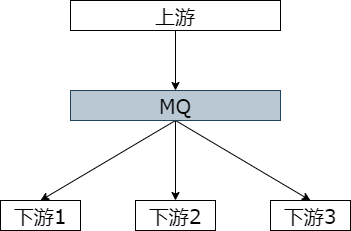
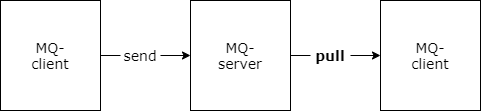

## 35、MQ，互联网架构解耦利器

随着数据量的进一步增长，流量的进一步增长，架构越来越复杂，解耦将是我们这一阶段需要重点关注的问题，而 mq 是互联网架构中最常见的解耦利器。

### MQ 是什么？



首先 mq 是什么呢？mq 消息总线 message queue，是一种跨进程的通信机制，通常用于上下游之间的消息传递。上游是一个发送进程，中间是 mq 服务，下游是一个消费进程，这两个进程通常不在同一台服务器上。

在互联网的架构中，mq 通常用来作为上下游的解耦，消息发送方只需要依赖 mq，而不需要关注消费方是谁。消费方也只需要依赖 mq，不需要关注发送方是谁。发送方和消费方物理上和逻辑上都不依赖于彼此。mq 是互联网分层架构中非常非常常见的解耦利器。

### 什么时候不用 MQ？

**调用方密切关注执行结果**



```php
ret = PassportService::userAuth(name, pass);
switch(ret) {
    case(YES): return YesHTML();
    case(NO): return NoHTML();
    case(JUMP): return 304HTML();
    default: return 500HTML();
}
```

在聊什么时候用 mq 来解耦之前，我们先来看一下什么时候不使用 mq。什么时候不使用 mq 呢。当调用方需要关注请求的执行结果时通常不使用 mq，而使用 rpc 调用。

这里举了一个非常典型的例子，passport 登录验证。passport 登录验证，用户传入用户名和密码来调用 passport 服务，验证登录结果。上游调用 passport 服务，处理的结果不同业务会走不同的执行逻辑，比如说登录成功，登录失败，执行错误等等等等，此时上游的调用强依赖于处理结果，就应该使用 rpc 调用。其实绝大部分的场景应该使用 rpc 调用。

### 如果此时，要强行使用 MQ 呢？



那此时，假设我们要强行使用 mq 呢？站点应用层通过 mq 来调用 passport 的服务，如果强行的使用 mq 通讯，调用方不能够直接告知用户登录成功或者失败，则要等待 mq 的另外应该回调，这么玩不仅使得编码异常复杂，还会引入消息中间件，多加了一层，可能导致消息丢失的风险，多此一举。所以绝大部分场景要等待调用的执行结果，根据执行结果走不同的后续处理逻辑，绝大部分的场景应该使用 rpc 调用。

### 到底何时使用 MQ 呢？

那到底何时使用 mq 来做解耦呢？

### 场景一：数据驱动的任务依赖



典型的场景一，数据驱动的任务依赖。什么是任务依赖？举一个例子，互联网公司经常在凌晨进行一些数据统计的任务，这些任务之间往往有一定的依赖关系，比如说 task3 需要使用 task2 的输出作为输入，task2 需要使用 task1 的输出作为 task2 的输入，这样的话任务一、任务二、任务三之间就有了依赖关系，必须任务一先执行，再任务二执行，再任务三后执行。

对于这一类的需求通常是这么实现的呢？常见的玩法是 crontab，人工执行时间表。如上图所示，我们需要手动的设定在零点 task1 先执行，根据经验来说 task1 的执行时间为 50 分钟。task2 什么时候执行呢？通常我们会约定一点执行，中间为 task1 的 50 分钟会预留十分钟的 buffer。同理，我们也会为 task3 设定执行时间，并为 task2 的执行时间预留 buffer。

这个 crontab 手动排班表有什么坏处呢？如果有一个任务的执行时间超过了 buffer 预留时间，后续的执行将会得到错误的一个结果，因为后续的任务不清楚前置任务是否执行成功，此时往往要手动重跑所有的任务，还可能要随时调整排班表。第二个不足，总的任务执行时间非常的长，中间你要预留非常非常多的 buffer，如果前置任务提前跑完，后置任务是不会提前开始的。还有其他的一些坏处，如果一个任务被多个任务依赖，这个任务将成为关键路径，排班表很难体现任务之间的依赖关系，非常容易出错。当有一个任务需要调整执行时间的时候，可能有多个任务的执行时间同时需要调整。

### 如何进行优化？



此时如何来进行优化呢？可以使用 mq 来进行解耦优化。如上图所示，任务之间通过 mq 来传递任务开始与任务结束的通知，比如说 task1，我们仍然准时开始，在他结束之后会往 mq 发送一个 task1 完成的消息，task2 订阅 task1 完成的消息，受到消息之后第一时间内启动执行，结束之后发动一个 task2 完成的消息，task3 订阅 task2 完成的消息，在收到相关的消息之后 task3 启动处理。

常用 mq 替代人工排班表 crontab 的好处是什么呢？首先，不需要预留 buffer 的时间。上游的任务执行完，下游总是会在第一时间内启动任务的执行。好处二，执行多个任务，依赖多个任务，依赖关系非常好处理，只需要订阅相关的消息完成即可。当有任务的执行时间发生变化的时候，如何下游的任务都不需要调整执行时间。因为他都是以上一个任务完成的通知为下一个任务启动的信号。特别需要说明的是，mq 只用来传递上下游执行任务完成的消息，这是一个典型的场景，可以使用 mq 来解耦。

### 场景二：上游不关心执行结果



典型场景二，当上游不需要关注执行结果的时候，我们通常可以使用 mq 解耦。需要关注执行结果我们用 rpc 调用，当上游不需要关心执行结果时我们通常使用 mq 来解耦。

举一个典型的例子，58 同城有很多下游的服务需要关注用户发布帖子这个事件，比如说招聘用户发布帖子了之后，招聘用户可能要奖励 58 豆，房产用户发布帖子之后，房产用户可能需要送两个置顶，二手用户发布帖子之后二手业务可能需要修改用户的统计数据。对于这一类需求如果不通过 mq 我们可以怎么实现呢？比较无脑的，我们可以使用 rpc 调用来实现，帖子任务发布完成之后分别调用下游的招聘业务、房产业务、和二手业务来完成消息的通知。然而这个消息通知是否正确的执行，帖子发布的上游服务根本不需要关心。如果通过 rpc 来传递消息，

有什么坏处呢？首先帖子发布的上游服务的执行时间增长了，其次当下游服务当机时可能导致帖子发布服务受影响，上下游在物理上和逻辑上依赖都非常的严重，更为悲剧的，每当增加一个下游节点，他需要知道帖子发布成功的通知时，修改代码的是上游的帖子发布服务，这一点是最恶心的，也属于架构设计中的典型的反向依赖，增加需求的明明是你，为什么修改代码升级的是我呢。

### 如何进行优化？



此时如何来进行优化呢？这个时候就可以通过 mq 来解耦代替 rpc。如上图所示，当上游帖子发布成功之后，往 mq 发布一个消息，哪个下游关注了帖子发布成功的消息，主动的去 mq 订阅。

如此一来有什么好处呢？首先上游的执行时间短，他只要向 mq 发出一个异步的消息即可。其次上下游物理上和逻辑上解除了耦合，除了与 mq 有物理的连接，模块之间都不会相互依赖。同时当下游新增一个消息的关注方，上游不需要修改任何的代码，以此来实现上下游的解耦。

### 场景三：上游关注结果，但执行时间很长


典型的场景三，上游关注执行结果，但执行时间很长的时候，我们也可以通过 mq 来解耦。更为典型的，当调用的是离线处理或者是跨公网调用的时候，经常使用回调网关加 mq 解耦的方案。。

举一个典型的例子，微信支付。跨公网调用微信的接口执行时间通常会比较长，但调用方又非常关注执行结果，此时一般怎么玩呢？一般采用回调网关加 mq 的方案来解耦。

第一步，调用方直接跨公网调用微信的接口，微信返回调用成功，此时并不代表执行成功。微信执行完成之后会统一回调网关，网关将最终的结果通知 mq，发送方订阅 mq 得到通知结果。这里需要注意的是，不应该由回调网关通过 rpc 来调用上游通知结果，如果是这样的话，每一次新增调用方都需要修改回调网关，仍然会出现典型的系统的反向依赖，明明新增业务需求的是你，调用微信的是你，修改代码的却是我的回调网关，所以不合理。此时，网关应该通过 mq 来向调用方传递第三方调用的最终通知结果，使用 mq 来解耦。任何新增对微信支付的调用不再需要修改网关的接口，而只需要直接调用并订阅 mq 即可完成扩展。

### 场景四：削峰填谷，流量控制，保护下游



最后一个典型的场景，mq 可以用来实现削峰填谷，流量控制，保护下游。如果没有 mq，使用 rpc 调用，上游有多少个调用，下游就要被调用多少次，很可能因为调用方的发送频率过高而压垮下游，此时可以通过 mq 来解耦。

mq 他分为推送模式和拉取模式，如果采用推送模式，不能够实现流量控制，上游发了多少的消息，mq 就推送多少消息给下游，可能把下游压垮。但如果升级为拉取模式，每隔一定的时间，消息的消费方根据自己的处理能力来拉取消息，实现流控，则能够达到自身保护的效果。这个时候 mq 他能够起到一个缓冲池的作用，并不需要上下游修改代码。

### 总结

**MQ 是一个互联网架构中常见的解耦利器。**

**什么时候不使用 MQ？**

上游实时关注执行结果，通常采用 RPC。

**什么时候使用 MQ？**

（1）数据驱动的任务依赖

（2）上游不关心执行结果

（3）上游关注结果，但执行时间很长

（4）削峰填谷，流量控制，保护下游
