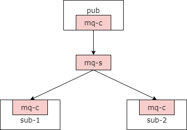
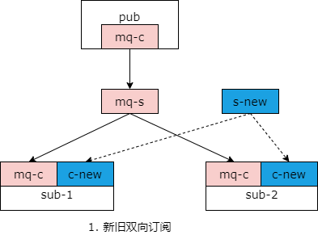
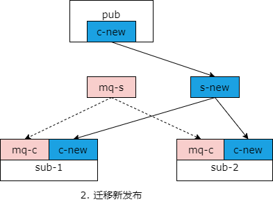
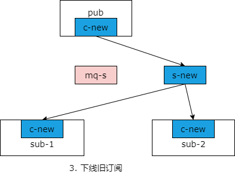
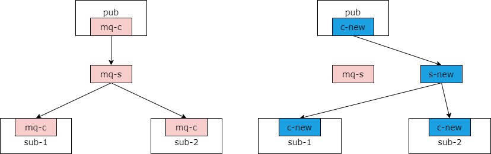

## 36、解耦：MQ，平滑迁移

之前介绍过当数据库底层存储介质升级的时候来进行平滑迁移的几种方案，追日志法，双写法，可以实现仅进行服务层的升级就能够实现调用方无感知的底层存储介质变化，例如 mongodb 升级为 mysql。那么对于 mq 底层存储的变化，比如说你要将 activemq 升级为 rabbitmq，能不能进行平滑的升级呢？今天将要介绍此方案的细节。

### MQ 架构简单回顾



**消息发送方**：使用 MQ 客户端生成消息。

```php
MQ-client::SendMsg(topic, msg);
```

**MQ 服务**：中转消息。

**消息接收方**：使用 MQ 客户端消费信息。

```php
MQ-client::RecvMsg(topic, msg, CALLBACK_FUNC);
```

首先我们来对 mq 的架构进行一个简单的回顾。如上图所示，使用 mq 异步的解耦通信，一般分为三层，消息的发送方使用 mq 客户端进行消息的生成，他使用的是类似于 mq client send msg 这样的接口来进行消息的生成。中间层是 mq 服务集群，他负责中转消息。消息的接收方使用 mq 客户端消费消息，他通常使用 mq client recv msg 去消费消息，通常需要带上一个 callback 参数。

这是一个典型的 pub-sub 的架构，如果要替换 mq 供应商，至少有三个地方需要替换，mq 发送方的 client，mq server，以及 mq 接收方的 client。任何平滑的迁移是今天将要讨论的核心话题。

### MQ 迁移的目标：不停服，平滑升级

我们的迁移目标是，不停服，能够平滑的升级。如果有很多很多的主题，需要一个一个主题的迁移，每个主题的迁移通常分为三个步骤。

### 步骤一：消费方双向订阅



如上图所示，不妨设粉色是旧的 mq 体系，蓝色是新的 mq 体系，平滑迁移的最终目的是发布、服务、订阅三层全部由粉色升级为蓝色。

第一步升级消费方，对于同一个主题（消费方）既要订阅旧的 mq 集群又要订阅新的 mq 集群。此时新服务新订阅也就是图中虚线框虽然有 tcp 连接，但是新的发布方没有上线，实际上不会有消息发送过来，消息仍然走的是旧的 mq 集群，上图的实线。

这是第一步，部署新的 mq 集群，消费方升级双向订阅。

### 步骤二：生产方升级为新发布



第一个步骤是部署新的 mq 集群，升级消费方，第二个步骤是升级消息的发布方，由旧的客户端发布升级为新的客户端发布，此时新分布、新服务、新订阅，会建立 tcp 连接，消息发布会由旧的粉色发布转移到新的 mq 集群消息发布通道上来，也就是上图的实线，而旧服务和旧的消费方虽然有 tcp 连接，但实际上旧的客户端消息发送方已经下线，所以实际并不会有消息发送。

### 步骤三：消费方下线旧订阅



第二步升级了新的消息发送方，通过新的 mq 集群，新的 mq 订阅客户端来进行消息的传递，那么对于旧的消息消费方进行一个订阅方的升级，彻底的将旧的订阅方从代码里移除掉。

至此整个 mq 迁移完成。原来发布方，集群，消费方都是粉色的节点，现在发布方，集群和消费方都升级为了蓝色的节点。

### 最终达到的效果



因此最终达到的效果，起始状态是全粉的状态，最终达到了全蓝的状态。

如果一个服务一个服务的升级，订阅方，集群，消费方，成本很高，有没有统一升级的方案呢？

其实是有的，在前面的章节介绍过，如果你进行了浅浅的一层封装，其实整个过程就变得异常的简单了。

假设**没有封装一层**，业务代码是：

```php
ActiveMQ-client::SendMsg(topic, msg);
ActiveMQ-client::RecvMsg(topic, msg, CALLBACK_FUNC);
```

即，业务方需要关心 activemq，如果基础设施升级为 rabbitmq，业务代码需要升级。

假如**有一层浅浅的封装**：

```php
ShenJianMQ::SendMsg(topic, msg) {
    ActiveMQ-client::SendMsg(topic, msg);
}
```

```php
ShenJianMQ::RecvMsg(topic, msg, CALLBACK_FUNC) {
    ActiveMQ-client::RecvMsg(topic, msg, CALLBACK_FUNC);
}
```

业务方不需要关心底层是什么 MQ，而只需要依赖基础组件 ShenJianMQ。

如果你做了这么一层浅浅的封装，你就可以实现统一的升级。具体的升级细节，步骤与前面描述的基本一致。

**第一步：RecvMsg 升级为双向订阅**。

```php
ShenJianMQ::RecvMsg(topic, msg, CALLBACK_FUNC) {
    ActiveMQ-client::RecvMsg(topic, msg, CALLBACK_FUNC);
    RabbitMQ-client::RecvMsg(topic, msg, CALLBACK_FUNC);
}
```

**第二步：SendMsg 升级为新分布**。

```php
ShenJianMQ::SendMsg(topic, msg) {
    RabbitMQ-client::SendMsg(topic, msg);
}
```

**第三步：RecvMsg 下线旧订阅**。

```php
ShenJianMQ::RecvMsg(topic, msg, CALLBACK_FUNC) {
    RabbitMQ-client::RecvMsg(topic, msg, CALLBACK_FUNC);
}
```

如此一来，只要大家逐步的依赖于浅浅分装以后的 ShenJianMQ，每一次升级最新的版本，经过三步的迭代，所有的服务就都由 activemq 升级为了 rabbitmq。这里你也可以看到浅浅的封装一层有多么的重要，不仅是 mq，缓存与数据库的客户端浅浅的封装一层也能够实现业务代码与基础组件的解耦，在基础组件需要进行替换或者升级的时候，而可以统一依赖最新的基础代码，浅浅封装一层的这个最新的库。

除了基础组件底层的替换，在实现监控，告警，数据收集等工作，也可以在浅浅封装的这一层很容易的统一实现。

### 总结

**MQ 是一个互联网架构中常见的解耦利器。**

**如何实现 MQ 的平滑迁移？**

步骤一：消费方双向订阅；

步骤二：生产方升级为新发布；

步骤三：消费方下线旧订阅；

**如何快速实现统一迁移？**

浅浅的封装一层