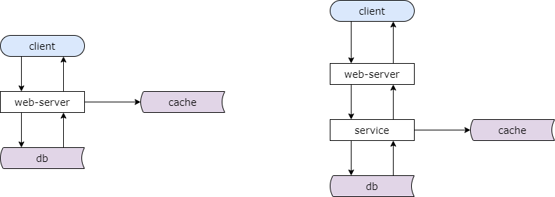
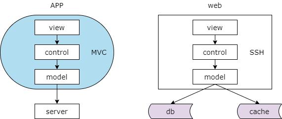
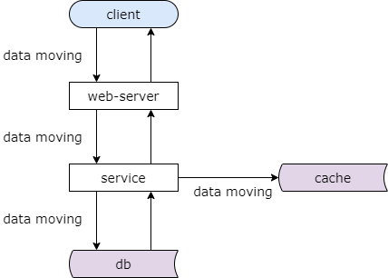
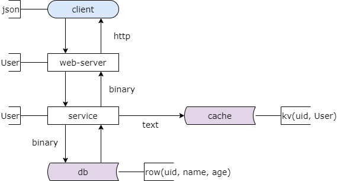

## 40、分层：互联网分层架构方法论

**随着共性代码下沉，分层会不会越来越多？**

**分层的方法论是什么？**

**什么时候要开始分层？**

这些问题的本质是分层架构设计方法论的问题。

### 两层架构，三层架构

典型的分层架构是两层的架构或者是三层的架构。左边的图是一个典型的互联网两层分层架构，顶端是客户端，典型的是浏览器或者手机应用 app，接下来是站点应用层，他实现核心业务逻辑，从下游获取数据，对上游返回 json 或者 html，然后是缓存层，它能够加速数据的访问，底层是数据库层，他进行数据的固化存储。如果实施了微服务架构，会多一个服务层，他对下游屏蔽底层数据获取的复杂性，向上游提供友好的 rpc 接口，让站点应用层就像调用本地函数一样去获取远端的数据。这是典型的两层或者三层的分层架构。

### MVC 架构

即使是在同一个层次的内部，app 层的内部或者是站点应用层的内部，也经常进行 mvc 分层。view 层进行数据的展现，control 层进行设计的逻辑处理，model 层进行数据的获取。不管是 app 侧还是站点应用侧都会经常有这样的 mvc 架构。

**每个工程师骨子里，都潜移默化的实施着：**

**分层架构设计**

数据分层架构设计，数据会在不同的层次之间移动。

### 数据是如何移动的？

你会发现数据是在不断的移动的，跨进程的移动以及本进程的移动。跨进程的数据会从数据库和缓存移动到 service 层，会从 service 层移动到站点应用层，会从站点应用层移动到客户端层。同进程的在站点应用和客户端层的内部也会从 model 层转移到 control 层，再转移到 view 层。

这是数据的移动，但数据的处理和呈现需要进行 cpu 计算，而 cpu 计算是固定不动的，数据库，缓存，服务，站点应用，他们都是部署在固定的集群上，cpu 是不能移动的，端上不管是浏览器还是 app 也有固定的 cpu 计算。数据是移动的，数据的获取和呈现 cpu 是固定的。

**此时，有两个东西就显得尤其重要：**

**（1）数据传输的格式**

**（2）数据在各个层次的形态**

### 数据的传输格式，各层次形态

先来看一下数据传输的格式。协议是数据传输的载体。服务和数据库和缓存之间，二进制与文本的协议是数据传输的载体。站点应用到服务之间，rpc 的二进制协议是数据传输的载体。客户端到站点应用之间，http 协议是数据传输的载体。

再来看数据在各个层次的形态。在数据库层，数据是以行为单位进行存储的，一行数据有 uid，用户姓名，用户年龄，等。在缓存层，数据是以 kv 的形式存在的，key 是用户的 id，value 是用户的实体序列化后的二进制。在 service 层，他会把 row 或者是 kv 转化为对程序友好的的 User 对象。在站点应用层，他会像调用本地函数一样去获取服务端的数据，所以他获得的也是友好的 User 对象。站点应用层会把对象转化为 json 或者是 html，端上最终获得的是 json 对象。

还是那句话

**分层架构，是一个“数据移动”，然后“被处理”，被“呈现”的过程！**

其中数据的移动是整个过程的核心。

为什么要说这个呢？这将引入互联网分层架构演进的核心原则。

**架构分层方法论：**

**（1）让上游更高效的获取与处理数据，复用**

**（2）让下游能屏蔽数据的获取细节，封装**

这个方法论能够告诉我们：

（1）为什么（以及何时）要引入 DAO

（2）为什么（以及何时）要服务化

（3）为什么（以及何时）要引入业务服务

（4）为什么（以及何时）要前后端分离

（5）为什么（以及何时）要做数据库中间件

### 总结

（1）分层架构，是一个“数据移动”，然后“被处理”，被“呈现”的过程！

（2）数据移动的过程中，以下两点尤其重要：

* 数据传输的格式
* 数据在各个层次的形态

（3）架构分层方法论：

* 让上游更高效的获取与处理数据，复用
* 让下游能屏蔽数据的获取细节，封装

接下来的几个章节将和大家介绍何时要引入 dao 分层，何时要引入服务化分层，何时要引入业务服务分层，何时要进行前后端分离，何时要引入数据库中间件，以及这些分层的架构与细节。