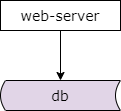
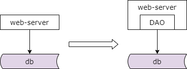
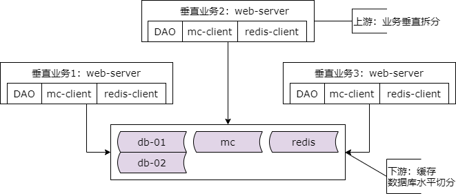
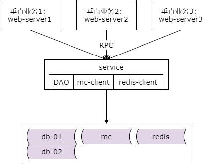
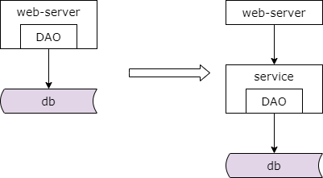

## 41、分层：DAO与服务化

### 最早架构的样子？



我们先来看一下一个架构最早期是什么样子的。一个业务系统的最初后端架构如上，典型的两层架构。站点应用层从数据库获取数据并进行加工处理，而数据库层则存储数据。

**此时，如何获取数据，如何处理数据？**

### 获取与处理数据

```java
Connection con = DriverManager.getConnection(
    "jdbc:mysql://localhost:3306/user",
    "root",
    "pass"
);
Statement stmt = con.createStatement();
ResultSet rs = stmt.executeQuery("select * from user where uid=123");
while(rs.next()) {
    String name = rs.getString("name");
}
rs.close();
stmt.close();
con.close();
```

我们可以来看一下站点应用层获取数据的一段伪代码如上，不用纠结代码的细节，也不用纠结不同的编程语言与不同的数据库驱动的差异。其获取数据的过程大概为，创建一个数据库连接，初始化资源，根据业务拼装一个 sql 语句，通过执行 sql 语句获取结果集，通过游标遍历结果集，取出每行数据，也可以从每行数据中取出数据的属性，最后关闭数据库连接，回收资源。大家早期是不是这么从数据库获取与处理数据的。

**方便还是不方便？**

**如何更高效？**

这么获取和处理数据方便还是不方便，高效还是不高效。如果业务不复杂，那样的代码写一次两次还是可以的，但如果业务越来越复杂，每次都这么获取数据就略显低效了，有大量的冗余的重复的每次都必写的代码。

### 提高“获取与处理数据”效率

```java
@Table(name = "user")
public class User implements Serializable {
    @Column(name = "uid")
    private long id;

    @Column(name = "name")
    private String userName;
}

int updateEntity(Object bean);
Object queryEntity(long id);
```

我们为了提高获取与处理数据的效率，可以通过技术的手段去实现。表与类的映射，属性与类成员的映射，sql 语句与函数的映射，这就是绝大部分公司正在使用的 orm，dao 等技术。这是一种分层抽象，可以提高数据的获取效率，屏蔽底层连接、游标、结果集这样的一些复杂性。

### 于是，架构演进了



于是架构就分层演进了，由两层的架构衍生出了一个 dao 层。这里的结论是，每当手写代码从数据库获取数据成为通用痛点的时候就应该抽象出 dao 层，简化数据获取的过程，提高数据获取的效率，向上游屏蔽底层数据获取的复杂性。

这就是分层架构演进方法论在初期落地的效果。

接下来呢？

（1）随着业务越来越复杂，业务会不断进行垂直拆分

（2）随着数据量越来越大，数据库会进行水平切分

（3）随着读并发的越来越大，会增加缓存降低数据库的压力

于是这个时候我们的架构就变成了这个样子。

### 架构变成了这个样子



业务垂直拆分，垂直业务一，垂直业务二，垂直业务三，数据库水平切分，数据库 db01，数据库 db02，缓存优化，引入了 mc，引入了 redis，这些都是最常见的架构优化手段。此时站点应用层如何获取底层的数据呢，根据我的经验，以用户数据为例，一般是这样的，每个业务在查询用户数据之前，一般会先查询缓存，先用 uid 尝试从缓存获取数据，如果 cache hit 则成功返回，返回 user 实体，流程结束，如果 cache miss 了，先查询路由配置确定该用户落在哪个数据库的实例上，然后最后查询数据库，通过 dao 层从对应的数据库获取 uid 对应的实体数据 user，最后插回到缓存中，以便下次查询能够命中缓存。

如果每个业务都执行上述流程，获取数据方便还是不方便，效率高还是低。如果业务不复杂，刚刚的代码写一次两次还是可以的，如果业务越来越复杂，每个垂直拆分的业务都这么获取数据就略显低效了，会有大量的冗余的重复的每次必写的代码，特别的业务垂直拆分成很多子系统之后，一旦底层稍许变化所有的上游系统都需要升级修改，子系统之间很可能出现代码拷贝，一旦代码拷贝出现一个 bug，多个子系统之间都需要升级修改。以五八同城为例，五八同城就有招聘，房产，二手，二手车，黄页等五大头部业务，他们随时都需要访问用户数据，每个子系统如果都需要关注缓存，分库分表，读写分离等复杂性，调用层会疯掉的。

### 提高“获取与处理数据”效率



如何提高我们获取与处理数据的效率呢？此时服务化，数据服务层的抽象势在必行。我们通过抽取数据服务层，站点应用层可以通过 rpc 接口像调用本地函数一样去调用远端的数据。而数据服务层只有这一个地方需要关注缓存、分库分表、读写分离这一些复杂性。这样就能够极大的提升上游获取与处理数据的效率。

### 于是，架构又演进了



我们的架构又演进了，由两层的架构升级为了三层的服务化后的架构。这里的结论是，随着业务越来越复杂，垂直拆分的系统越来越多，数据库实施了水平切分，数据层实施了缓存加速，底层数据获取的复杂性成为通用痛点的时候，这个时候我们就应该进行服务化，抽象出数据服务层，以简化上游获取数据的过程，提高数据获取的效率，向上游屏蔽底层的复杂性。

互联网的分层架构是一个非常非常有意思的的问题，服务化的引入并不是越早越好，毕竟在之间增加了一个层次，请求的处理时间可能会增加，运维的复杂性可能会增加，定位问题可能会越来越麻烦。我们也千万不要鲁莽的在微服务的大流之下草率的进行微服务改造，看似高大上的架构的背后其实隐藏着很多你可能没有接触过的大坑。还是那句话，架构和业务的特点与阶段有关，一切脱离业务的架构设计都是耍流氓。

### 总结

（1）分层架构，是一个“数据移动”，然后“被处理”，被“呈现”的过程！

（2）架构分层方法论：

* 让上游更高效的获取与处理数据，复用
* 让下游能屏蔽数据的获取细节，封装

（3）为了屏蔽数据库数据细节，需要**引入 DAO**

（4）为了屏蔽垂直拆分，分库分表，缓存细节，需要**基础数据服务化分层**
