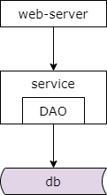
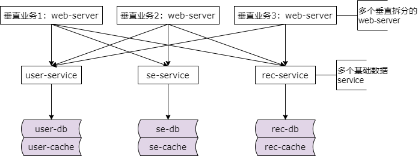
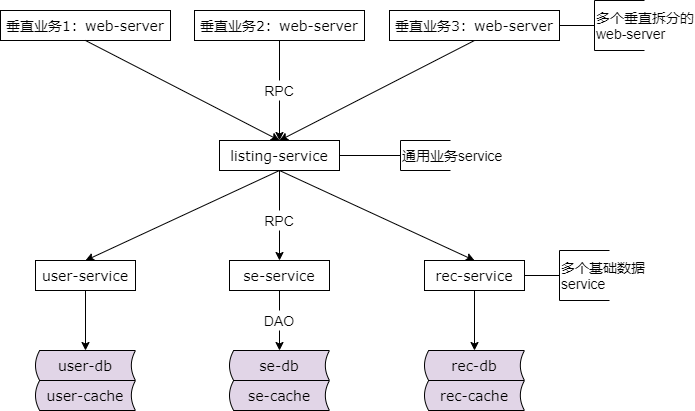
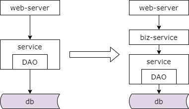

## 42、分层：业务服务层，是否有必要？

本章将要解答的问题是基础数据的访问需要服务化，那业务层是否需要进行服务化？如果需要进行服务化，那什么时候要服务化。

### 基础数据服务化后的架构

基础数据服务化后的架构如上。最上层是站点应用，他通过 rpc 接口从基础数据服务层获取数据，基础数据服务层通过 dao 从数据库和缓存获取数据，底层是数据库与缓存进行数据存储。

接下来呢？

（1）随着业务越来越复杂，业务会不断进行垂直拆分

（2）随着数据越来越复杂，基础数据 service 也会越来越多

随着时间的推移系统架构并不是一成不变的，站点所需的数据越来越多了，系统越来越复杂了。

### 架构变成了这个样子

于是我们的架构会变成这个样子，上游是多个垂直拆分开的子业务，中间是多个基础数据服务层，垂直业务要通过多个 rpc 接口去获取自己想要的基础数据，每个基础数据服务也有自己所依赖的缓存数据库。

上面的架构图的依赖关系是不是看上去非常的别扭，基础数据服务与存储层之间的连接关系是非常非常的清晰的，但是站点应用层与基础数据服务层之间的连接关系就变成了蜘蛛网。举一个更具体的例子，五八同城的列表页由房产、招聘、二手、黄页、二手车等多个站点应用层，这些站点应用层都需要先调用商业基础 service 获取商业帖子数据，用于顶部的精准智能置顶，再调用基础搜索 service 获取自然搜索的帖子数据，再调用推荐基础 service 获取推荐的帖子，再调用用户基础 service 获取用户的数据以用于列表页的展现。如此获取数据方便还是不方便，高效还是低效，如果只有一个列表页这么写还行，但如果有招聘、房产、二手、二手车、黄页等多个子业务都需要这么获取数据，刚刚提到的商业、推荐、自然搜索和用户的数据是每个业务都必须展现的共性数据，当然每个业务还有自己业务个性化的需要展现的数据，如果每一次都像上面那样获取共性的要展现的数据就略显低效了，会有大量的冗余的重复的每次比写的代码。特别的，不同业务的上游列表页都依赖于底层若干相同的服务，一旦一个服务的 rpc 接口有变化，上游的所有系统都需要升级，子系统与子系统之间可能出现代码拷贝，一旦代码拷贝，一处出现了 bug 多个子系统都需要进行升级修改。

### 提高“获取和处理数据”效率

那么如何让数据的获取更加高效快捷呢？业务服务化，通用业务服务层的抽象势在必行。通过通用业务服务层的抽象，例如五八同城他抽象出了通用列表服务，多个站点应用层通过 rpc 接口像调用本地函数一样去调用通用列表服务，一次性获取他所需要的商业、自然搜索、推荐和用户的数据。而通用业务服务，首先它是一个跟业务相关的服务，listing service 是一个列表页的服务，他可以多次调用基础服务，他可以分别调用商业、自然搜索、推荐和用户的基础服务，封装所有业务上游所需要共性展现的一些数据，底层数据的复杂性都屏蔽在了他这一层。这样的好处是复杂的代码只在通用业务服务写了一次，并没有任何代码的拷贝，当底层基础数据服务的接口发生变化的时候，只有通用业务服务这一处需要升级和修改，如果有 bug，不管是底层基础数据服务的 bug 还是通用业务服务的 bug 只有这一处需要升级，而业务服务获取数据更加的便捷，他一次性获取了所有的数据，只需要一个 rpc 的接口调用。

### 于是，架构又演进了

于是我们的架构又演进了，由三层的架构变成了四层的架构，原来只有一个基础数据服务层，升级为了还有一个业务服务层。

你会发现基础数据服务层他需要关注底层数据存储的复杂性，而业务服务层很多时候他可能并不直接调用缓存与数据库，他调用基础数据服务层的 rpc 接口。

这里的结论是，当业务越来越复杂，系统垂直拆分越来越多，基础数据服务越来越多，底层数据获取的复杂性成为通用痛点的时候，我们很有可能需要抽象出通用的业务服务，简化数据获取的过程，提高数据获取的效率，向上游屏蔽底层的复杂性。最后再强调几点，是否需要抽象出通用业务服务和业务的复杂性以及业务发展的阶段有关，千万不可一概而论，需要抽象什么通用业务服务和具体的业务有关，比如说五八同城他可能需要抽象出列表服务、详情页服务。总之，任何脱离业务的架构设计都是耍流氓。

### 总结

（1）分层架构，是一个“数据移动”，然后“被处理”，被“呈现”的过程！

（2）架构分层方法论：

* 让上游更高效的获取与处理数据，复用
* 让下游能屏蔽数据的获取细节，封装

（3）为了屏蔽多个基础服务的调用，需要**引入业务服务层**
