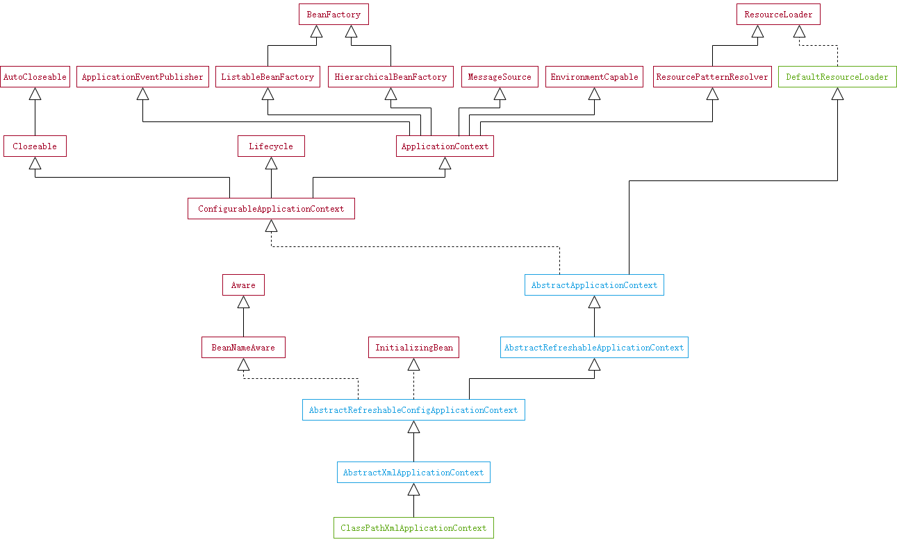

在分析 Spring 的源码之前需要建立一个基本的分析环境。

```
.
├── src/main/java
│   └── me.acomma.demo.spring
│       ├── service
│       │   └── Greeter.java
│       └── Application.java
└── src/main/resources
    └── services.xml
```

`Greeter` 类的代码非常简单，只有一个 `sayHello` 方法，这个方法简单的返回一个字符串。

```java
public class Greeter {
    public String sayHello() {
        return "Hello, Spring!";
    }
}
```

`services.xml` 文件声明了一个 bean 对象。

```xml
<?xml version="1.0" encoding="UTF-8"?>
<beans xmlns="http://www.springframework.org/schema/beans"
       xmlns:xsi="http://www.w3.org/2001/XMLSchema-instance"
       xsi:schemaLocation="http://www.springframework.org/schema/beans http://www.springframework.org/schema/beans/spring-beans.xsd">

    <bean id="greeter" class="com.acomma.demo.spring.service.Greeter"/>

</beans>
```

`Application` 类将上面两部分连接了起来。

```java
public class Application {
    public static void main(String[] args) {
        ApplicationContext context = new ClassPathXmlApplicationContext("services.xml");
        Greeter greeter = context.getBean("greeter", Greeter.class);
        String hello = greeter.sayHello();
        System.out.println(hello);
    }
}
```

我们选择分析的是 `ClassPathXmlApplicationContext` 类，它的类继承关系如下图。



完~
