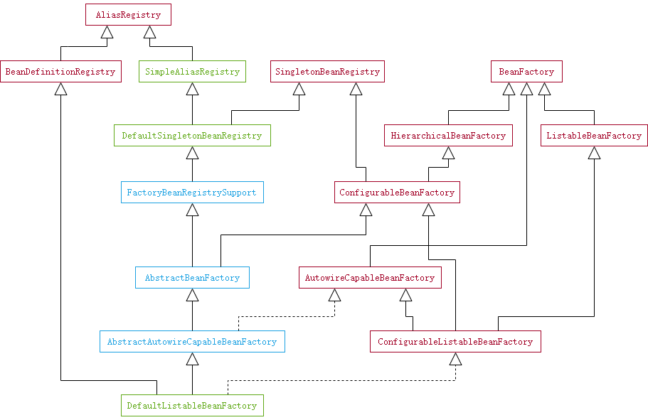

刷新容器的第二步是创建一个 BeanFactory。

```java
//AbstractApplicationContext.java
protected ConfigurableListableBeanFactory obtainFreshBeanFactory() {
    refreshBeanFactory();
    return getBeanFactory();
}

//AbstractRefreshableApplicationContext.java
protected final void refreshBeanFactory() throws BeansException {
    //如果 BeanFactory 已经存在，则销毁容器管理所有单例，然后再关闭 BeanFactory
    if (hasBeanFactory()) {
        destroyBeans();
        closeBeanFactory();
    }
    try {
        //创建 BeanFactory
        DefaultListableBeanFactory beanFactory = createBeanFactory();
        beanFactory.setSerializationId(getId());
        //配置 BeanFactory，1.是否允许BeanDefinition被覆盖；2.是否允许循环引用
        customizeBeanFactory(beanFactory);
        //加载 BeanDefinition
        loadBeanDefinitions(beanFactory);
        synchronized (this.beanFactoryMonitor) {
            this.beanFactory = beanFactory;
        }
    }
    catch (IOException ex) {
        throw new ApplicationContextException("I/O error parsing bean definition source for " + getDisplayName(), ex);
    }
}
```

`createBeanFactory()` 创建的是一个 `DefaultListableBeanFactory`，它的类图如下



加载 `BeanDefinition` 就是解析 XML 文件，构造 `BeanDefinition` 实例的过程，包括默认命名空间 `http://www.springframework.org/schema/beans`，比如 `<bean ... />`，和自定义命名空间，比如 `<aop/>`。内容还是挺多的，留待后续分析。

完~
