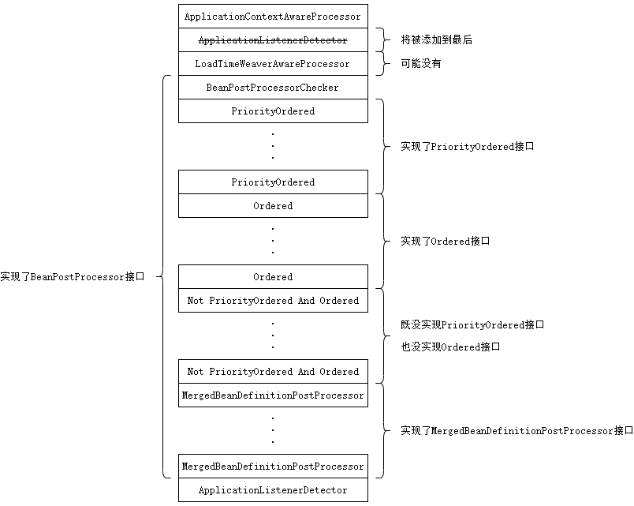

刷新容器的第六步是注册 bean 后置处理器。

```java
protected void registerBeanPostProcessors(ConfigurableListableBeanFactory beanFactory) {
    PostProcessorRegistrationDelegate.registerBeanPostProcessors(beanFactory, this);
}
```

具体逻辑交给了代理类 `PostProcessorRegistrationDelegate` 的 `registerBeanPostProcessors` 方法。

```java
public static void registerBeanPostProcessors(
        ConfigurableListableBeanFactory beanFactory, AbstractApplicationContext applicationContext) {

    String[] postProcessorNames = beanFactory.getBeanNamesForType(BeanPostProcessor.class, true, false);

    // Register BeanPostProcessorChecker that logs an info message when
    // a bean is created during BeanPostProcessor instantiation, i.e. when
    // a bean is not eligible for getting processed by all BeanPostProcessors.
    int beanProcessorTargetCount = beanFactory.getBeanPostProcessorCount() + 1 + postProcessorNames.length;
    beanFactory.addBeanPostProcessor(new BeanPostProcessorChecker(beanFactory, beanProcessorTargetCount));

    // Separate between BeanPostProcessors that implement PriorityOrdered,
    // Ordered, and the rest.
    List<BeanPostProcessor> priorityOrderedPostProcessors = new ArrayList<>();
    List<BeanPostProcessor> internalPostProcessors = new ArrayList<>();
    List<String> orderedPostProcessorNames = new ArrayList<>();
    List<String> nonOrderedPostProcessorNames = new ArrayList<>();
    for (String ppName : postProcessorNames) {
        if (beanFactory.isTypeMatch(ppName, PriorityOrdered.class)) {
            BeanPostProcessor pp = beanFactory.getBean(ppName, BeanPostProcessor.class);
            priorityOrderedPostProcessors.add(pp);
            if (pp instanceof MergedBeanDefinitionPostProcessor) {
                internalPostProcessors.add(pp);
            }
        }
        else if (beanFactory.isTypeMatch(ppName, Ordered.class)) {
            orderedPostProcessorNames.add(ppName);
        }
        else {
            nonOrderedPostProcessorNames.add(ppName);
        }
    }

    // First, register the BeanPostProcessors that implement PriorityOrdered.
    sortPostProcessors(priorityOrderedPostProcessors, beanFactory);
    registerBeanPostProcessors(beanFactory, priorityOrderedPostProcessors);

    // Next, register the BeanPostProcessors that implement Ordered.
    List<BeanPostProcessor> orderedPostProcessors = new ArrayList<>();
    for (String ppName : orderedPostProcessorNames) {
        BeanPostProcessor pp = beanFactory.getBean(ppName, BeanPostProcessor.class);
        orderedPostProcessors.add(pp);
        if (pp instanceof MergedBeanDefinitionPostProcessor) {
            internalPostProcessors.add(pp);
        }
    }
    sortPostProcessors(orderedPostProcessors, beanFactory);
    registerBeanPostProcessors(beanFactory, orderedPostProcessors);

    // Now, register all regular BeanPostProcessors.
    List<BeanPostProcessor> nonOrderedPostProcessors = new ArrayList<>();
    for (String ppName : nonOrderedPostProcessorNames) {
        BeanPostProcessor pp = beanFactory.getBean(ppName, BeanPostProcessor.class);
        nonOrderedPostProcessors.add(pp);
        if (pp instanceof MergedBeanDefinitionPostProcessor) {
            internalPostProcessors.add(pp);
        }
    }
    registerBeanPostProcessors(beanFactory, nonOrderedPostProcessors);

    // Finally, re-register all internal BeanPostProcessors.
    sortPostProcessors(internalPostProcessors, beanFactory);
    registerBeanPostProcessors(beanFactory, internalPostProcessors);

    // Re-register post-processor for detecting inner beans as ApplicationListeners,
    // moving it to the end of the processor chain (for picking up proxies etc).
    beanFactory.addBeanPostProcessor(new ApplicationListenerDetector(applicationContext));
}
```

这个代码看起来也挺长的，简单归纳一下它的逻辑。

1. 从 BeanFactory 中获取类型为 `BeanPostProcessor` 的 bean 的名字。
2. 添加一个后置处理器 `BeanPostProcessorChecker`。这个后置处理器的作用就是打日志。
3. 将从 BeanFactory 中获取 bean 后置处理器按照是否实现了 `PriorityOrdered`接口，是否实现了 `MergedBeanDefinitionPostProcessor` 接口，是否实现了 `Ordered` 接口，或者都没实现分类。
4. 将实现了 `PriorityOrdered` 接口的 bean 后置处理器排序后加入 BeanFactory 的 bean 后置处理器集合。
5. 将实现了 `Ordered` 接口的 bean 后置处理器排序后加入 BeanFactory 的 bean 后置处理器集合。
6. 将既没实现 `PriorityOrdered` 接口，又没实现 `Ordered` 接口的 bean 后置处理器加入 BeanFactory 的 bean 后置处理器集合。
7. 将实现了 `MergedBeanDefinitionPostProcessor` 接口的 bean 后置处理器排序后加入 BeanFactory 的 bean 后置处理器集合。
8. 再次将 `ApplicationListenerDetector` 添加到 BeanFactory 的 bean 后置处理器集合。

经过这几个步骤后，所有的 bean 后置处理器在集合中的位置如下图。



因为 `addBeanPostProcessor` 方法在添加之前会移除原来的 bean 后置处理器，因此 bean 后置处理器集合中只会又一个 `ApplicationListenerDetector` 且在最后。

完~
