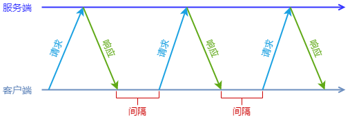
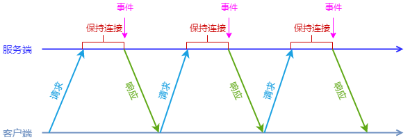
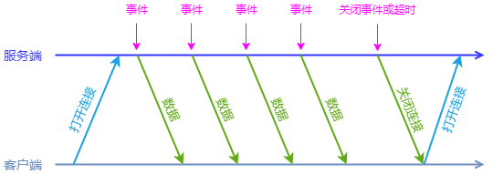
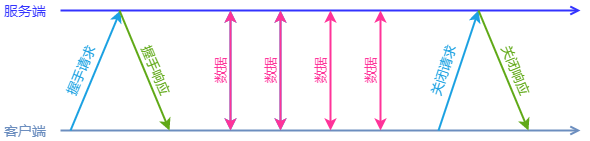

客户端想要及时获取服务端的数据有四种方式：Polling、Long Polling、Comet Streaming、WebSocket。

## Polling

客户端向服务端发起请求，服务端处理后立即向客户端返回结果，这时候可能有数据也可能没有，等待一段时间后，客户端再次向服务端发起请求，如此循环即为轮询。

## Long Polling

客户端向服务端发起请求，如果服务端有客户端想要的数据则立即返回结果，如果没有则保持连接一段时间，直到有数据产生或者超时，客户端收到响应结果后立即发起下一次请求，如此循环，这就是长轮询。

## Comet Streaming

客户端连接服务端，当服务端有数据产生时立即向客户端推送数据，连接会一直保持直到超时或者关闭，客户端立即重新与服务端建立连接，这就是流推送。

## WebSocket

WebSocket 分为 3 个阶段：建立连接阶段、数据传输阶段、关闭连接阶段，连接一旦建立后就可以进行双向的数据传输。

参考资料：

1. [大中型网站技术架构浅析 - 实时通信](http://kenny7.com/2013/05/technical-guide-for-website-realtime-communication.html)
2. [Long polling](https://javascript.info/long-polling)
3. [Long Polling长轮询详解](https://www.jianshu.com/p/d3f66b1eb748)
4. [Long Polling长轮询实现进阶](https://www.jianshu.com/p/6e90c2f2e463)
