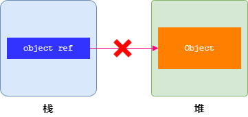
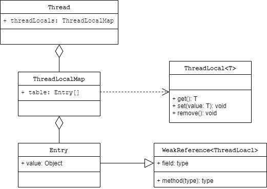
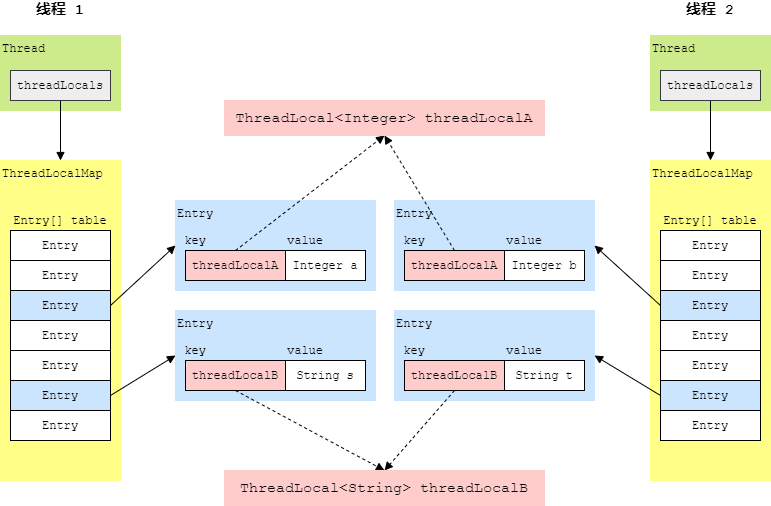
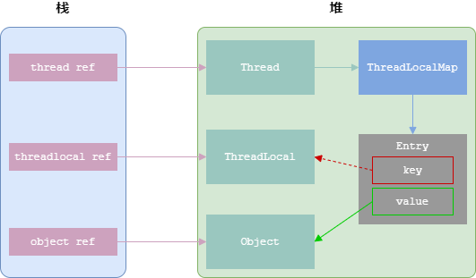
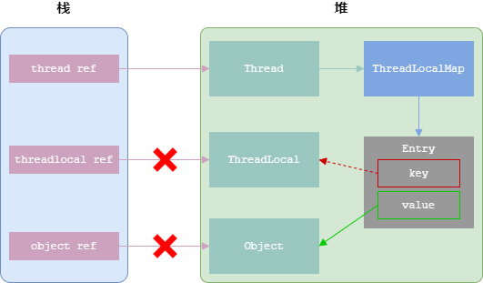

`Object object = new Object();`


`object = null;`



ThreadLocal 与 Thread 的关系



ThreadLocal 线程隔离



ThreadLocal 引用关系



ThreadLocal 内存泄漏



只要线程依然存活，就存在如下引用关系

```
thread ref -> Thread -> ThreadLocalMap -> Entry -> value -> Object
```

因此，Object 的内存空间不会被回收，从而导致内存泄漏。
