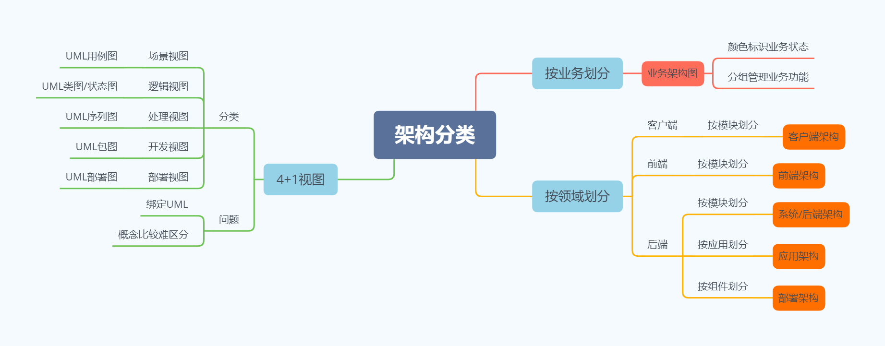
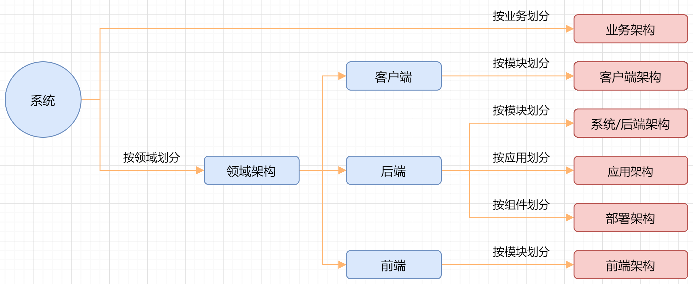

## 架构图分类

## 业务架构

定义

描述系统对用户提供了什么业务功能，类似与4+1视图的场景视图。

使用场景

1. 产品人员规划业务
2. 给高P汇报业务
3. 给新员工培训业务

画图技巧

1. 通过不同颜色来标识业务状态
2. 业务分组管理

## 客户端架构、前端架构

定义

客户端和前端的领域逻辑结构，类似于4+1视图的逻辑视图。

使用场景

1. 整体架构设计
2. 架构培训

画图技巧

1. 同步不同颜色来标识不同角色
2. 通过连接线来表示关系

## 系统架构

定义

后端的逻辑架构，又叫“后端架构”，“技术架构”。

使用场景

1. 整体架构设计
2. 架构培训

画图技巧

1. 同步不同颜色来标识不同角色
2. 通过连接线来表示关系

简单，画1张图；复杂，画2张图，功能示意图和交互示意图。

## 应用架构

定义

描述后端系统由哪些应用组成。

使用场景

1. 项目开发、测试
2. 部署发布
3. 子域架构设计

画图技巧

1. 同步不同颜色来标识不同角色
2. 通过连接线来表示关系

## 部署架构

定义

描述后端系统具体如何部署的。对应4+1视图的物理视图。

使用场景

1. 总体架构设计
2. 运维规划和优化

画图技巧

1. 用图标代替区块
