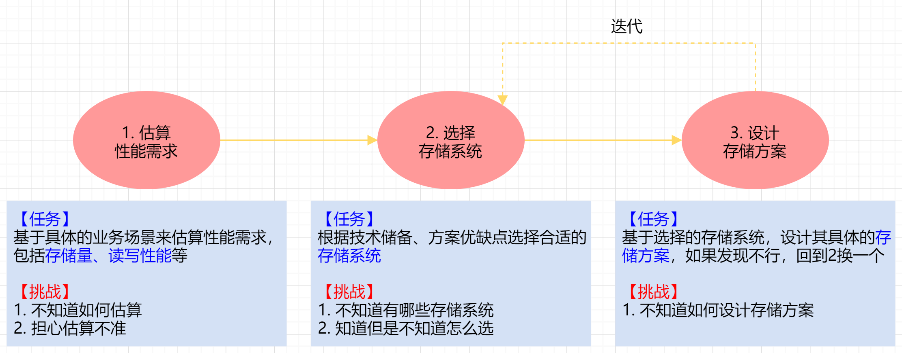
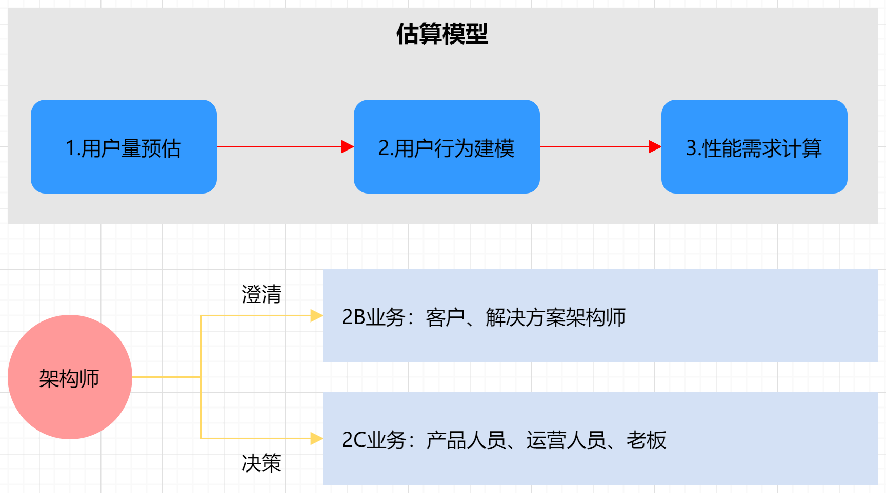
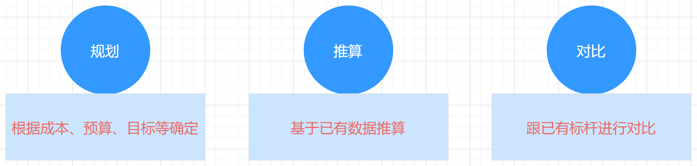
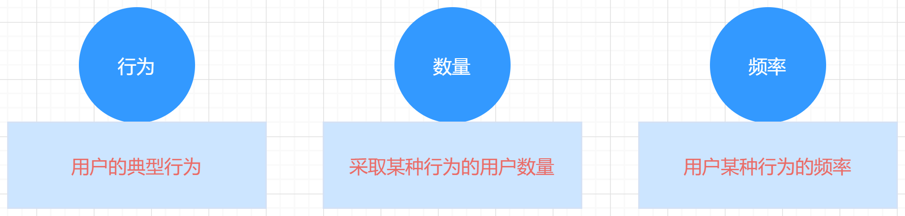
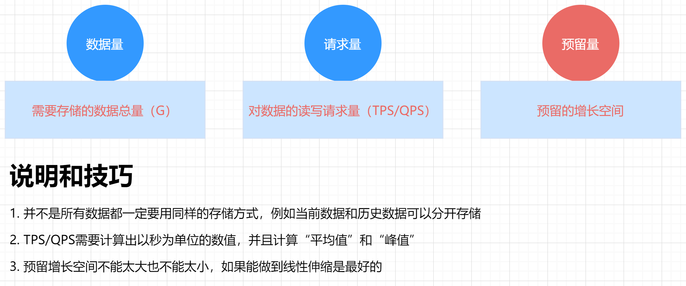
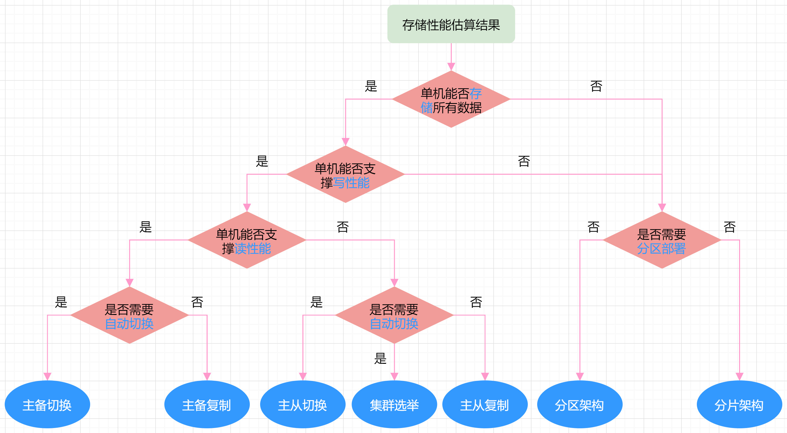
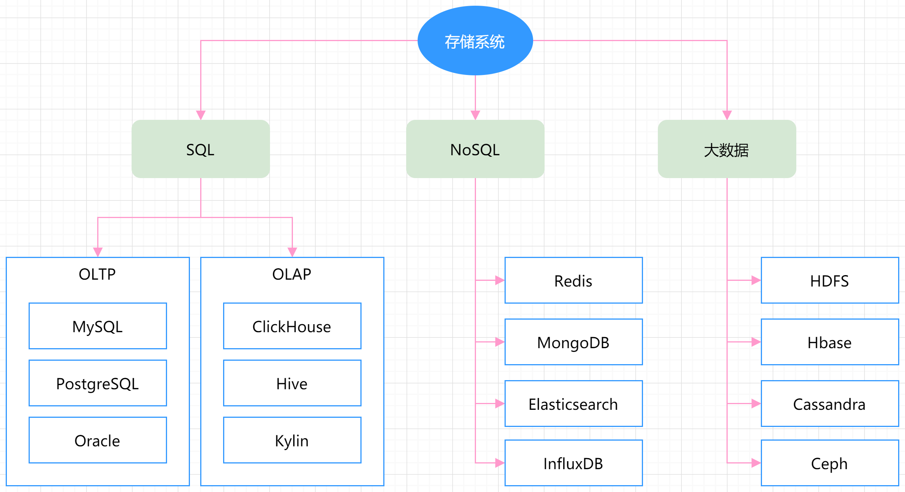
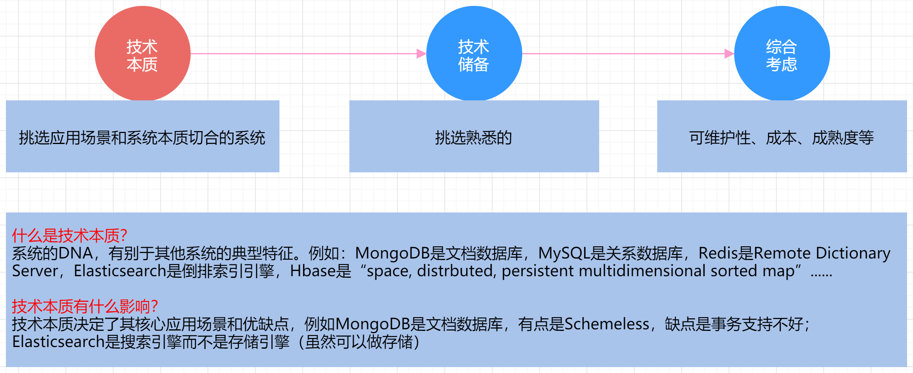
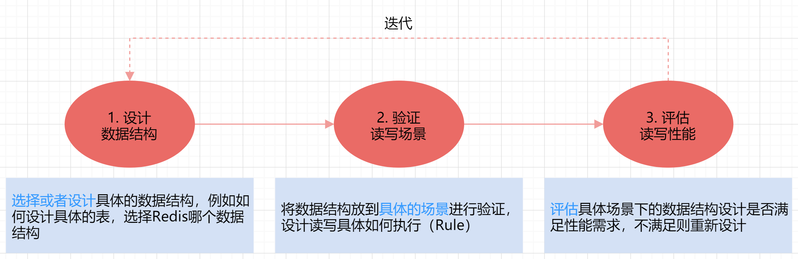

存储结构设计三个步骤

性能估算步骤

用户量预估

用户行为建模

存储性能需求计算

存储结构选择逻辑

常见存储系统分类

更多请参考：[https://db-engines.com/en/ranking/relational+dbms](https://db-engines.com/en/ranking/relational+dbms)

如何选择合适的存储系统

存储方案设计三个步骤

