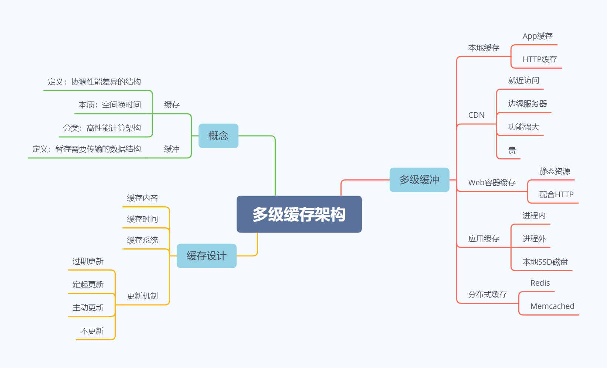
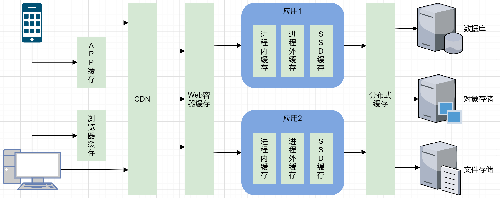
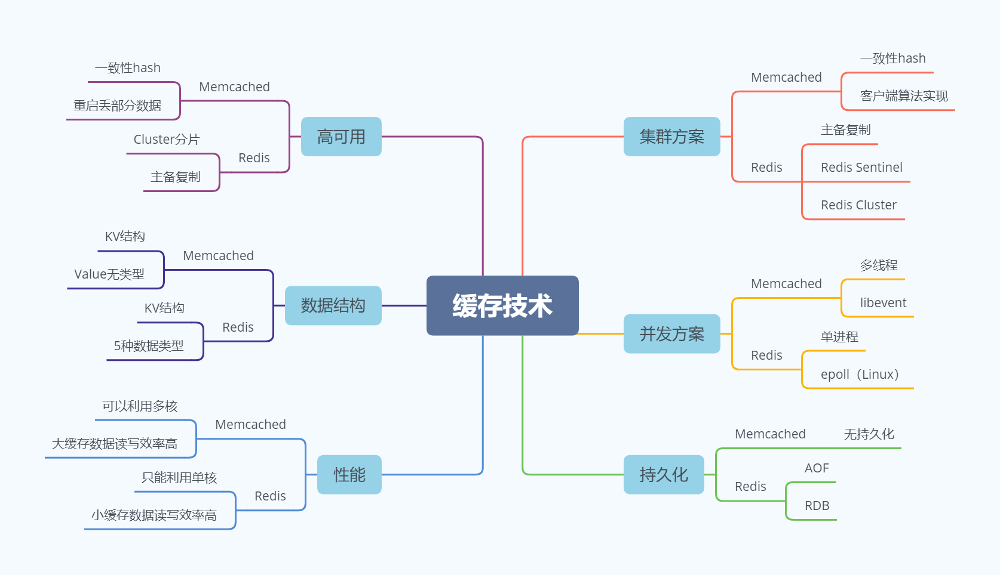

多级缓存架构

Redis vs Memcached

1、如果有较多大的缓存对象读写就用Memcached，否则用Redis

技术原理：Redis是单进程

2、如果是数据库+缓存这种组合方案就能满足需求，用Memcached更简单一些；如果业务上有MySQL难以满足用Redis可以很好满足的强需求，用Redis

技术原理：Redis支持复杂的数据结构

3、如果缓存生成的代价很高，丢失后可能引起严重的系统问题，则用Redis；如果短时间丢失部分缓存影响不大，则用Memcached

技术原理：Redis支持持久化
