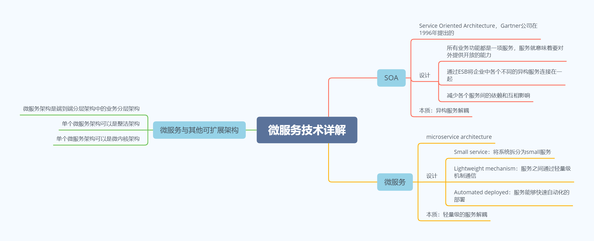

微服务 vs SOA

&nbsp; | SOA | 微服务 | 案例
--- | --- | --- | ---
服务粒度 | 粗 | 细 | SOA：员工管理系统 微服务：员工信息服务、福利服务、考勤服务
服务通信 | 重量级 | 轻量级、标准化 | SOA：ESB 微服务：Dubbo、HTTP
服务交付 | 慢 | 快 | NA
应用场景 | 企业级 | 互联网 | NA
技术本质 | Smart pipes and dumb endpoints |Smart endpoints and dumb pipes | ESB很强大
