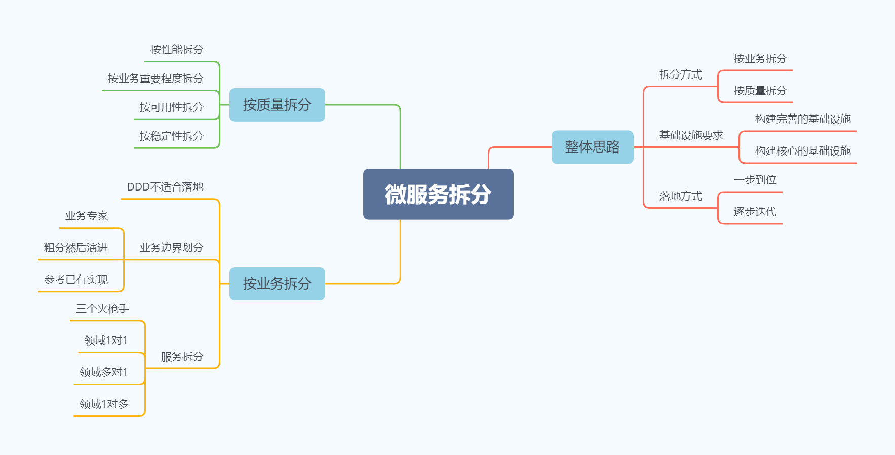
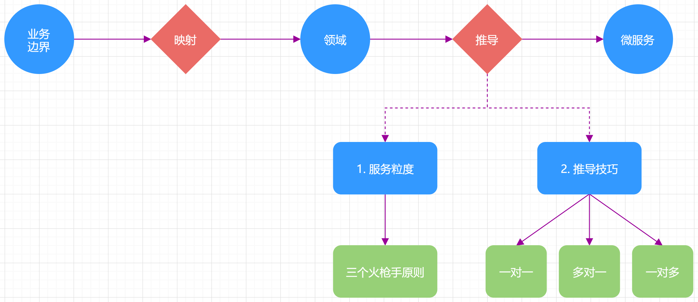

常见场景实施建议

&nbsp; | 拆分方式 | 基础设施要求 | 落地方式
--- | --- | --- | ---
从0开始构建业务系统 | 按业务拆分微服务 | 搭建完善基础设施 | 一步到位
单体架构微服务化 | 按业务拆分微服务 | 搭建完善基础设施 | 逐步落地
粗粒度服务微服务化 | 按质量拆分微服务 | 搭建核心基础设施 | 逐步落地
局部系统优化 | 按质量拆分微服务 | 重用已有基础设施 | 逐步落地

服务拆分技巧

