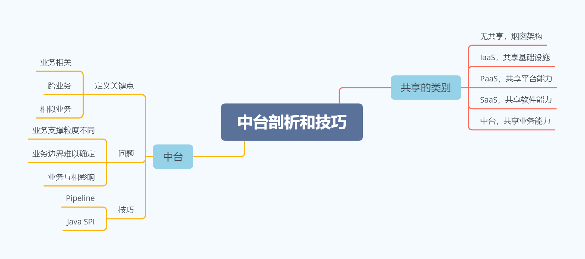
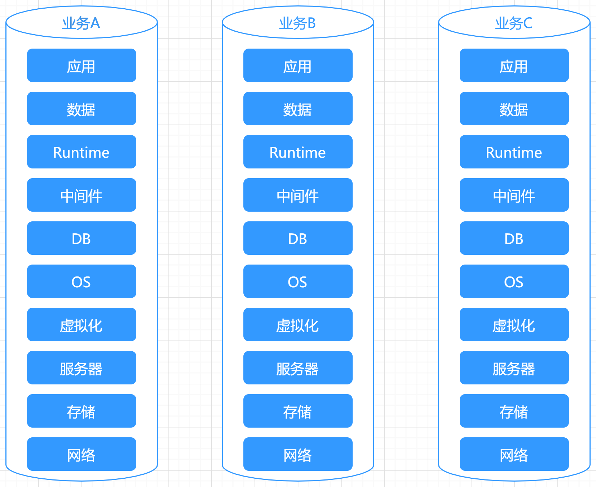
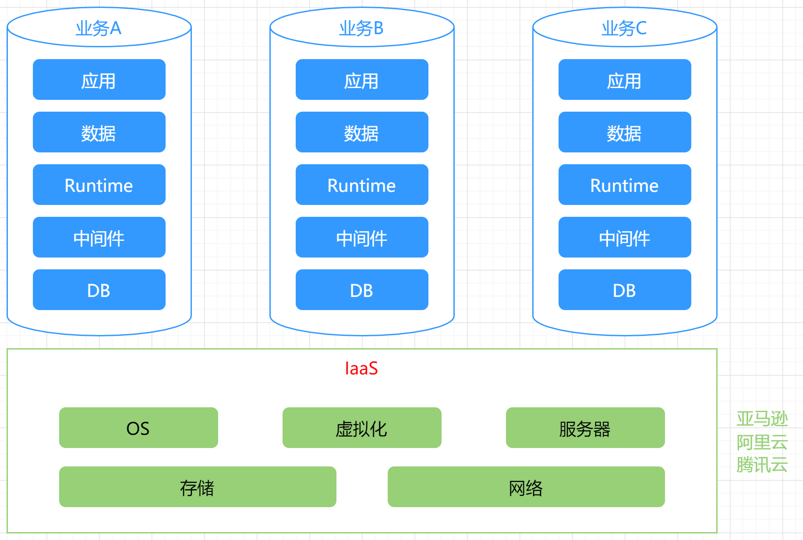
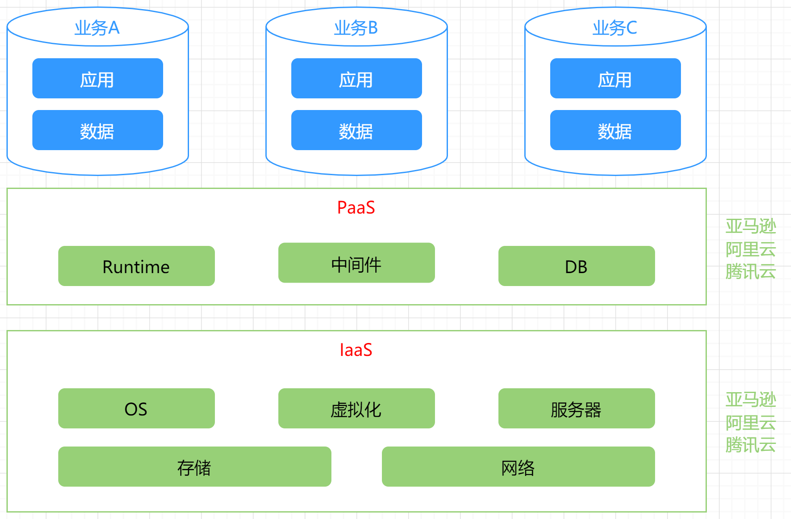
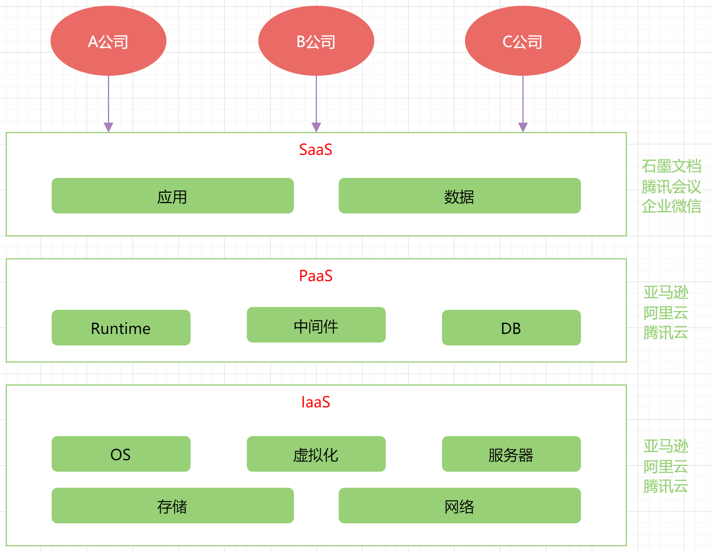
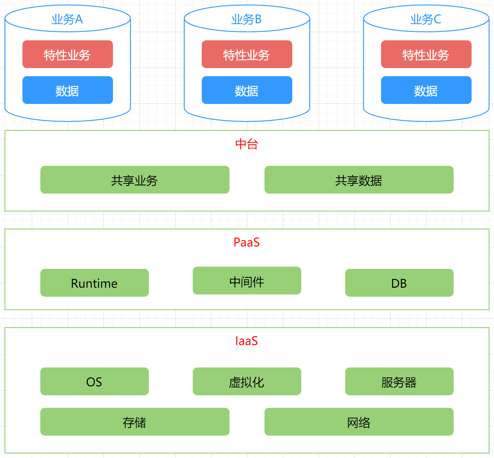
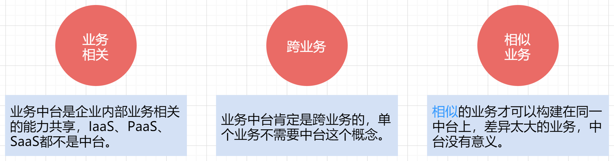
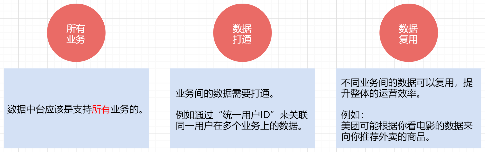

烟囱架构

IaaS架构

PaaS架构

SaaS架构

中台架构

理解中台概念 - 业务中台

业务中台，是将企业内多个相似的通用业务能力沉淀到平台，以减少重复建设，提升业务开发效率的一种架构模式。

理解中台概念 - 数据中台

数据中台，是将企业所有业务的数据沉淀到同一平台，支持业务间数据打通以及数据复用，提升企业运营效率的一种架构模式。

中台与业务的边界难以明确

1. 没有任何明确的规则，都是靠人肉讨论；
2. 在已有业务的基础上比较容易提炼，创新业务几乎无法判断；
3. 创新业务对中台KPI没有帮助，大部分情况下都会被拒掉，由业务自己实现；
4. 中台适合做“组合式创新”，没法做“颠覆式创新”。

中台设计最难的不是领域划分，而是中台和业务的边界划分！

Pipeline和SPI方案对比

&nbsp; | Pipeline | SPI | 对比
--- | --- | --- | ---
开发模式 | 中台团队负责框架和实际的业务代码实现。 | 中台团队负责框架，业务团队负责业务代码实现。 | SPI看起来好些。
开发难度 | 中台团队全部搞定，开发难度低。 | 业务团队需要熟悉中台团队的设计和原理，并且需要明确边界，开发难度高。 | Pipeline好一些。
部署方式 | 统一部署。 | 业务代码更新只需要发布jar包。 | SPI更好一些。
业务隔离 | Pipeline做业务隔离，代码级别隔离。 | 微内核+插件做业务隔离，插件级别隔离。 | SPI好一些。
