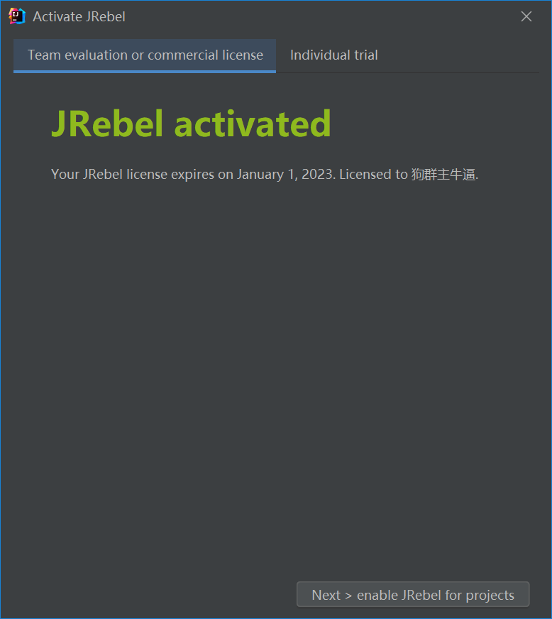

太长不看版：显示激活成功，但是 JRebel 不能正常工作。这篇文章只是记录了尝试激活的过程。

[ja-netfilter](https://github.com/ja-netfilter/ja-netfilter) 的作者说 [plugin-power](https://github.com/ja-netfilter/plugin-power) 是非对称加密的“屠龙刀”，并在 QQ 群里公布了生成 [JRebel](https://plugins.jetbrains.com/plugin/4441-jrebel-and-xrebel) 激活码的片段（替换了相关隐私信息）。

```java
KeyFactory keyFactory = KeyFactory.getInstance("RSA");
PrivateKey privateKey = keyFactory.generatePrivate(new PKCS8EncodedKeySpec(Base64.getDecoder().decode(CERT_PRIVATE)));

Map<String, Object> abc = new HashMap<>();
abc.put("Type", "dedicated");
abc.put("Name", "狗群主牛逼");
abc.put("commercial", "true");
abc.put("Seats", "Unlimited");
abc.put("validFrom", DateUtils.parseDateTime("2022-01-01 00:00:00"));
abc.put("validUntil", DateUtils.parseDateTime("2022-12-31 23:59:59"));
ByteArrayOutputStream os = new ByteArrayOutputStream();
ObjectOutputStream oos = new ObjectOutputStream(os);
oos.writeObject(abc);

byte[] licenseByte = os.toByteArray();
com.zeroturnaround.licensing.UserLicense license = new UserLicense();
license.setLicense(licenseByte);

final Signature signature = Signature.getInstance("SHA1withRSA");
signature.initSign(privateKey);
signature.update(licenseByte);
license.setSignature(signature.sign());

os = new ByteArrayOutputStream();
oos = new ObjectOutputStream(os);
oos.writeObject(license);

System.out.println(Base64.getEncoder().encodeToString(os.toByteArray()));
```

其中 `CERT_PRIVATE` 是私钥证书，`DateUtils` 是 ja-netfilter 中的工具类，`UserLicense` 是 jrebel.jar 中类。plugin-power 的配置中 `y` 代表指数（exponent），`z` 代表模数（modulus）。除此之外没有公布更多的细节，今天来尝试一下根据这些信息是否能激活 JRebel。

要使上面的代码片段不报错需要进行如下的一些操作。首先，在 IntelliJ IDEA 中安装 [JRebel and XRebel](https://plugins.jetbrains.com/plugin/4441-jrebel-and-xrebel/) 插件，版本为 2021.4.2。然后在 `pom.xml` 文件中加入类似如下的依赖

```xml
<dependency>
    <groupId>com.ja-netfilter</groupId>
    <artifactId>ja-netfilter</artifactId>
    <version>2.0.1</version>
</dependency>
<dependency>
    <groupId>com.zeroturnaround</groupId>
    <artifactId>licensing</artifactId>
    <version>6.0</version>
    <scope>system</scope>
    <systemPath>C:/Users/{用户名}/AppData/Roaming/JetBrains/IntelliJIdea2021.3/plugins/jr-ide-idea/lib/jrebel6/jrebel.jar</systemPath>
</dependency>
```

在生成激活码的片段中会根据 `CERT_PRIVATE` 生成私钥，这样做的目的我想作者是想让 plugin-power 的配置能通用起来，只要你拿到了 `CERT_PRIVATE` 和这段代码片段就能生成自己的激活码，而不需要更改 `power.conf` 配置文件。但是在尝试的过程中这种方式没能激活成功，因此选择牺牲通用性，改为直接使用 RSA 的 `PrivateKey` 对象。

```java
public class JRebelActivationCodeGenerator {
    public static void main(String[] args) throws Exception {
        KeyPairGenerator keyPairGenerator = KeyPairGenerator.getInstance("RSA");
        keyPairGenerator.initialize(2048);
        KeyPair keyPair = keyPairGenerator.generateKeyPair();
        RSAPublicKey publicKey = (RSAPublicKey) keyPair.getPublic();
        RSAPrivateKey privateKey = (RSAPrivateKey) keyPair.getPrivate();
        String activationCode = generateActivationCode(privateKey);

        System.out.println("公钥指数：" + publicKey.getPublicExponent());
        System.out.println("公钥模数：" + publicKey.getModulus());
        System.out.println("私钥指数：" + privateKey.getPrivateExponent());
        System.out.println("私钥模数：" + privateKey.getModulus());
        System.out.println("激活码：" + activationCode);
    }

    private static String generateActivationCode(RSAPrivateKey privateKey) throws Exception {
        Map<String, Object> abc = new HashMap<>();
        abc.put("Type", "dedicated");
        abc.put("Name", "狗群主牛逼");
        abc.put("commercial", "true");
        abc.put("Seats", "Unlimited");
        abc.put("validFrom", DateUtils.parseDateTime("2022-01-01 00:00:00"));
        abc.put("validUntil", DateUtils.parseDateTime("2022-12-31 23:59:59"));
        ByteArrayOutputStream os = new ByteArrayOutputStream();
        ObjectOutputStream oos = new ObjectOutputStream(os);
        oos.writeObject(abc);

        byte[] licenseByte = os.toByteArray();
        com.zeroturnaround.licensing.UserLicense license = new UserLicense();
        license.setLicense(licenseByte);

        final Signature signature = Signature.getInstance("SHA1withRSA");
        signature.initSign(privateKey);
        signature.update(licenseByte);
        license.setSignature(signature.sign());

        os = new ByteArrayOutputStream();
        oos = new ObjectOutputStream(os);
        oos.writeObject(license);

        return Base64.getEncoder().encodeToString(os.toByteArray());
    }
}
```

`keysize` 一开始选择的 1024，但是没有激活成功，然后改为 2048 就可以了。运行下上面的代码可以得到类似如下的结果。

```
公钥指数：65537
公钥模数：16585698039045204581497234996160733043317037940461810589928977800470814802501123357463091404916035094043782790777799147084296278747964813355600887318910114123183574275979796303997300496379802542768910290594313061979610384845093988183212683603899724572936194133530602301598134706694971319706585571607293367833005876836750113081853479019242312942511772793211501196748485990310199418432212831700753338897581196302855525217996544123384205477193232988887388715630384986104105241821464898316001751158353535789255351109606767320810841950229010275805625601538106988194513811955139070981790107196679569231293798050041796487513
私钥指数：12015944319908850169057001657349460684753543210905698564319817293534252205971486900717878143726648248549656024934463028572598491156955145003950899948149170980801014795055018211297310337185300284277093254152890492131038971458032295633595346407573720535316088582938385908416305840576731285528307413215653586595340889590914425540633104574904198770149634023699602369736227184355032406266794651703173126313740166638346463053086611866831752298562322924346620380717973176885377099129437567071582391131304937713561183681989654106937665326317287341133694970022312564414743264234792812176147600948879932182695556508932882431073
私钥模数：16585698039045204581497234996160733043317037940461810589928977800470814802501123357463091404916035094043782790777799147084296278747964813355600887318910114123183574275979796303997300496379802542768910290594313061979610384845093988183212683603899724572936194133530602301598134706694971319706585571607293367833005876836750113081853479019242312942511772793211501196748485990310199418432212831700753338897581196302855525217996544123384205477193232988887388715630384986104105241821464898316001751158353535789255351109606767320810841950229010275805625601538106988194513811955139070981790107196679569231293798050041796487513
激活码：rO0ABXNyAChjb20uemVyb3R1cm5hcm91bmQubGljZW5zaW5nLlVzZXJMaWNlbnNlAAAAAAAAAAECAANMAAdkYXRhTWFwdAAPTGphdmEvdXRpbC9NYXA7WwAHbGljZW5zZXQAAltCWwAJc2lnbmF0dXJlcQB+AAJ4cHB1cgACW0Ks8xf4BghU4AIAAHhwAAAA+qztAAVzcgARamF2YS51dGlsLkhhc2hNYXAFB9rBwxZg0QMAAkYACmxvYWRGYWN0b3JJAAl0aHJlc2hvbGR4cD9AAAAAAAAMdwgAAAAQAAAABnQABFR5cGV0AAlkZWRpY2F0ZWR0AApjb21tZXJjaWFsdAAEdHJ1ZXQACnZhbGlkVW50aWxzcgAOamF2YS51dGlsLkRhdGVoaoEBS1l0GQMAAHhwdwgAAAGFaOlQGHh0AAl2YWxpZEZyb21zcQB+AAd3CAAAAX4ROCgAeHQABE5hbWV0AA/ni5fnvqTkuLvniZvpgLx0AAVTZWF0c3QACVVubGltaXRlZHh1cQB+AAQAAAEAI/1iwEojlRd92HEAW9yPnVc1f+KWtNpqv0P7VtQml5RiqA40c5a3hFRHkKpJ/t9slNBbjD6BaO9+2X9GqTPQSsHtMAQ6M/RqollM0Qxdf8u9HfELN2lA6jsG8CqmrHJA47t+UNIKIQeSEFUYWYVZS9knjSs+M5CLFkz4NM763czNgUBUyAYpkOABL2kUvHVlcAgKnieKvvEmcP+EGppBuEbwu2cJL/hT3GUo2AxK6ju3HPbtJ0hsceHhP92TF/Och7Mkw+WO3lUDyXQZHS9ENpBeOskZ+5SPNyvsyDVwt5ZxVzRb0F2JCbe63wXSmeNoc98CHWbgK83U+QYDkPGWtw==
```

结果中的公钥指数和公钥模数就是 plugin-power 配置的 `fakeY` 和 `fakeZ`。

为了找到 JRebel 激活时使用的 `y` 和 `z` 我们需要修改一下 plugin-power 的代码。

```java
// ArgsFilter.java
public static BigInteger[] testFilter(BigInteger x, BigInteger y, BigInteger z) {
    DebugInfo.output("Plugin Power ArgsFilter: " + y.intValue() + "," + z.intValue());
    if (l1cached.contains(y.intValue() + "," + z.intValue())) {
        return l2cached.getOrDefault(y.intValue() + "," + z.intValue(), null);
    }
    return null;
}

// ResultFilter.java
public static BigInteger testFilter(BigInteger x, BigInteger y, BigInteger z) {
    DebugInfo.output("Plugin Power ResultFilter: " + x.intValue() + "," + y.intValue() + "," + z.intValue());
    if (l1cached.contains(x.intValue() + "," + y.intValue() + "," + z.intValue())) {
        return l2cached.getOrDefault(x + "," + y + "," + z, null);
    }

    return null;
}
```

然后重新打包，用打包好的 power.jar 替换 [ja-netfilter-all.zip](https://jetbra.in/52c2a991-6278-42fa-8e91-aaa649bbdb7b.html) 对应的文件。

要使 ja-netfilter 显示日志输出需要根据 ja-netfilter 的文档设置系统环境变量 `JANF_DEBUG=1`，然后用 `C:\Program Files\JetBrains\IntelliJ IDEA 2021.3.1\bin\idea.bat` 启动 IntelliJ IDEA。在 JRebel 的激活窗口选择 “Activation code” 项并输入上面的激活码，然后关闭激活窗口就可以在控制台看到如下的输出

```
2022-03-26 14:38:16.870 DEBUG [rebel-ide-activation-dialog-1@10892] com.janetfilter.plugins.power.ResultFilter-37 : Plugin Power ResultFilter: -1863215433,65537,-1252335993
2022-03-26 14:38:16.870 DEBUG [rebel-ide-activation-dialog-1@10892] com.janetfilter.plugins.power.ArgsFilter-54 : Plugin Power ArgsFilter: 65537,-1252335993
```

其中 `65537,-1252335993` 就是 `y,z`。

这样 plugin-power 配置需要的参数就找齐了，接下来就可以进行配置了。

```
[Args]
EQUAL,65537,-1252335993->65537,16585698039045204581497234996160733043317037940461810589928977800470814802501123357463091404916035094043782790777799147084296278747964813355600887318910114123183574275979796303997300496379802542768910290594313061979610384845093988183212683603899724572936194133530602301598134706694971319706585571607293367833005876836750113081853479019242312942511772793211501196748485990310199418432212831700753338897581196302855525217996544123384205477193232988887388715630384986104105241821464898316001751158353535789255351109606767320810841950229010275805625601538106988194513811955139070981790107196679569231293798050041796487513
```

配置好后重启 IntelliJ IDEA，在 JRebel 激活窗口重新输入激活码就可以激活成功了。



创建一个简单的项目试一下 JRebel 是否可用了呢？用 JRebel 选项启动项目后在 JReble Console 看到了类似如下输出

```
[2022-03-26 14:53:36] JRebel: Directory 'E:\git\gitee\mvc-demo\target\classes' will be monitored for changes.
[2022-03-26 14:53:36] JRebel:  Starting logging to file: C:\Users\{用户名}\.jrebel\jrebel.log
[2022-03-26 14:53:36] JRebel:  
[2022-03-26 14:53:36] JRebel:  #############################################################
[2022-03-26 14:53:36] JRebel:  
[2022-03-26 14:53:36] JRebel:  JRebel Agent 2021.4.2 (202112061403)
[2022-03-26 14:53:36] JRebel:  (c) Copyright 2007-2021 Perforce Software, Inc.
[2022-03-26 14:53:36] JRebel:  
[2022-03-26 14:53:36] JRebel:  Over the last 1 days JRebel prevented
[2022-03-26 14:53:36] JRebel:  at least 0 redeploys/restarts saving you about 0 hours.
[2022-03-26 14:53:36] JRebel:  
[2022-03-26 14:53:36] JRebel:  UNABLE TO INITIALIZE LICENSING - NO LICENSE FOUND
[2022-03-26 14:53:36] JRebel:  
[2022-03-26 14:53:36] JRebel:  If you think this is an error, contact support@jrebel.com.
[2022-03-26 14:53:36] JRebel:  
[2022-03-26 14:53:36] JRebel:  
[2022-03-26 14:53:36] JRebel:  #############################################################
[2022-03-26 14:53:36] JRebel:  
[2022-03-26 14:53:36] JRebel: UNABLE TO INITIALIZE LICENSING - NO LICENSE FOUND
```

在其他配置都正确的情况下热加载并没有生效，看起来是一次不太成功的尝试。

完~
