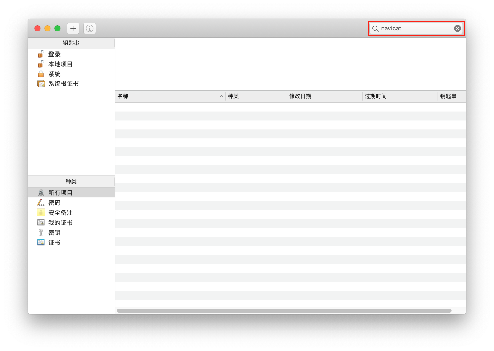
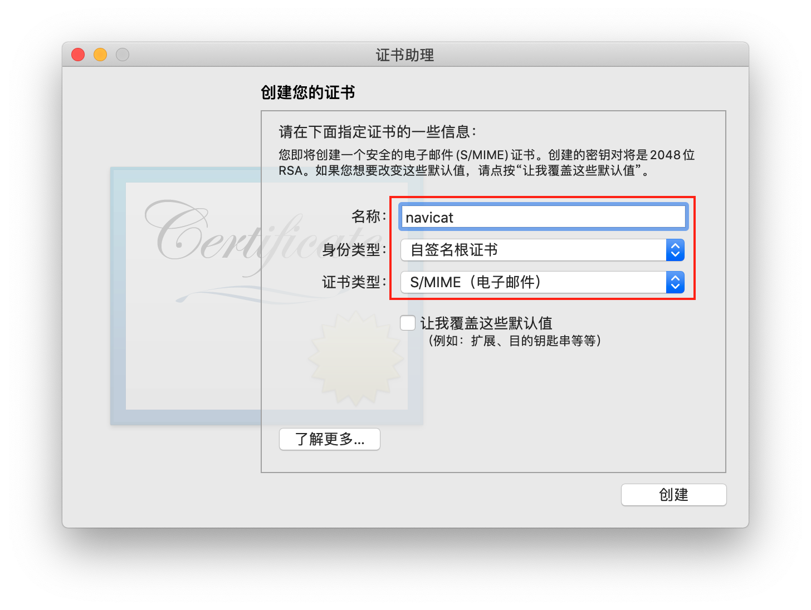
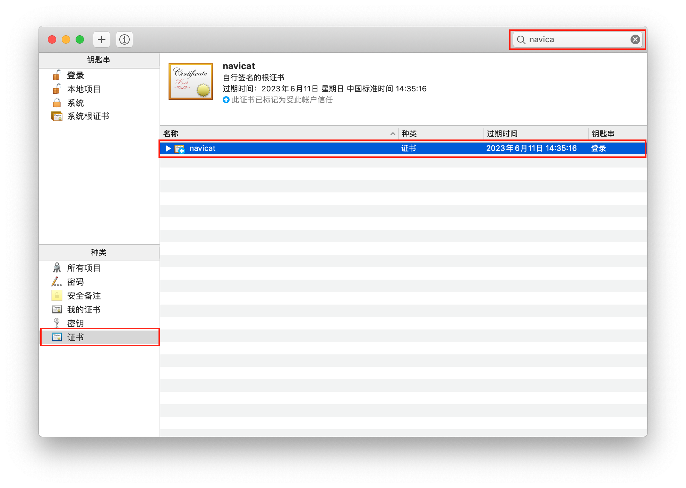
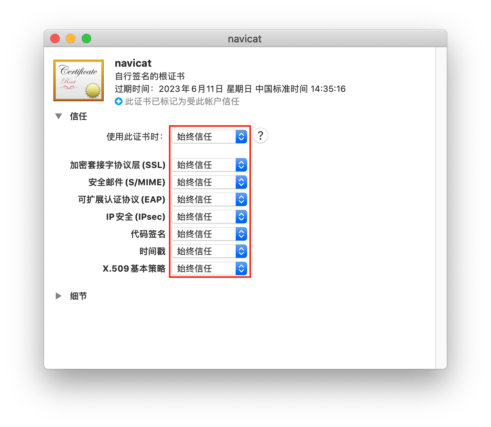
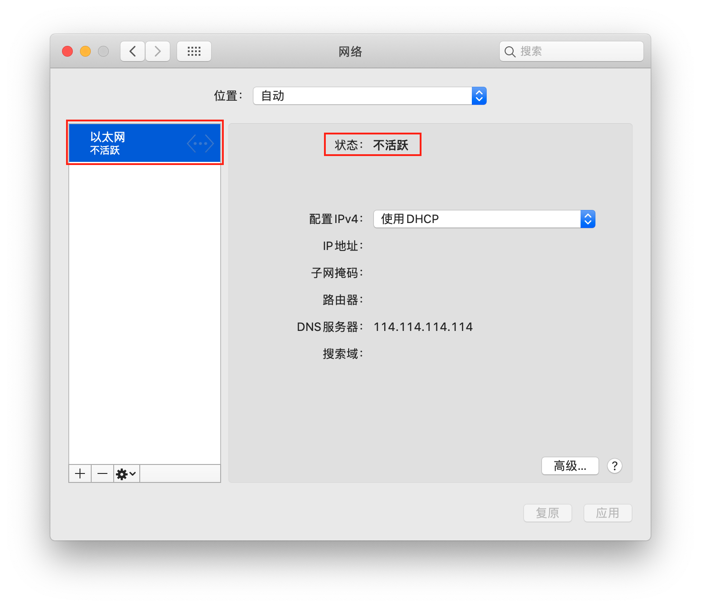
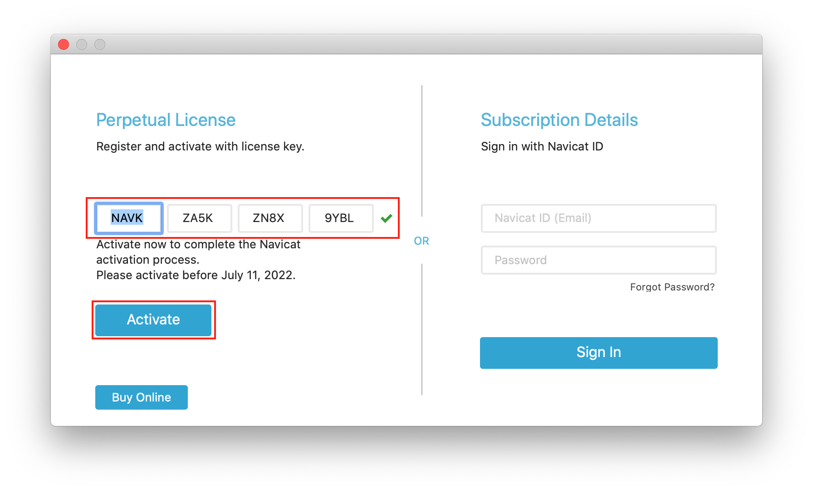
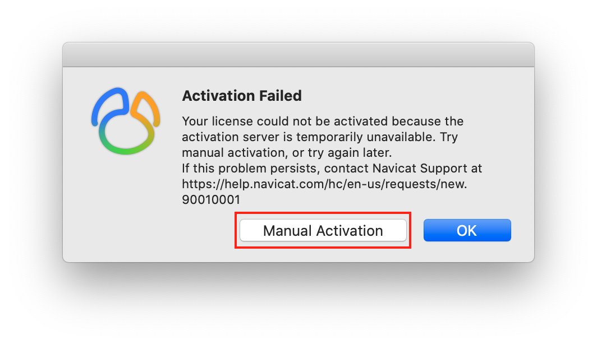
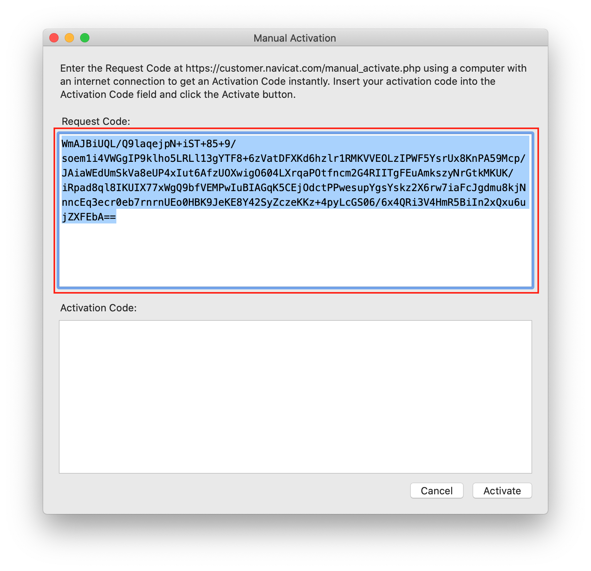
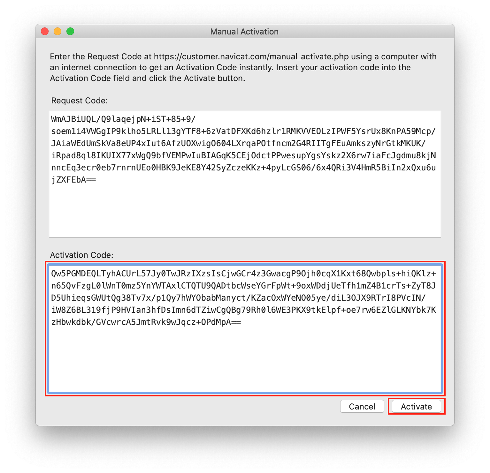
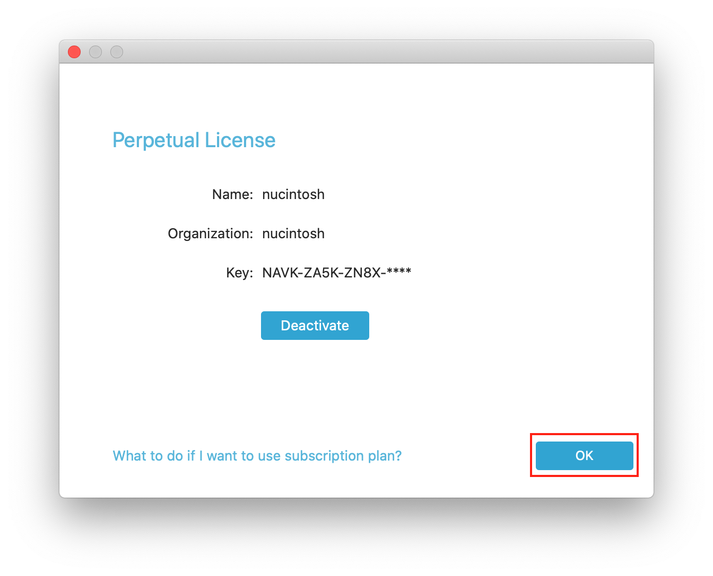

## 编译 Navicat Keygen

**第 1 步**

使用如下的命令安装 Homebrew

```shell
$ /bin/bash -c "$(curl -fsSL https://raw.githubusercontent.com/Homebrew/install/HEAD/install.sh)"
```

如果速度比较慢或者出错，则使用下面的命令进行安装

```shell
$ /bin/bash -c "$(curl -fsSL https://gitee.com/ineo6/homebrew-install/raw/master/install.sh)"
```

**第 2 步**

我们需要安装如下 5 个依赖

```shell
$ brew install openssl@1.1
$ brew install capstone
$ brew install keystone
$ brew install rapidjson
$ brew install libplist
```

注意 openssl 使用的版本为 1.1，因为 Navicat Keygen 只支持 1.0.x 和 1.1.x 两个版本。

>由于最初安装 openssl 时没有指定版本，默认安装的是版本 3 的 openssl，因此在执行 `make all` 命令时报错
>
>```
>In file included from ./navicat-patcher/PatchSolution0.cpp:1:
>In file included from ./navicat-patcher/PatchSolutions.hpp:3:
>./common/RSACipher.hpp:2:10: fatal error: 'openssl/opensslv.h' file not found
>#include <openssl/opensslv.h>
>         ^~~~~~~~~~~~~~~~~~~~
>1 error generated.
>```
>
>根据提示并查看执行 `brew install openssl` 命令的输出结果后执行了下面 3 条命令
>
>```shell
>$ echo 'export PATH="/usr/local/opt/openssl@3/bin:$PATH"' >> ~/.zshrc
>$ export LDFLAGS="-L/usr/local/opt/openssl@3/lib"
>$ export CPPFLAGS="-I/usr/local/opt/openssl@3/include"
>```
>
>再次编译时问题依然存在，只能求助搜索引擎并根据[这篇文章](https://www.jianshu.com/p/0e87bbcbe091)的提示检查文件 `opensslv.sh` 是否存在
>
>```shell
>$ cd /usr/local/opt/openssl/include/openssl
>$ ls opensslv.sh
>```
>
>发现文件是存在的，因此根据提示建立软连接
>
>```shell
>$ cd /usr/local/include
>$ ln -s ../opt/openssl/include/openssl .
>```
>
>然后再编译是就提示“unexpected OpenSSL version”
>
>```
>In file included from ./navicat-patcher/PatchSolution0.cpp:1:
>In file included from ./navicat-patcher/PatchSolutions.hpp:3:
>./common/RSACipher.hpp:112:2: error: "RSACipher.hpp: unexpected OpenSSL version."
>#error "RSACipher.hpp: unexpected OpenSSL version."
> ^
>```
>
>根据错误信息查看 RSACipher.hpp 文件发现只支持 1.0.x 和 1.1.x 两个版本，因此使用 `brew uninstall --ignore-dependencies openssl` 命令卸载 openssl，然后再安装 1.1 版本的 openssl。

**第 3 步**

下载源码并编译

```shell
$ git clone -b mac --single-branch https://github.com/DoubleLabyrinth/navicat-keygen.git
$ cd navicat-keygen
$ make all
```

>编译会失败，提示信息为
>
>```
>ld: library not found for -lplist++
>clang: error: linker command failed with exit code 1 (use -v to see invocation)
>make: *** [patcher] Error 1
>```
>
>在仓库的 issues 列表中找到了解决办法。
>
>使用 `brew install libplist` 命令安装的 libplist 的版本是 2.0.x，文件 libplist++.a 在目录 `/usr/local/opt/libplist/lib` 存在但是带有版本号，因此需要修改 Makefile 文件，将内容 `-lplist++` 替换为 `-lplist++-2.0`。

编译成功后在 navicat-keygen/bin 目录下存在两个可执行的文件


```shell
$ ls bin/
navicat-keygen    navicat-patcher
```

## 使用 Navicat Keygen

**第 1 步**

从[这个链接](http://download.navicat.com/download/navicat150_premium_en.dmg)下载 navicat150_premium_en.dmg，当前的版本为 15.0.35，然后安装它。

安装成功后需要打开 Navicat 程序并试用一次，然后关闭并退出 Navicat 程序。

**第 2 步**

删除在“钥匙串访问”应用中搜索到的所有 navicat 项目。



**第 3 步**

使用 `navicat-patcher` 替换掉公钥

```shell
$ ./navicat-patcher /Applications/Navicat\ Premium.app/
```

**第 4 步**

在“钥匙串访问”应用的菜单栏中依次选择“钥匙串访问->证书助理->创建证书...”



在“钥匙串访问”应用的种类中选中“证书”，然后搜索“navica”，在结果中选中“navicat”



单击鼠标右键，在弹出的菜单中选择“显示简介”，在“信任”栏目中选择“始终信任”



**第 5 步**

用 `codesign` 对 `libcc-premium.dylib` 和 `Navicat Premium.app` 重签名

```shell
$ codesign -f -s "navicat" /Applications/Navicat\ Premium.app/Contents/Frameworks/libcc-premium.dylib
$ codesign -f -s "navicat" /Applications/Navicat\ Premium.app/
```

注意先后顺序不能乱。

**第 6 步**

使用 `navicat-keygen` 生成“序列号”和“激活码”

```shell
$ ./navicat-keygen ./RegPrivateKey.pem
```

在选择语言及主版本号之后会生成一个序列号，接下来要输入用户名和组织名，在输入请求码之前先暂停下来

```
**********************************************************
*       Navicat Keygen (macOS) by @DoubleLabyrinth       *
*                   Version: 5.0                         *
**********************************************************

[*] Select product language:
 0. English
 1. Simplified Chinese
 2. Traditional Chinese
 3. Japanese
 4. Polish
 5. Spanish
 6. French
 7. German
 8. Korean
 9. Russian
 10. Portuguese

(Input index)> 0

[*] Input major version number:
(range: 0 ~ 15, default: 15)> 15

[*] Serial number:
NAVK-ZA5K-ZN8X-9YBL

[*] Your name: nucintosh
[*] Your organization: nucintosh

[*] Input request code in Base64: (Double press ENTER to end)
```

**第 7 步**

在“🍎->系统偏好设置...->网络”中关闭网络



打开 Navicat 软件，在菜单栏中选择“Navicat Premium->Registration...”打开注册窗口，填入第 6 步的序列号，然后点击激活按钮



**第 8 步**

在弹出的激活失败窗口中选择手动激活



**第 9 步**

将手动激活窗口的请求码复制出来



粘贴到第 5 步输入请求码的地方，并按两次回车键

```
[*] Input request code in Base64: (Double press ENTER to end)
fq7M9cRPXyqGJ0EnyGIBHbMoDHQ/tHroJLF3ReUUYzIw+WlD4SSvex2Sx10ViwAFSuH2q/Xk7Id6g7vLjeTmeQHS4tKPiV0DMExh+1HYW59NuK8k/NzkuzJCusJTd5L29mHHLtg6QULJGSXKs+NAOBx8ZFhMSyzLUXvOLbTpmyKXSmSKDscCsNYKc6laJfAwa00PVwtOcgtdijZYWkNQMJ+I0geQlgMEB76o655PSNKapjGPAIwUJZn4ET6631fVW1ITT+ExbaLOiGrWykGFsbrebLeTufGG7OE+pF6KKPSE72BBlFvttqBQJ6Xf8vBp0pGpEcSkpuzorJSCtFzayg==

[*] Request Info:
{"K":"NAVKZA5KZN8X9YBL", "DI":"382FCB4D430AAD74E05C", "P":"MAC"}

[*] Response Info:
{"K":"NAVKZA5KZN8X9YBL","DI":"382FCB4D430AAD74E05C","N":"nucintosh","O":"nucintosh","T":1654930006}

[*] Activation Code:
Qw5PGMDEQLTyhACUrL57Jy0TwJRzIXzsIsCjwGCr4z3GwacgP9Ojh0cqX1Kxt68Qwbpls+hiQKlz+n65QvFzgL0lWnT0mz5YnYWTAxlCTQTU9QADtbcWseYGrFpWt+9oxWDdjUeTfh1mZ4B1crTs+ZyT8JD5UhieqsGWUtQg38Tv7x/p1Qy7hWYObabManyct/KZacOxWYeNO05ye/diL3OJX9RTrI8PVcIN/iW8Z6BL319fjP9HVIan3hfDsImn6dTZiwCgQBg79Rh0l6WE3PKX9tkElpf+oe7rw6EZlGLKNYbk7KzHbwkdbk/GVcwrcA5JmtRvk9wJqcz+OPdMpA==
```

**第 10 步**

将激活码复制出来粘贴到手动激活窗口的激活码输入框中并点击激活按钮



**第 11 步**

最后在激活窗口点击 OK 完成激活



完～
