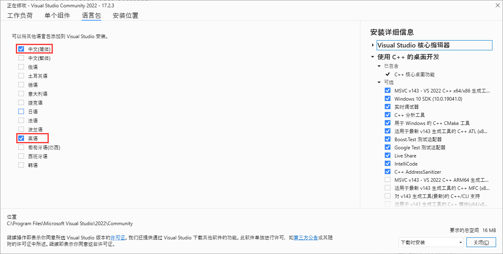

## 编译

**第 1 步**

安装 Visual Studio Community 2022。安装时“工作负荷”需要选中“使用C++的桌面开发”，“语言包”需要选中“中文(简体)”和“英文”。[issues/23275](https://github.com/microsoft/vcpkg/issues/23275)




**第 2 步**

在任意目录使用 PowerShell 获取 vcpkg，其实使用 CMD 也是可以的

```shell
$ git clone https://github.com/microsoft/vcpkg
$ .\vcpkg\bootstrap-vcpkg.bat
```

**第 3 步**

进入 vcpkg 目录执行下面的命令安装依赖

```shell
$ .\vcpkg.exe install fmt:x64-windows-static
$ .\vcpkg.exe install fmt:x86-windows-static
$ .\vcpkg.exe install openssl:x64-windows-static
$ .\vcpkg.exe install openssl:x86-windows-static
$ .\vcpkg.exe install rapidjson:x64-windows-static
$ .\vcpkg.exe install rapidjson:x86-windows-static
$ .\vcpkg.exe install keystone:x64-windows-static
$ .\vcpkg.exe install keystone:x86-windows-static
$ .\vcpkg.exe install unicorn:x64-windows-static
$ .\vcpkg.exe install unicorn:x86-windows-static
```

这个过程可能耗时比较长。

**第 4 步**

集成 Visual Studio 和 vcpkg

```shell
$ .\vcpkg.exe integrate install
```

**第 5 步**

下载项目并用 Visual Studio 打开

```shell
$ git clone -b windows --single-branch https://notabug.org/doublesine/navicat-keygen.git
```


**第 6 步**

选择 Release 配置，根据需要选择 x64 或 x86


**第 7 步**

在菜单栏选择“生成->生成解决方案”


在项目的 bin 目录“E:\Projects\navicat-keygen\bin\x64-Release”下生成了两个可执行文件
 `navicat-keygen.exe` 和 `navicat-patcher.exe`。

## 使用

**第 1 步**

卸载本地的 Navicat（如果有），然后[下载](https://download3.navicat.com/download/navicat160_premium_en_x64.exe)最新的 Navicat，当前版本为 16.0.13，最后根据安装向导一步一步的进行安装。

**第 2 步**

>必须“以管理员身份运行” CMD 程序，不然会出现打不开文件的错误
>
>```console
>E:\keygen>navicat-patcher.exe "C:\Program Files\PremiumSoft\Navicat Premium >16"
>***************************************************
>*       navicat-patcher by @DoubleLabyrinth       *
>*               version: 16.0.7.0-2               *
>***************************************************
>
>[-] .\navicat-patcher\wmain.cpp:190 ->
>    Failed to open libcc.dll
>    ?????  (0x5)
>
>E:\keygen>
>```

使用 `navicat-patcher.exe` 替换掉 `navicat.exe` 和 `libcc.dll` 里的 Navicat 激活公钥

```shell
$ navicat-patcher.exe "C:\Program Files\PremiumSoft\Navicat Premium 16"
```

**第 3 步**

使用 `navicat-keygen.exe` 来生成序列号和激活码

```shell
$ navicat-keygen.exe -text .\RegPrivateKey.pem
```

在选择产品类别、语言及主版本号之后会生成一个序列号，接下来要输入用户名和组织名，在输入请求码之前先暂停下来

```console
***************************************************
*       navicat-keygen by @DoubleLabyrinth        *
*                version: 16.0.7.0-2              *
***************************************************

[*] Select Navicat product:
 0. DataModeler
 1. Premium
 2. MySQL
 3. PostgreSQL
 4. Oracle
 5. SQLServer
 6. SQLite
 7. MariaDB
 8. MongoDB
 9. ReportViewer
 10. ChartsCreator
 11. ChartsViewer

(Input index)> 1

[*] Select product language:
 0. English
 1. Simplified Chinese
 2. Traditional Chinese
 3. Japanese
 4. Polish
 5. Spanish
 6. French
 7. German
 8. Korean
 9. Russian
 10. Portuguese

(Input index)> 0

[*] Input major version number:
(range: 1 ~ 16, default: 16)> 16

[*] Serial number:
NAVF-EJYU-T7S7-J56W

[*] Your name: acomma
[*] Your organization: acomma

[*] Input request code in Base64: (Input empty line to end)
```

**第 4 步**

断开网络，目的是不让 Navicat 联网激活。

打开 Navicat，在菜单栏选择“Help -> Registration...”打开注册窗口，填入第 3 步生成的序列号并点击激活按钮


**第 5 步**

在弹出的激活失败窗口中选择手动激活


**第 6 步**

将手动激活窗口的请求码复制出来


粘贴到第 3 步输入请求码的地方，并按两次回车键

```console
[*] Input request code in Base64: (Input empty line to end)
kzjD8lsG6ep6v2OZHIWr85Q/cqgYPmpcwyyYvrvg687rZzMWNfcROTwyvfZQkNpImEaKlpHApKxYXhs+M7WO55/fQUQVct4FBH6M9lTmzUWsZKbgRDaj3HP8FXZSgkrSPoOwmMZLbsjD7E2rTpa6ItncUXoXU+VQkKT0ZYGZTaM2IFxqzNGQEmoCmZyvzBdJCh1eSurHyQEAr5zYJvEDbvTKLJC814eRGRUFlLvpMvOB2MzkAMqjB4aPmwR64p7sVW8Q5H8bX0YtlClcsKqp5CBiKy+3kS8f5DzcsdI/+UqdTLWWnQGpf8TsXVpgQ7QixCIWFiOuGBJxUxAYaZ2e2Q==

[*] Request Info:
{"K":"NAVFEJYUT7S7J56W", "DI":"49D5B5AE8FEDE4844197", "P":"WIN"}

[*] Response Info:
{"K":"NAVFEJYUT7S7J56W","DI":"49D5B5AE8FEDE4844197","N":"acomma","O":"acomma","T":1655021714}

[*] Activation Code:
vJtSo36m2zVJEfRaexsEQuqFczWLJYYFSPpiEXwabCBjD82OkEajH6C85nBZHdjqG5UgGZF4Mh3zxFVJsQsm9YQwtwhPJMu5Vs9fOya9ftYUeOmEQHafhpcOIwPDCKYcYcTpNNNSbE+CMdHA8CMmDjxNQwh6A3z0JDevMN7TxdFvZ4a8Chby5GpX1P0ZqBFEgwd//YjxvrctAvGHYu6JR5IAzv6b9UpMkxatOr+b0CnQ4S+7nbSdI0F+VyGJiuEl0S1SWYtVv3mKsGWLvrlq1YHma6sX+drr/IlpktI2KoC+JutHAUt1sGa1hAgIotwRcD9mNU2258Q8gQ8NmVCNmQ==
```

**第 7 步**

将激活码复制出来粘贴到手动激活窗口的激活码输入框中并点击激活按钮


**第 8 步**

最后在激活窗口点击 OK 完成激活


完～
