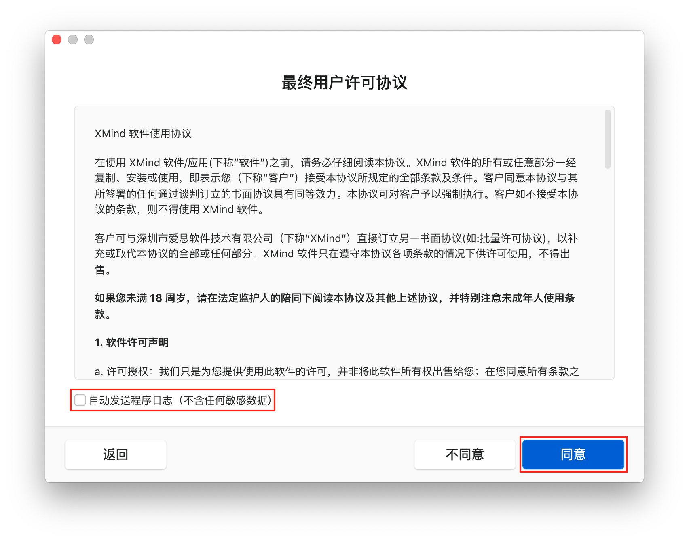
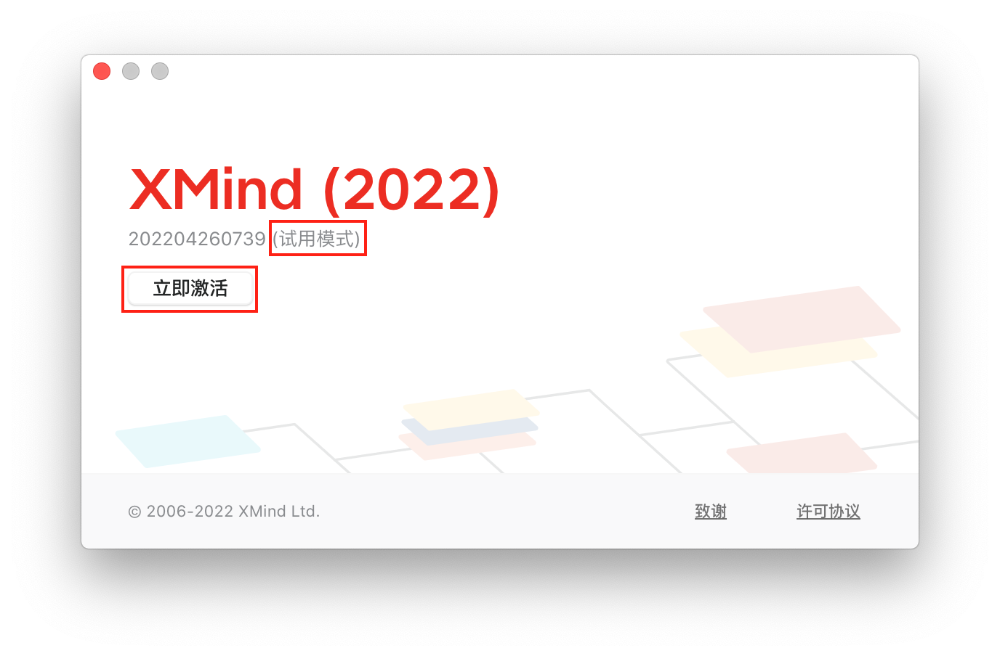
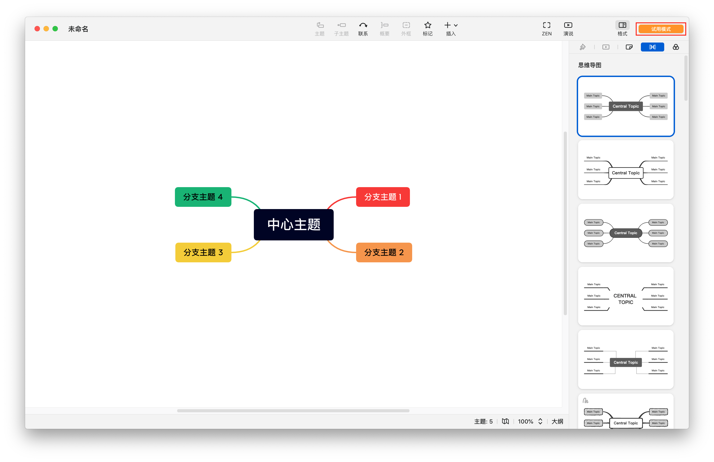
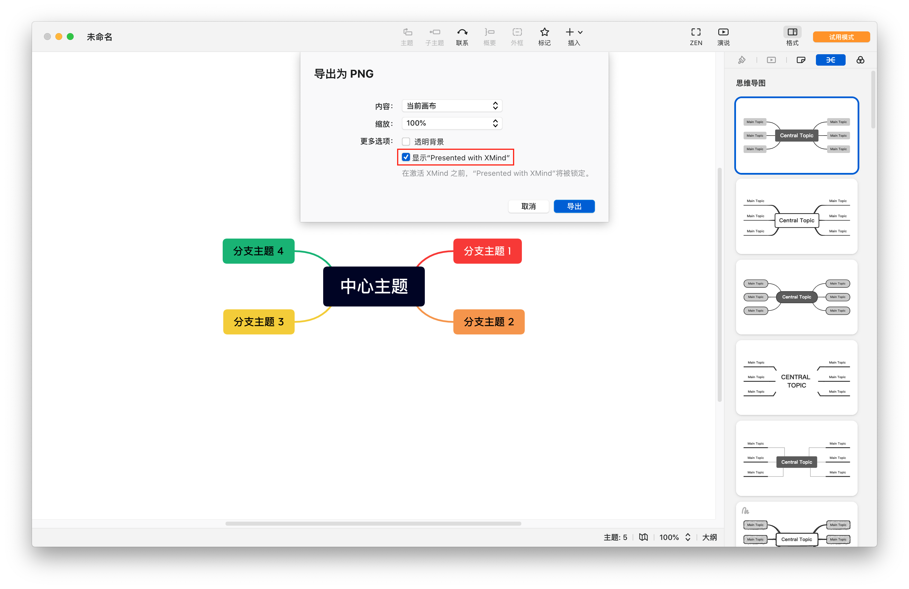

## MacOS

**第 1 步**

从[这里](https://dl2.xmind.cn/XMind-for-macOS-12.0.2-202204260739.dmg)下载 12.0.2 版本，然后进行安装。

**第 2 步**

安装完成后第一次打开时在最终用户许可协议窗口取消“自动发送日志”勾选并点击”同意“按钮



**第 3 步**

在登录窗口点击“跳过”，不用登录也不用创建账号


**第 4 步**

在菜单栏依次选择“XMind->关于 XMind”，在弹出的对话框中有“立即激活”按钮和“试用模式”字样



同时在 XMind 窗口的右上角也有“试用模式”字样



**第 5 步**

在菜单栏依次选择“文件->导出->PNG”，在导出为 PNG 对话框中有“显示“Presented with XMind””复选框



但是只能取消勾选一次，第二次将弹出订阅 XMind 对话框


**第 6 步**

现在完全退出 XMind 应用。

**第 7 步**

从启动台打开终端应用，输入 `sudo vim /etc/hosts` 命令编辑 hosts 文件，增加如下两行配置

```
127.0.0.1 www.xmind.net
127.0.0.1 www.xmind.cn
```

**第 8 步**

在终端应用中输入如下的命令

```
vim /Users/{your user name}/Library/Application\ Support/XMind/Electron\ v3/vana/state/account.json
```

编辑 account.json 文件，添加 `rawSubscriptionData` 项，值为
```
ZsZbGQIBXYN5o9XXh+6qGV9meueJYv6lQzAaqWP1xl7DL8xnP1sBEJia+ws9rW\/nax4qVczmG9fy6BOzzR8lX\/W8ZhvQVAvwOvIOkvjkbsNK9MP0YrrvEvvSMcJfPxmTa70LzXcSlWturHweqryIK6tJ5VKeqigTj3EN\/LJJO5E=
```

编辑完成后的 account.json 文件内容为

```json
{"region":"us","openActivateDialogDate":"2022-06-22T15:10:59.779Z","rawSubscriptionData":"ZsZbGQIBXYN5o9XXh+6qGV9meueJYv6lQzAaqWP1xl7DL8xnP1sBEJia+ws9rW\/nax4qVczmG9fy6BOzzR8lX\/W8ZhvQVAvwOvIOkvjkbsNK9MP0YrrvEvvSMcJfPxmTa70LzXcSlWturHweqryIK6tJ5VKeqigTj3EN\/LJJO5E="}
```

**第 9 步**

再次打开 XMind 应用，发现第 4 步和第 5 步描述的激活按钮和试用模式字样已经没有了，说明已经激活成功。

## Windows

从[这里](https://dl2.xmind.cn/XMind-for-Windows-64bit-12.0.2-202204260729.exe) 下载 12.0.2 版本，激活方式和 MacOS 差不多，只是 account.json 文件的路径为

```
C:\Users\{your user name}\AppData\Roaming\XMind\Electron v3\vana\state\account.json
```

## 参考资料

1. [最新版XMind(2021) 所有水印去除](https://www.jianshu.com/p/55fc41e450f5)，只适用 11.1.2 版本
2. [思维导图软件 XMind 2021 v11.1.2-202111071931 和谐版](https://bbs.pcbeta.com/viewthread-1935764-1-1.html)，本文即采用的和谐方法2，这种方法的弊端是需要重新修改 hosts 文件才能打开 XMind 网站，修改后 account.json 文件可能被重写，需要再次执行第 8 步
3. [修改Xmind的试用时间，近乎无限时长试用](https://blog.csdn.net/weixin_44835732/article/details/103603373)
4. [[Xmind]关于Xmind免费激活方法](https://blog.csdn.net/ZXW_NUDT/article/details/119380695)
