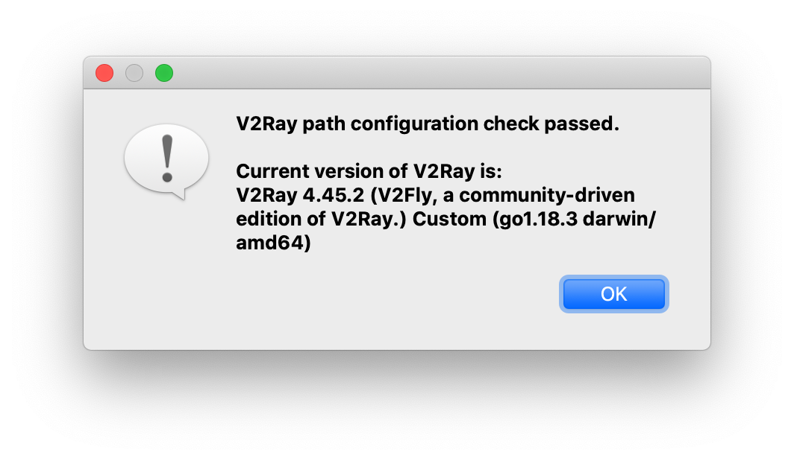

**第 1 步**

到[这里](https://github.com/Qv2ray/Qv2ray/releases/download/v2.7.0/Qv2ray-v2.7.0-macOS-x64.dmg)下载 [Qv2ray](https://github.com/Qv2ray/Qv2ray)，当前版本是 v2.7.0，然后按照 MacOS 下的软件安装方式进行安装。

**第 2 步**

上一步下载的 Qv2ray 不包含 v2ray-core，需要从[这里](https://github.com/v2fly/v2ray-core/releases/download/v4.45.2/v2ray-macos-64.zip)下载 [v2ray-core](https://github.com/v2fly/v2ray-core)，当前版本是 v4.45.2。

**第 3 步**

打开终端工具，在你的 home 目录中创建 Qv2ray 专用子目录，比如

```shell
$ cd ～
$ mkdir .qv2ray
```

**第 4 步**

在 `.qv2ray` 目录中创建子目录 `vcore`

```shell
$ cd ～/.qv2ray
$ mkdir vcore
```

**第 5 步**

将第 2 步下载的 v2ray-core 解压到 `~/.qv2ray/vcore` 目录。

**第 6 步**

给予 `v2ray` 和 `v2ctl` 可执行权限，默认是有的，如果没有则执行如下的命令

```shell
$ cd ~/.qv2ray/vcore
$ chmod +x v2ray
$ chmod +x v2ctl
```

**第 7 步**

打开 qv2ray 应用，并点击 Proferences 按钮打开 Proferences 窗口


**第 8 步**

在 Proferences 窗口中选择 Kernel Settings 标签

1. 将 V2Ray Core Executable Path 设置为 `v2ray` 可执行性文件所在的地址，即 `/Users/{your user name}/.qv2ray/vcore/v2ray`，
2. 将 V2Ray Assets Directory 设置为第 5 步创建的目录，即 `/Users/{your user name}/.qv2ray/vcore`


然后点击 Check V2Ray Core Settings 按钮来验证您的 V2Ray 核心设置。重复尝试，直到检查通过。



**第 9 步**

为了支持更多的协议我们还需要下载以下几个插件

1. [QvPlugin-Command](https://github.com/Qv2ray/QvPlugin-Command)，[点击下载](https://github.com/Qv2ray/QvPlugin-Command/releases/download/v3.0.0/QvPlugin-Command.v3.0.0.macOS-x64.so)
2. [QvPlugin-SS](https://github.com/Qv2ray/QvPlugin-SS)，[点击下载](https://github.com/Qv2ray/QvPlugin-SS/releases/download/v3.0.0/QvPlugin-SS.v3.0.0.macOS-x64.so)
3. [QvPlugin-SSR](https://github.com/Qv2ray/QvPlugin-SSR)，[点击下载](https://github.com/Qv2ray/QvPlugin-SSR/releases/download/v3.0.0/QvPlugin-SSR.v3.0.0.macOS-x64.so)
4. [QvPlugin-Trojan-Go](https://github.com/Qv2ray/QvPlugin-Trojan-Go)，[点击下载](https://github.com/Qv2ray/QvPlugin-Trojan-Go/releases/download/v3.0.0/QvPlugin-TrojanGo.v3.0.0.macOS-x64.so)
5. [QvPlugin-Trojan](https://github.com/Qv2ray/QvPlugin-Trojan)，[点击下载](https://github.com/Qv2ray/QvPlugin-Trojan/releases/download/v3.0.0/QvPlugin-Trojan.v3.0.0.macOS-x64.so)
6. [QvPlugin-NaiveProxy](https://github.com/Qv2ray/QvPlugin-NaiveProxy)，[点击下载](https://github.com/Qv2ray/QvPlugin-NaiveProxy/releases/download/v3.0.0/QvPlugin-NaiveProxy.v3.0.0.macOS-x64.so)

**第 10 步**

打开 qv2ray 应用，并点击 Pluings 按钮打开 Pluing Manager 窗口


在 Pluing Manager 窗口点击 Open Local Plugin Folder 按钮打开本地插件目录，并将第 9 步下载的插件移动到这里


重启 qv2ray 应用使插件生效。要退出 qv2ray 需要点击菜单栏右侧的 qv2ray 图标，在下拉菜单中点击 Quit。

**第 11 步**

打开 qv2ray 应用，并点击 Import 按钮打开 Import file 窗口


将其他人分享的链接粘贴到 Import file 窗口的 Share Link 的位置，然后点击 Import 按钮完成导入。


**第 12 步**

双击 Default Group 展开，选择一个连接，右键选择 Connect to this，然后就可以接入互联网了。


参考资料

1. [qv2ray 中文站点](https://qv2ray.net/lang/zh/)
2. [苹果MacOS电脑使用Qv2ray客户端上国外网站的方法](https://iyuantiao.me/qv2ray.html)
3. [https://github.com/mgxray/Evanescence](https://github.com/mgxray/Evanescence)
