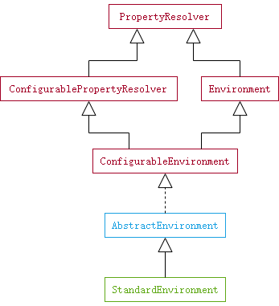

`ClassPathXmlApplicationContext` 构造函数做的第二件事是设置配置文件路径。

```java
public void setConfigLocations(@Nullable String... locations) {
    if (locations != null) {
        Assert.noNullElements(locations, "Config locations must not be null");
        this.configLocations = new String[locations.length];
        for (int i = 0; i < locations.length; i++) {
            this.configLocations[i] = resolvePath(locations[i]).trim();
        }
    }
    else {
        this.configLocations = null;
    }
}
```

`setConfigLocations` 方法循环解析每一个路径，并将解析后的结果放在 `AbstractRefreshableConfigApplicationContext` 类的`configLocations` 变量以便在后续使用。

为什么我们传入的配置文件路径需要再次解析呢？这是因为 Spring 支持路径中使用占位符，即 `${...}`，因此需要将它们替换为具体的值。下面就来看看 `resolvePath` 的具体实现。

```java
protected String resolvePath(String path) {
    return getEnvironment().resolveRequiredPlaceholders(path);
}
```

`resolvePath` 首先获取当前应用的运行环境。

```java
public ConfigurableEnvironment getEnvironment() {
    if (this.environment == null) {
        this.environment = createEnvironment();
    }
    return this.environment;
}

protected ConfigurableEnvironment createEnvironment() {
    return new StandardEnvironment();
}
```

因为在初始化变量时没有给 `environment` 变量赋值，因此这里需要调用 `createEnvironment` 方法创建一个 `StandardEnvironment` 对象。



需要关注 `AbstractEnvironment` 的下面的几个变量，前两个与 `Profile` 相关，后两个与属性来源相关。

```java
private final Set<String> activeProfiles = new LinkedHashSet<>();
private final Set<String> defaultProfiles = new LinkedHashSet<>(getReservedDefaultProfiles());
private final MutablePropertySources propertySources = new MutablePropertySources();
private final ConfigurablePropertyResolver propertyResolver = new PropertySourcesPropertyResolver(this.propertySources);
```

`StandardEnvironment` 构造函数最终会调用 `customizePropertySources` 方法初始化两个属性来源，一个来自 `System.getProperties()` 获取的属性，另一个来自 `System.getenv()` 获取的属性。

```java
protected void customizePropertySources(MutablePropertySources propertySources) {
    propertySources.addLast(new MapPropertySource(SYSTEM_PROPERTIES_PROPERTY_SOURCE_NAME, getSystemProperties()));
    propertySources.addLast(new SystemEnvironmentPropertySource(SYSTEM_ENVIRONMENT_PROPERTY_SOURCE_NAME, getSystemEnvironment()));
}
```

当 `StandardEnvironment` 对象构建好了之后就会调用它的 `resolveRequiredPlaceholders` 方法解析替换占位符。

```java
public String resolveRequiredPlaceholders(String text) throws IllegalArgumentException {
    return this.propertyResolver.resolveRequiredPlaceholders(text);
}
```

这个方法调用 `PropertySourcesPropertyResolver.propertyResolverresolveRequiredPlaceholders(String text)` 完成真正的工作。因为当前传入的路径中没有占位符，所以可以略过占位符的具体处理。

完~
