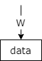
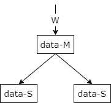
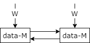
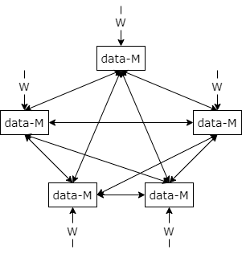
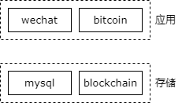
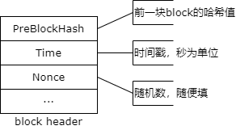
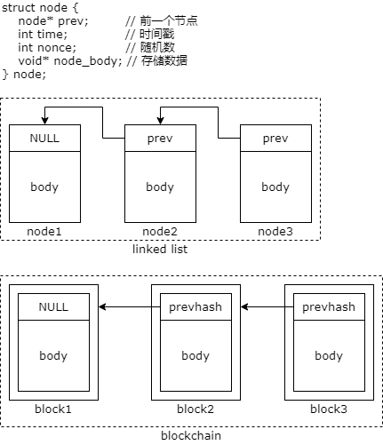
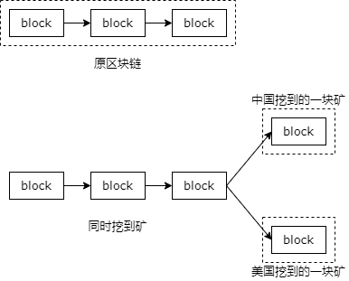
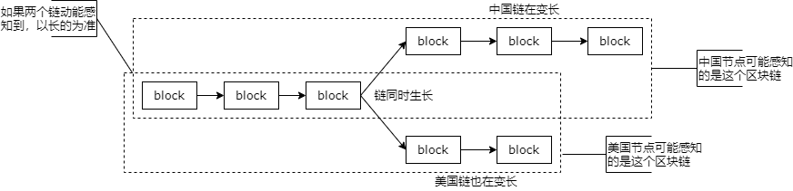

## 声明

这篇文章是[沈剑—区块链底层核心技术架构基础篇](http://pc-shop.xiaoe-tech.com/appZCodH6sz4402/columnist_detail?id=p_5eca89fe51700_RW8aLHcc)课程的文字版，沈老师讲解得通俗易懂，但是视频版不好回顾，从回顾知识得角度还是喜欢文字版。

## 第一课 都聊区块链，区块链的本质究竟是啥？

*区块链*的本质是一个存储系统，这个系统没有管理员，每个节点都拥有全部数据的分布式存储系统。

### 普通存储系统



一个空间存储数据，一个软件管理数据，提供接口写入数据，这两部分组成了一个存储系统。*MySQL* 是常见的存储系统。

普通存储系统存在两个问题

* 非高可用。数据存在一个地方很危险，即数据不高可用。
* 单点写入。写入点只有一个，即单点控制。

普通存储系统解决这两个问题的方式

* 数据冗余。解决非高可用问题。

    

    将数据复制几份，冗余到多个地方。一个地方的数据挂了，另外的地方还存有数据。例如 MySQL 的主从集群，磁盘的 RAID。数据冗余有两个问题需要引起注意，一个是一致性问题，比如 MySQL 主从集群中读写是有延时的，也就是在短时间内读写不一致；另一个是效率问题，数据冗余往往会降低写入的效率，因为数据同步也是要消耗资源的。

* 多点写入。解决单点控制问题。

    

    MySQL 可以做双主的主从同步，两个节点可以同时写入。多点写入有一个问题需要注意，即写写冲突一致性问题。举个例子，节点 A 和 节点 B 的数据表 id 现在都是 1、2、3、4，现在节点 A 写入了一条数据 id 为 5，节点 A 开始同步数据到节点 B，在同步的过程中节点 B 先写入了一条数据，id 也为 5，这时节点 A 同步的数据就无法写入成功，这就是写写冲突。

既然多点写入有一致性问题，那么有什么办法能保证一致性呢？当数据不一致时，往往需要一个算法来协商如何处理不一致的数据。

* 时间戳。以时间戳最小的数据为准，即最早写入的那一条为准，后写入的放弃。
* 投票。在集群中有多个节点（至少 3 个）时以多数票的数据为准，比如有 3 个节点，有 2 个节点写入了相同的一条数据，那另外一个节点的数据可能就要作废，因为两个节点是多数票。

### 区块链

区块就是一块存储空间，它可以用来存储数据。区块链是一个存储系统，将区块像链表一样串联起来，并约定了一系列算法来管理这些数据。因此区块链的本质是一个存储（管理）系统。

区块链有很多节点，每个节点都保存了全部的数据，所以它是一个高可用的存储系统。它没有一个中心节点，每一个节点都可以写入数据，它是没有管理员的。



综上所述，区块链是一个没有管理员的，没有一个中心管理节点的，即它是去中心化的，每个节点都存储了全部数据的分布式的存储系统。

只要你愿意，你可以随时向区块链中的任何一个节点写入数据，当然写入的数据别人是否认可，是由一个一致性的算法来保证的。

*比特币*是基于这个分布式的存储系统，在上层应用实现的一个电子货币的一个应用。

基于区块链的特点：多点写入、每个节点保存了全部的数据、必须保证所有的数据一致，区块链有两个特点

* 存储数据少
* 数据写入慢

### 总结

* 普通存储系统，容易存在问题：  
    （1）非高可用  
    （2）单点写入
* 如何保证高可用？冗余
* 能否多点写入？可以
* 多点写入存在什么问题？数据一致性
* 如何解决？时间戳、投票
* 什么是区块链？  
    （1）一个存储系统  
    （2）每个节点都存储全部数据，高可用  
    （3）每个节点都可以写入，去中心化，没有管理员

## 第二课 都聊挖矿，挖矿究竟是啥？

### 区块链与比特币的比较

区块链是分布式存储，比特币是基于该存储的应用。



其他的莱特币、以太币都是基于区块链的电子货币应用，所以理论上使用上层的应用来解释底层的存储系统是不合适的。就像我们经常用 MySQL 来做底层存储，微信是 MySQL 上层的应用，用微信来解释底层的 MySQL 也是不合适的。

### 区块与区块链

区块是一块存储空间，可以存储数据。


区块分为 header 和 body 两部分。它们分别存储了什么数据呢？

区块体想存什么数据就存什么数据，比如说比特币应用，区块体里存储的是比特币的交易数据。区块头里存储了和这个区块以及这个区块链相关的一些元数据。



区块是怎么链起来的？



区块头通过存储上一个区块头结点的 hash 值将区块链接起来。一个区块的唯一标识是这个区块头的 hash 值。

### 什么是挖矿

*挖矿*就是生成一个区块，链入区块链的过程。挖矿的人就是*矿工*。

#### 区块链的三个特征

* 历史区块无法改变
* 只能在最新的区块后面，生成新区块

    新生成的区块只能在区块链的最后，所以必须同步完全网最新的区块，才能够启动生成新区块这项工作。

* 新区块很难生成，必须满足特定条件

#### 挖到矿（生成新区块）的特定条件

前提：已经同步了全网最新的、最全的区块链数据。

特定条件：

* 最新的区块头，进行两次 `SHA256`
* 得到的哈希结果，高 48bit， 必须是：`0x00000000FFFF`

只有满足这个条件才算挖矿成功。

#### 挖到矿（生成新区块）很难

```
Header {
    prevHash;  // 前一个区块头哈希
    int time;  // 时间戳
    int nonce; // 随机数
}
```

因为前一个区块头哈希是固定的，所以能变的是时间戳和随机数。又因为 hash 运算是不可逆的，所以不能由 hash 运算的结果反推出时间戳和随机数。可以认为 hash 运算的结果完全是随机的，要得出前 48bit 是一个给定的 bit，就如同连续抛 48 次硬币每次得到的都是我们想要的结果，这个概率非常非常小，这个概率是 1/2 的 48 次方。

#### 逆向推导不行，如何成功挖到矿？

正向的穷举法

```
byte[32] = PrevBlockHash; // 上一个区块的哈希
for (int i = 0 to 2^32) { // 遍历所有整数
    int time = now(); // 时间戳
    blockHeader = new(byte[32], time, i); // 生成区块头
    hashResult = SHA256D(blockHeader); // 计算哈希值
    if (hashResult >> 208 == 0x00000000FFFF) { // 哈希符合预期
        echo "bingo"; // 挖到矿啦
    }
}
```

#### 比拼计算力

采用正向穷举法，只要时间足够旧，是否就一定能挖到矿呢？然而结果是悲观的，并不是。如果别人的计算能力比你强，在你挖到矿之前别人先挖到了一个矿并把他挖到的矿广播到全链路，你本地就不是最新的区块链了，你必须要同步别人先挖到的矿，你才能够在尾部继续挖矿。所以你发现你要不断的向网络同步最新的数据，又要重新开始挖矿，你挖到了，可能你本地又不是最新的数据了，那你就特别特别的悲剧，所以并不是所有的人运行上面的那个算法足够久就能够挖到矿的。

#### 从架构的角度，如何提升挖矿速度

* 缓存：无效
* Scale up：有效

    提升单机能力，比如增强单 CPU 的计算能力、使用 GPU 替代 CPU、使用特殊芯片来计算 `sha256d`

* Scale out：有效

    水平扩展，一台机器不行，就搞集群

## 第三课 挖矿的人越来越多，会不会越挖越快？

结论：匀速。虽然大家都在挖矿，但挖到矿的速度是均匀的。

以承载比特币的区块链为例，每十分钟才产生一个区块，这个速度基本上是不变的。

### 如何保证匀速

* 需要一个**统计**机制
* 需要一个**调节**机制

假设我们期望比特币全球区块链，每十分钟生成一个区块，需要设定一个动态调节机制，每两周做一次统计，如果统计的结果是最近两周平均每五分钟就生成了一个区块，说明生成的速度太快了，需要变慢 50%；如果统计的结果是最近两周平均每二十分钟才生成一个区块，说明生成的速度太慢了，需要加速一倍。

### 如何控制“加速”与减速？

难度系数机制

区块链中有一个难度系数来调节生成区块速度的快与慢，难度系数影响的是区块头的 hash 结果有多少比特必须符合预期才算挖矿成功。比如说，原计划 hash 结果高 48bit 符合预期才算挖矿成功，现在改为 49bit 符合预期才算挖矿成功，这个时候预期 hash 的概率就降低了，整体挖矿的速度就变慢了；相反，如果改为 47bit 哈希结果符合预期就算挖矿成功，这样得到预期 hash 的概率就变高了，挖矿就变快了。

### 总结

* 定期统计，动态调节
* 难度系数，控制速度

## 第四课 头发分叉要剪，区块链分叉咋办？

问题描述：

如果两个节点同时挖到新的区块，会不会出现数据不一致？如何解决不一致的冲突问题呢？

问题分析：

冗余会带来一致性问题，比如数据库主从，它其实是一种数据的冗余，所以会出现主从数据延时的一致性问题。

数据库与缓存，它的本质也是一种数据的冗余，数据既存在了数据库里，又存在了缓存里，由于数据的修改并不是同时进行的，所以它也会出现数据库与缓存数据不一致的问题。

对于区块链来说也是一样的，全球每个区块链节点都包含全部的数据，大家都在最新的区块链数据的基础之上挖符合条件的区块，如果两个节点同时挖到矿，那就可能出现区块链的分叉。



假设又连个节点，中国的一个节点和美国的一个节点，都同步了最新的区块，然后在最新的基础上进行计算。中国的一个节点挖到了一个矿，生成了一个新的区块，链上来。美国的一个节点也生成了符合条件的区块，也链上来。大家都把自己挖到的矿链到本地的区块链上，这就出现了区块链的分叉。

这只是局部的节点会以为自己在最新的链上挖到了矿并且会将自己挖到矿的信息传播给自己附近的区块链节点，大家在自己以为最新的节点上继续挖矿。



中国节点和美国节点都会将“我挖到矿啦”这个消息同步给全球的其他节点，以便于其他的节点先同步完最新的数据再在最新的数据基础上继续挖矿。离中国节点比较近的节点会同步中国链，并在此链的基础上继续挖，此链会继续增长。离美国节点较近的节点会可能先同步到美国链，并在此链的基础上继续挖，这个链条也会继续增长。

节点收到两个冲突的区块链，会判断此时那个链条更长，会以长度更长的区块链为准。比如说由一个节点可能离这两个链距离差不多，同时收到了两个信息，中国的链说我是最新的区块，中国链上此时有三个新增的区块了，美国链它也收到了说“我挖到矿啦”，但是同步美国链发现美国链只有两个区块链节点，此时会以中国链为准。

要挖出更长的区块链，你消耗的算力更多，整体的原则是不能让绝大部分矿工白干，如此迭代，最终全球的区块链会达成一致，以最长的区块链为准。如果步遵守规则，成为少数派的节点，你继续在少数派的节点上继续挖矿，最终不会被多数派承认，也就等于你是白干了。所以在区块链的系统里，遵守规则是所有节点的最佳策略。除非有一个人掌握了全球 51% 的计算力，他才能够为所欲为，但这其实步就相当于中心化了吗，有一个中心化的节点，它可以控制整个数据的走向。

以承载比特币应用的区块链为例，一般我们认为一个区块后面链了六个区块后就不可能被颠覆了，故基于承载比特币的区块链一般生成新的区块需要六次确认。所以对于一个矿工来说，你挖到一个新的区块，别高兴得太早，等后面生成了六个其他的区块，进行了六次确认之后，基本才可以认为你生成的这个区块成功了。承载比特币的区块链平均每十分钟生成一个区块，六次确认大概需要一个小时。

软分叉：

当区块链这个系统升级之后所有的节点的升级节奏是不一样的，在所有节点升级到最新的版本之前，由于程序版本的差异可能导致分叉，只要升级到最新的版本，分叉就会消失。也就是软分叉是临时的，等大家软件版本都升级上来，软分叉就自动消失了。

硬分叉：

有一些玩家头硬，我就是不按照规则来，拉了一个分支，以道德或者法律的名义说以我这个分支为准，号召区块链玩家承认自己的链，这样就会形成永久的分叉。

历史上最出名的硬分叉要属以太经典（ETC）和以太坊（ETH）的分叉。

总结：

* 区块链分叉，本质是一个“高可用存储，数据一致性”问题
* 探测到分叉时，会以更长的链为准
* 软分叉，本质是软件版本不一致导致的分叉
* 硬分叉，本质是“强制回滚”
* 在区块链的世界里，“遵守规则”是最佳策略

## 第五课 作为虚拟货币，比特币为啥这么值钱？

电子货币是最典型的区块链应用。

比特币是基于区块链的能够抵抗通货膨胀的电子货币。作为一种电子货币和其他的货币一样是有价值的。

越来越多的人认可比特币的价值，它有区块链的技术做保障，它有固定的总发行量，非常的稀少，能像钻石一样抵抗通胀，相信其价值的人越来越多，所以它越来越贵。

区块链担保了什么？

* 高可用
* 去中心化
* 防篡改
* 一致性
* 透明性

如何获取比特币收益？

* 挖矿

    每当矿工挖到矿，会生成一个新的区块，就能够得到响应的区块奖励。这里面有两部分收益：
    * 区块补贴

        你费了电，进行了大量的计算，挖到了新的区块，会一次性的奖励若干比特币给你。例如 50 个比特币。这些比特币是凭空多出来的。

    * 交易费用

        持有比特币的人如果要进行比特币交易，他的交易转账记录就要写到某个账本上，也就是写到区块体里，想要到我挖出来的区块上写入你的转账记录，不好意思，请付我一笔交易费用。比如说 0.5 比特币。这些比特币是交易比特币的人给矿工的。

* 比特币单位：中本聪（Satoshi Nakamoto）
    * 1BTC = 1000中
    * 1中 = 1000本
    * 1本 = 100聪（Satoshi）

比特币为何能抵抗通胀？

* 区块补贴，是凭空生成比特币的唯一方式
* 区块补贴的折半规则
    * 生成前 N=210000 个区块，补贴 50BTC
    * 后续每生成 N 个，补贴减半
* BTC 总个数：50 + 25 + 12.5 + ... = 2100W

总结：

* 比特币是基于区块链的，能抵抗通货膨胀的，电子货币
* 比特币的价值，基于人们对它的认可
* 通过挖矿，获取“区块补贴”和“交易费用”可以获得比特币收益
* 比特币发行总量有限，能够抵抗通胀

## 补充：[区块链中的架构理念](https://appzcodh6sz4402.h5.xiaoeknow.com/v1/course/alive/l_5edf8611b7166_niC0blyW?type=2&app_id=appZCodH6sz4402)

### 一、高可用问题

（1）如何判断系统是不是高可用？

（2）常见的系统单点：反向代理，缓存，数据库写库

（3）反向代理，站点服务，服务，缓存，数据库（从库，主库）如何保证高可用？

（4）数据层，高可用的弊端？

### 二、多点写入问题

（1）单点写入如何支持数据冗余？（MySQL，GFS）

（2）存储系统，能否支持多点写入？

（3）可能存在什么问题？（MySQL-MM架构）

（4）通常可以怎么解决？

* 时间戳
* 投票

### 三、哈希，完整性与可逆性

（1）哈希签名，一般用来表征数据的完整性（奇偶校验，上线文件md5值，消息防篡改）

（2）哈希是否可逆？Md5(string) = string_md5

（3）如何找到，特定哈希特征的字符串？

* 求8000bit的字符串，使之哈希结果，以0xFF开头？

### 四、提升系统性能的方法

（1）scale up（总有上限，但实施容易）

* 单机软件优化
* 单机硬件优化

（2）scale out（理论上，无限性能）

* 反向代理
* 站点应用
* 服务
* 缓存
* 数据库（读/写）

### 五、上传、下载的限速问题

网盘与BT，如何进行上传下载限速？

### 六、并发写的一致性问题

（1）最终一致性（以转账为例，A用户扣100，B用户加100）

（2）最终一致性的工程实践