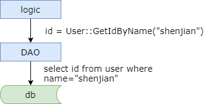

### 2、技术选型：创业初期，技术如何选型

我经常说到，任何脱离需求的架构设计都是耍流氓。可能早期，你找了几个志同道合的朋友创业了，那么此时，你对系统的需求是什么？

#### 需求是什么？

有个能看得见的产品（网站？H5？APP？）就踏实了。

创业初期，可能老板有一个看得见的产品，输入网址，一回车，产品能够在 pc 端，能够在 h5 上显示出来，可能他心里就踏实了。

#### 系统的特点是什么？

（1）请求量低（小于 10W）

（2）数据量小（小于 10W）

（3）代码量小

（4）一台机器

那么此时系统的特点是什么呢？首先请求量低，每天的请求量我们暂且认为小于 10 万。数据量小，总数据量我们暂且认为小于 10 万。此时的代码里也非常非常的小，可能所有的系统部署在一台机器上。

请求量小于 10 万这意味着什么呢？意味着平均每秒可能只有一两个请求，而 10 万的流量甚至绝大部分创业产品可能都达不到。此时我们的系统特点是这样子的。

#### 架构特点是什么？

（1）单机系统（All in one）

（2）程序耦合（All in one）

（3）逻辑核心是 CURD

那么此时系统的架构特点是什么样子的呢？如果说这个时候系统有架构的话，那么架构就是这个样子。

是不是和大学里数据库课程设计或者叫网页开发课程设计的层次结构非常的像，此时系统它是一个单机系统（All in one），所有的东西，包括你的站点应用程序，包括你的数据库都部署在一台机器上。同时它是一个程序耦合 All in one 的系统，可能只有一个站点，所有的东西都堆在里面。此时代码的核心业务逻辑，其实是 CURD，也就是说，前端来了一个请求，解析输入的参数，转化为 SQL 语句，操纵数据库里的数据，返回组成的页面，这个页面可能返回到 h5 端，pc 端或者是 app。这个时候绝大部分的工程师都在写拼 SQL 语句，就和数据库课程设计里主要工作一样。

#### 创业早期架构特色：All in one

所有的东西都在一个里面，那么此时我们的技术应该如何选型呢？

#### 如何选型？

大伙可以猜猜看，为什么 58 同城可能早期选择了 .NET，就是微软 windows 那套技术体系，SQL-server、IIS、windows-server？大家也可以猜一猜，为何快狗打车早期选择了 Java，MySQL，Tomcat，Linux 等开源技术体系？

那么其实原因是什么呢？原因是，可能技术合伙人，他只会某个技术栈。所以在创业初期选择会的，熟悉的，会成为早期技术选型的主要依据。

你找了几个同学创业，技术合伙人他只会 windows 技术体系，他只会 Java 技术体系，那可能就不存在什么选型，他只能选择他会的和他熟悉的。

这里对我们的启示是什么呢？早期技术合伙人的，技术高度，技术视野，会显得尤为重要。如果未来规模做大了，好的技术选型，未来能够少走很多弯路，而不好的技术选型，未来要为技术体系的建设重构，甚至重来，一次甚至多次。

那么如果是我创业，创业初期早期的技术选型，我会如何选呢？

我会选择：

* PHP 体系（Linux，Apache，MySQL，PHP）
* Java 体系（Linux，Tomcat，MySQL，Java）

无论是选择 PHP 体系还是 Java 体系，这个阶段，工程师的主要矛盾是什么呢？绝大部分工程师的工作内容是在写业务逻辑。根据我们之前的经验，工程师的主要矛盾是 CRUD 频繁出错。早期，甚至不是所有的工程师都精通数据库，SQL 需要一定的门槛，我们可能招的工程师，他面向对象比较厉害，基础 SQL 对他们来说难了点，而且调试 SQL 没那么容易。这个面向对象你可以单步，你可以 watch，你可以查看变量。

那么我们在早期如何解决工程师 CRUD 频繁出错的主要矛盾呢？

#### 早期尽快引入 DAO/ORM 技术

* DAO

    （1）Data Access Object

    （2）像访问对象一样访问数据
* ORM

    （1）Object Relation Mapping
    （2）简化数据库查询过程

DAO 的核心思想是，将所有对数据源的访问操作封装在一个对象的接口里。接口中定义了所有数据的访问方法，当你需要跟数据源进行交互的时候，实际上你代码就跟这个对象进行交互就完了。这是一个封装和屏蔽复杂性的过程。

封装和屏蔽复杂性，在整个架构设计演进的过程中，每个阶段都会面临相关的问题，你都会抽象相关的层次来简化你的系统架构。从最早期的 DAO 和 ORM 的抽象就体现了这个特色。

#### 总结

（1）技术选型，先看业务需求，任何脱离需求的技术选型，~~就~~都是耍流氓

（2）早期架构：All in one

（3）早期选型依据：熟悉的，擅长的

（4）建议选型：PHP 体现，Java 体现

（5）早期主要矛盾：业务开发效率与质量低，CURD 出错

（6）早期重要组件：DAO/ORM