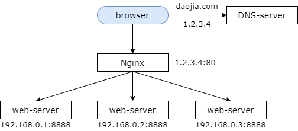
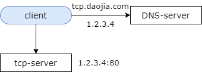
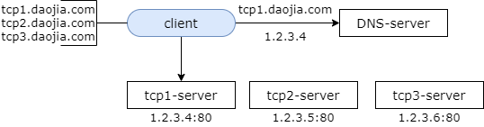
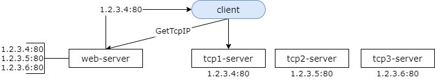
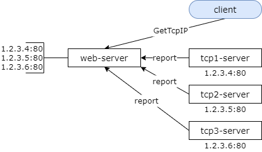
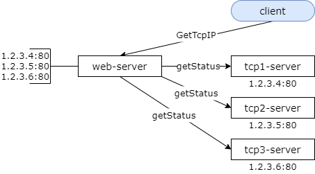

### 10、TCP负载均衡，该怎么玩？

#### 之前几节，讲的都是 http 的负载均衡

稍微简单的回顾一下

**http 负载均衡**

在互联网的分层架构中，web-server 层一般都使用 nginx 来做反向代理，实施负载均衡，整个架构分为三层。上层调用层，一般是浏览器，h5，或者 app，中层反向代理 nginx 或者 apache，下层真实的 web 集群，例如 tomcat。整个访问过程是，浏览器先解析域名，调用一次 dns-server，返回 nginx 的外网 ip，然后通过外网 ip 访问 nginx，nginx 实施负载均衡策略，常见的策略有随机，轮询，静态权重，ip 哈希等等等等，然后 nginx 会用这些策略将请求分发给后端的真实的 web-server。由于 http 是短连接，如果你在架构设计中做到了 web-server 无状态，那么此时理论上 nginx 不管将 http 请求转发给哪一台，web-server 都应该能够正常的处理。这是 http 的负载均衡。

#### 那 TCP 呢？

tcp 它是有状态的连接，客户端与服务器进行的是长连接，一旦建立连接，一个客户端发起的请求必须落在同一台 tcp 的 server 上，此时如何做负载均衡，既能够保证长连接，又能够保证每一台 tcp-server 上的连接数量是差不多的呢？当然，你还要必须要保证高可用，以及很好的扩展性。

##### 单体架构法

首先，我们来看一下单体架构法。和 http 的单体架构类似 tcp 也可以使用单体架构。可能在系统早期的时候大部分的公司都是使用的单体架构，单体架构可以保证请求的一致性。客户端将 tcp 的域名解析出 tcp-server 的外网 ip，然后客户端直接的和 tcp-server 发起长连接。

该方案的缺点是没办法扩展，没有办法保证高可用，如果服务器挂了，那么整个服务就不可用了。

##### 客户端负载均衡（内置集群配置）

第二种方案，客户端负载均衡法，也就是客户端内置服务器集群的配置。通过搭建 tcp 集群来保证高可用，由客户端来实施 tcp 的负载均衡，客户端的内部配置了 tcp1，tcp2，tcp3 三个 tcp-server 的域名，然后通过随机、哈希的方式来选择 tcp-server。假设客户端选择到的是 tcp1，然后对 dns 发起域名解析，解析返回 tcp1 的外网 ip，客户端往 tcp1 发起 tcp 的长连接。

这是如何保证高可用的呢？当客户端发现某一个 tcp-server 挂了的时候客户端必须要有重连机制去访问其他的 tcp-server。

这个方案潜在的缺点是，首先每次连接之前要多一次 dns 访问，并且它难以预防 dns 劫持，如果我劫持了你的 dns，我可以让你连到我的一个假冒的 tcp 服务器上。多一次 dns 访问意味着有更长的连接时间，这个不足在手机端尤为明显。

如何解决 dns 的问题呢？可以将 tcp-server 的所有外网 ip 直接配置在客户端的配置文件中，同时还能够防 dns 劫持。这个方案很多公司其实就是那么做的，它叫做 ip 直通车。

ip 直通车有什么新的问题呢？将 ip 写死在客户端的配置里，在客户端实施负载均衡，它的扩展性是比较差的，如果原来的 ip 发生变化，客户端其实是不能够被实时通知到的。如果新增了 ip，tcp-server 进行了扩容，客户端也不会被实时通知到。如果负载均衡策略要发生变化，要升级的是客户端。

把负载均衡策略放在客户端有诸多的问题，那么本质上我们还是得将负载均衡策略最终放到服务端来。

##### 服务端负载均衡（静态 IP 列表）

服务端的负载均衡策略首先有一个静态 ip 列表法，将复杂的负载均衡策略下沉到服务端才能根本的解决扩展性的问题。我们新增一个 http 的接口，将客户端的 ip 配置与负载均衡策略放到服务端的这个 http 接口上，客户端每一次访问 tcp-server 之前，首先调用新增的一个 http 的获取 tcp-server ip 的接口，对于客户端而言这个 http 接口只返回一个可用的 tcp 服务器的 ip，这个 http 接口只返回一个 tcp-server 的 ip。原来由客户端实施的 ip 负载均衡策略由这个 http 接口来实施，拿到这个 ip 之后，客户端与原来一样和 tcp-server 发起 tcp 长连接。

长连接的特点是，一旦建立连接就不会断开了，所有的请求都是通过这个连接走的。这样的话，扩展性的问题就解决了，如果 ip 发生了变化，比如说你某一个 tcp-server 的 ip 发生了变化，你只要修改这个 http 接口的配置部分。如果你要新增一个 tcp-server 也只需要在服务端 web-server 的这个配置进行新增扩展就可以了。

当然这个 http 接口如何保证高可用，那是使用 http 它高可用的一些方案去解决了。

然而新的的问题又产生了，如果将 ip 配置放在客户端的本地，客户端当连接不上一个 ip 的时候，它可以切换到其他的 ip。但如果你把 ip 放在 web-server，web-server 它只负责分发 ip，它并不知道这些服务器的存活状态。对不对，也就是说，如果其中有一台 tcp-server 挂了客户端它能够感知到，但是 web-server 感知不到。就是说，它没办法保证系统的高可用了，这个时候该怎么办呢？

##### 服务端负载均衡（服务状态上报）

此时我们可以由 tcp-server 向 http-server 上报服务的状态。这个 web-server 如何知道 tcp 集群中各个服务器是否可用呢？tcp-server 可以主动的，比如说每分钟，调用 http 的一个接口，去上报自己的状态，如果一个 tcp-server 挂了，将会终止上报，对于停止上报状态的 tcp-server，web-server 的获取 tcp-server ip 的接口将不会将相应的 ip 返回给客户端。上报服务状态，保证 web-server 返回的 tcp-server 的 ip 一定是可用的。

这个设计，它解决了服务可用的问题，但出现了什么新的问题呢？这里犯了一个反向依赖耦合的设计错误，tcp-server 它为什么要依赖于一个与本身业务完全无关的 web-server 呢？对不对，如果你 tcp-server 进行上报的话，其实相当于你 tcp 实施业务的系统它要依赖于一个只是单纯为了获取外网 ip 的一个 web 子系统，这个设计是非常非常不合理的。

##### 服务端负载均衡（服务状态拉取）

此时我们可用将状态的上报改为状态的拉取。web-server 通过拉的方式来获取各个 tcp-server 的状态，而不是 tcp-server 通过推的方式来上报自己的状态，这样的话 tcp-server 它就独立与解耦了，只需要专注于与自身 tcp-server 业务相关的功能即可，而高可用，负载均衡，扩展性，存活性都由 web-server 的这个子系统去实施就行了。

多说一句，负载均衡实现在服务端还有一个好处，它可以实现异构服务器的负载均衡以及过载保护。动态的实施方案是 web-server 可以拉回来 tcp 的状态，动态的分配负载，在 tcp 性能急剧下降的时候来实施过载保护就不将相关 tcp-server 的 ip 返回给客户端了。

#### 总结

（1）web-server 如何实施负载均衡？http 短连接，可以利用反向代理。

（2）tcp-server 如何快速实施？单体架构，但无法保证高可用。

（3）tcp-server 如何快速实施负载均衡 + 高可用？客户端内置集群，但无法保证扩展性。

（4）tcp-server 如何保证负载均衡 + 扩展性？服务端提供 get-tcp-ip 接口。

（5）提供 get-tcp-ip 接口后，如何保证高可用？服务状态上报，但会出现耦合。

（6）提供 get-tcp-ip 接口后，保证负载均衡 + 高可用 + 可扩展 + 解耦？服务状态拉取。

我估计如果大家没有做过什么消息系统，推送系统，im 系统，可能用不上这个 tcp 连接。