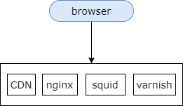

## 11、性能优化：动静分离，互联网优化利器？

### 实施完“伪分布式+反向代理之后”，用户访问仍然很慢，有什么优化方法？

**对架构影响最小，早期提升性能最快的优化方法：**

**三大分离**

它们分别是：动静分离，读写分离，前台与后台分离。

### 什么是静态页面？什么是动态页面？什么是动静分离？

#### 静态页面

与静态页面匹配的加速技术：

（1）CDN

（2）nginx

（3）squid / varnish

所谓静态页面是指互联网架构中几乎不变的页面，或者是变化频率非常低的页面，例如首页等 html 页面，js css 等样式文件，jpg apk 等资源文件。

静态文件有与之匹配的技术架构来进行加速，例如 cdn nginx squid varnish 等，这些技术都非常适合静态资源的访问加速。

#### 动态页面

与动态页面匹配的加速技术：

（1）分层架构

（2）服务化架构

（3）数据库、缓存架构

什么是动态页面呢？动态页面是不同的用户访问，传入不同参数，由服务端计算拼接临时生成的页面。

与动态页面匹配的互联网加速技术有，如图所示，我们通常使用互联网的分层架构，我们会使用服务化，我们会使用缓存来进行加速，我们会使用数据库的主从，数据库的水平切分来降低数据量，来提升数据库的读写性能。通过这些技术能够加速动态页面的生成，加速用户的访问。

#### 动静分离

**动静分离：“静态页面与动态页面，分开不同的系统访问”的架构设计方法**

动静分离架构是指使用相关的技术使得静态页面与动态页面分开不同的系统来访问的架构设计方法。

一般来说，静态页面的访问路径很短，访问速度非常的快，几毫米就可以返回。而动态页面它的访问路径非常的长，反向代理层，web 层，service 层，还有 cache，还有数据库，访问路径非常非常的长，访问速度相对较慢，特别是数据库的访问需要进行磁盘 io 的话可能会比较慢，需要中间有大量的网络传输，有很多业务逻辑计算，一般需要几十毫秒甚至几百毫秒返回。

动态页面对架构的扩展性要求更高，我们使用不同的系统来返回和处理静态页面和动态页面。动态页面和静态页面常常用不同的域名来进行访问的区分。

静态页面，几毫秒返回

动态页面，几百毫秒返回

性能相差 100 倍，有没有可能，把“原本需要动态生成的页面”变为“静态页面”？这样，性能岂不是提升 100 倍吗？

这就是“页面静态化”技术！

### “页面静态化”技术

举例

动态站点是如何生成的？

我们可以看一下我们的动态站点是如何生成的？如图所示，我们要访问一个帖子的详情页，这个详情页原本是需要动态生成的，浏览器访问这个详情页，请求到了 web-server 层，web-server 层的业务逻辑解析出帖子的 id 是某一个值，将这个 id 调用服务端的 rpc 接口，服务的 rpc 接口通过这个帖子 id 的参数转化成 sql 语句，访问数据库，取出这一行帖子的信息。服务层一般是通过 dao 层来拼接 sql 语句，访问数据库的，然后服务层将相关的行数据转化为实体数据返回给站点层，站点拼装最终的 html 页面返回浏览器层，动态站点是这么生成的。

如何实施“页面静态化”？

那什么是页面静态化？如何实施页面静态化呢？我们可以提前将帖子的详情页生成相关的 html，把它变成静态的 html，用静态页面相关的加速技术来进行加速，使用 cdn，nginx，squid，varnish 等来进行加速，这样的话就能够极大的提升访问速度，减少访问时间，来提高用户的体验。

原来动态的访问需要几百毫秒才返回这个帖子的详情页，现在你提前生成好相关的静态页面，通过静态页面相关的加速技术来进行加速，极大的提高用户的体验。

### 什么样的业务场景，适合“页面静态化”？

适合的场景：返回页面结果集有限。

（1）城市页；

（2）二手车；

（3）...

不适合的场景：返回页面结果集数量过大。

（1）帖子；

（2）搜索；

（3）...

任何脱离业务的架构设计都是耍流氓，页面静态化优化后速度会加快，那能不能所有的场景都使用这个优化呢？哪些业务场景适合使用这个架构优化方案呢？页面静态化它非常适合于返回页面结果集有限的业务场景。

比如业务的城市页，他可能只有几百个城市，就可以利用这个优化提前生成相关的几百个城市的静态页面。又例如一些二手车的业务，可能只有几万辆二手车的库存，可以提前生成这几万个二手车的静态页面。

它不适合什么样的业务场景呢？不适合返回页面数量结果集非常大的业务场景。比如说，信息模式，帖子，可能有几千万甚至上亿的帖子，就不太适合提前生成静态页面，这样的话文件太多，碎片文件太多，反而会加慢，而且帖子的读写变化可能会比较快，也不太适合页面静态化技术。包含搜索业务场景，搜索词的量非常非常的大，返回页面结果集非常非常的多，可能也不太适合页面静态化。

### 总结

（1）早期，对架构影响最小，最快提升性能的优化方法：三大分离；

（2）动静分离，是指“静态页面与动态页面，分开不同的系统访问”的架构设计方法；

（3）“页面静态化”是一种将原本需要动态生成的站点提前生成静态站点的优化技术；

（4）总数据量不大，生成静态页面数据量不多的业务，非常适合“页面静态化”优化；