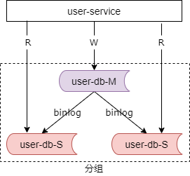

## 12、性能优化：读写分离，前台与后台分离

### 实施完“伪分布式+反向代理之后”，用户访问仍然很慢，有什么优化方法？

**对架构影响最小，早期提升性能最快的优化方法：**

**三大分离**

它们分别是：动静分离，读写分离，前台与后台分离。之前讲了第一个动静分离，今天来讲第二个及第三个，读写分离以及前台与后台分离的架构设计。

### 读写分离

什么是数据库的读写分离呢？一主多从，读写分离，主从同步，是一种常见的数据库架构。一般来说，主库，提供数据库的写服务；从库，提供数据库的读服务。主从之间通过某种机制来进行数据同步，例如 mysql 的 binlog。一个主从同步集群我们通常称为一个“分组”。

### 读写分离解决什么问题？

数据库读性能提升

主从分离架构方案，解决什么问题呢？大部分互联网的业务是属于读多写少的业务，数据库的读往往最先成为性能的瓶颈，如果希望线性的提升数据库的读性能，通过消除读写锁冲突来提升数据库的写性能，此时可以用分组，读写分离的架构设计。一句话，分组主要解决数据库读性能瓶颈的问题，它是用来提升数据库的读性能的，在数据库扛不住读的时候可以用读写分离，通过增加从库的方式线性的提升系统的读性能。

**容易混淆的，是水平切分，什么是水平切分？**

比较容易与分组读写分离架构方案混淆的是数据库的水平切分方案，作为对比我们来看下什么是数据库的水平切分方案？

### 水平切分

水平切分也是一种常见的数据库架构。一般来说水平切分后每个数据库之间没有数据的重合，没有类似于 binlog 同步的关联，所有数据的并集会组成全部的数据，会用算法对全量的数据来进行分割，例如，这个图中我们通过一个业务 id 取模来对数据进行分割，比如说，如果你通过用户 id 来进行取模，把用户 id 奇数的在第一个水平切分的库内，用户 id 为偶数的在第二个水平切分的库内。水平切分集群中的每一个数据库通常称为一个分片。

### 水平切分解决什么问题？

数据库存储容量提升

那数据库的水平切分架构究竟解决什么问题呢？大部分的互联网业务它的数据量非常的大，单库很容易成为系统的瓶颈，如果希望线性的降低单库的数据容量，线性的提升数据库的写性能，增加提供读写数据库实例的个数，那么此时可以使用水平切分的架构。

一句话来总结，水平切分主要通过增加实例，数据分片来解决数据库容量不够的问题，它是线性提升数据库容量的。容量扛不住的时候通常我们使用水平切分。

### 什么是前台？什么是后台？

说完数据库读写分离的架构，那么再来看看前台与后台分离的架构设计。

前台，后台，举个房产信息平台的栗子：

前台，用户访问的对外系统

后台，运营访问的对内系统

房产信息平台：

（1）前台写入，用户发布数据

（2）后台写入，爬虫抓取数据

（3）前台读取，用户浏览数据

（4）后台读取，运营浏览数据

那么在早期，系统的架构设计是什么样的呢？

#### 早期为了快速迭代，前台后台架构设计

早期在一个创业公司，为了快速迭代，系统的架构图如上，它分为 web 层，任务层，以及存储层。web 层有对用户读写进行服务的读的系统和写的系统，比如说发布页，比如说详情页。任务层我们有使用爬虫对于互联网的信息进行抓取的系统。数据库它存储用户发布的和爬虫抓取的信息。

### 容易出现什么问题？

**前台，后台，耦合 + 系统瓶颈**

前台数据特点：结构化，变化少

后台数据特点：数据源多，结构变化快

此时系统容易出现前台与后台耦合的问题，以及数据库成为系统瓶颈的问题。

系统的两类数据源，一类是用户发布的数据，一类是爬虫抓取的数据，两类数据的特点不一样。用户发布的数据相对结构化，结构的变化会较少，而爬虫抓取的数据由于数据源非常非常的多，数据结构的变化非常非常的快，如果此时我们将这些数据耦合在一个数据库里，经常出现的情况是，抓取的数据结构发生了变化，需要修改数据库的数据结构，会影响前台用户的展现，也就是说经常被动的修改前台的展现系统来配合后台抓取的升级。同时前台与后台使用同一个数据库，数据库的硬件资源也很容易成为系统瓶颈。

### 优化思路：前台与后台分离

那么此时我们的优化思路是，前台与后台的系统与数据库进行分离

如上图所示，前台的展现数据实现了系统与存储的分离，与后台的系统进行解耦。前台展现的数据库相对独立，因为它的库数据结构相对比较稳定。而后台的抓取的数据，它的数据结构变化较多，库独立，经常可以单独的来升级。在任务层增加一个数据转换层，当后台的数据结构发生变化的时候升级的是数据转换的这个任务，转换成前台相对比较稳定的数据结构，如此这般频繁的变化，抓取程序，以及后台的异步存储，不会影响用户侧的数据结构和系统。前台的数据和 web 都不需要被动的配合后台的数据结构的变化而升级。同时还实现了存储层的解耦，后台的数据库的资源瓶颈不会限制前台的数据库。

这就是前台与后台分离的架构设计，对架构的影响相对比较少，进行一个数据库的拆分，增加了一个异步转换层，原来的系统它的代码改动是非常非常少的。

### 总结

（1）早期，对架构影响最小，最快提升性能的优化方法：三大分离；

（2）动静分离，是指“静态页面与动态页面，分开不同的系统访问”的架构设计方法；

（3）读写分离，用数据库分组，快速提升数据库读性能；

（4）水平切分，用数据库分片，提升数据库存储容量（往往涉及系统改造）；

（5）前台后台分离，系统解耦，消除底层资源瓶颈；