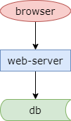
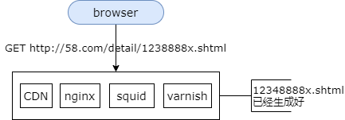
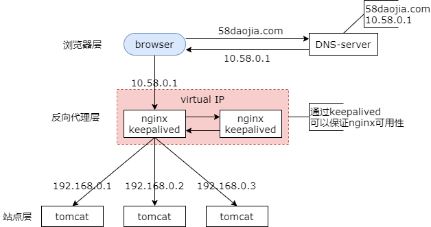

## 13、本章小结：百万流量，这些技术够用了

### 单体 All in one 架构，遇到什么问题，架构如何演进？

早期系统使用单体 All in one 架构，遇到了什么问题？架构要如何演进呢？

此时遇到的问题是，访问人数多的时候希望系统能够快一点，这是一个性能问题。当出现问题的时候，系统不要全部挂掉，这是一个耦合问题。

### 此阶段的设计思路是什么？

（1）技术不炫技，以解决业务问题为导向；

（2）系统改造尽可能小的架构方案；

（3）以最快的速度，提升系统的性能，解决遇到的问题；

#### 问题一：如何突破单机资源限制，提升性能？

##### 伪分布式，三大分离！！！**

**架构演进：伪分布式，提升性能**

所谓伪分布式，它的思路就是用最快的速度增加硬件资源，提升系统性能，增加访问的速度。

三大分离

（1）动静分离

（2）读写分离（引发读写延时问题）

（3）前台后台分离

##### 动静分离！！！

**动静分离：“静态页面与动态页面，分开不同的系统访问”的架构设计方法**

静态页面由与之匹配的架构来加速，例如 cdn nginx squid 和 varnish。动态页面也由与之匹配的架构技术来进行加速，例如分层架构，服务化架构，数据库水平切分，垂直拆分，与缓存技术等等。

静态页面，几毫秒返回

动态页面，几百毫秒返回

性能相差 100 倍，有没有可能，把“原本需要动态生成的页面”变为“静态页面”？这样，性能岂不是提升 100 倍吗？

##### 页面静态化！！！

举个例子，如下图所示，一个帖子详情页的访问，原本是动态生成的，我们需要将参数传到 web-server 层，web-server 解析出 http 请求中的参数后通过 rpc 调用将参数传到 servic 层，service 层通过 dao 拼装 sql 语句将请求传到数据库层，返回行记录，返回实体记录，拼装 html 页面返回，这是一个典型的动态页面。

那么我们可以提前将这个页面静态的生成好，然后通过静态页面相关的技术来加速访问，这就是页面静态化。页面静态化适用于数据量不是特别大，返回结果集有限的业务场景，例如城市详情页，例如二手车的最终页。

##### 读写分离！！！

之前的章节除了介绍动静分离还介绍了读写分离。

读写分离（分组）

水平切分（分片）

什么是读写分离呢？一主多从，读写分离，主从同步，它是一种常见的数据库架构。一般来说，主库提供写服务，从库提供读服务，主从之间通过某种机制同步数据，例如 mysql 的 binlog，一个主从集群，我们通常称为一个分组。

那么分组架构究竟解决什么问题呢？分组架构，它主要解决数据库读性能的瓶颈问题，在数据库读扛不住的时候，可以通过读写分离，线性的增加系统的读性能。

前面的章节，还介绍了数据库的水平切分，它也是一种常见的数据库架构。一般来说，水平切分的数据库集群中，每一个实例之间的数据没有交集，也没有类似于 binlog 同步的机制。

水平切分解决什么问题呢？一句话总结，水平切分主要解决数据量大的问题，通过水平切分，线性的降低单库的数据量。

##### 前台后台分离！！！

三大分离的最后，是前台与后台的分离。

前台与后台耦合的时候，前台的用户展现和发布使用的数据库与后台抓取的数据库进行耦合，资源耦合，后台抓取需求需要对数据库的数据结构进行修改会反向的影响前台系统的升级。

此时我们通过代码拆分，数据库拆分的方式进行前台与后台的解耦，它们不再共用一个数据库，而是通过增加一个数据转换层来进行解耦。

#### 问题二：如何解除耦合，缩小系统故障范围？

在单体架构 All in one 架构里，一个地方故障所有的系统都故障。

业务垂直拆分！！！！

之前章节介绍的是，业务的垂直拆分，

**架构演进：垂直拆分，解耦**

垂直拆分

（1）业务垂直拆分

（2）代码垂直拆分（子系统解耦）

（3）数据库垂直拆分（数据量降低，延时缓解）

（4）研发团队垂直拆分（专业化，效率提升）

#### 问题三：如何保证垂直拆分后，子系统的高可用？

反向代理！！！

反向代理，解决什么问题？

（1）子 web 系统的性能，不再受到单台机器资源限制，可以扩展；

（2）子 web 系统，实现了高可用（伪集群 -> 真集群）；

#### 问题四：真集群后，如何做负载均衡？

参考[6、接入层：反向代理，负载均衡，我有话要说](./ch2-6-接入层：反向代理，负载均衡，我有话要说)

#### 问题五：反向代理，如何保证高可用？

#### 问题六：反向代理技术出现之前，接入层如何扩展？

DNS 轮询！！！

#### 问题七：多层反向代理，如果还有性能瓶颈呢？如何做到，无限性能？

DNS 轮询！！！

#### 问题八：session 一致性如何保障？

#### 问题九：静态资源如何加速？

CDN！！！

**源**：数据库

**镜像**：多个“穿透缓存”

**智能 DNS**：决定我们访问哪一个

保证一致性的最佳实践

（1）资源更新，采用拉（镜像拉取），而不是推（源推送镜像）；

（2）常更新的静态资源，加上版本号；

### 还有那些架构实践？

（1）分层**服务化**

（2）服务化之后的高可用，高性能，负载均衡

（3）**数据库**极限优化

（4）架构优化万金油，**缓存**最佳实践

（5）高并发下的一致性

（6）...