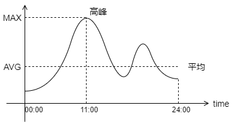
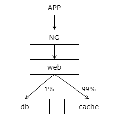

### 4、容量设计：流量高低，对架构究竟有什么影响？

#### 容量预估问题

随着业务的增长，日流量从 10W 级别，增长到 100W 级别。

此时，要进行容量预估

什么样的场景，需要进行容量设计呢？

（1）容量有质变性增长

（2）临时运营活动

（3）新系统上线

场景一

pm 要做双十一促销活动，技术老大杀过来，问了两个问题：

* 机器能扛住么？
* 如果扛不住，需要加多少台机器？

场景二

新系统上线，技术老大杀过来，又问：

* 数据库需要分库么？
* 如果需要分库，需要分几个库？

技术上来说，这些都是系统容量预估的问题，容量设计是架构师必备的技能。

#### 那些指标需要进行容量预估？

看具体业务，对应到系统侧的主要矛盾是什么，例如：

（1）数据量（58 同城的帖子业务）

（2）并发量，吞吐量（12306 的抢票业务）

（3）带宽（音视频，直播业务）

（4）CPU/MEM/DISK 等（加解密，搜索排序，区块链）

#### 如何进行容量评估？

以吞吐量为例

##### 第一步：评估总访问量

如何知道系统的总访问量呢？对于一个运营活动的访问量评估或者一个线上系统的 pv 评估，有什么好的方法吗？

答案是，询问相关的运营同学活动的预期访问是什么？询问产品同学新产品上线后的预估访问量是什么？

举个例子

假设，公司要做一个 APP-push 的运营活动：

（1）计划在 30 分钟内完成 5000w 用户的 push 推送

（2）预估 push 消息点击率 10%

请问：push 落地页系统的总访问量?

答：5000w * 10% = 500w

##### 第二步：评估平均访问量（QPS）

也就是每秒钟的请求量

知道了总量之后，如何评估平均访问量呢？

总量除以总时间即可。

如果按照天计算，一天按照 4w 秒来算，一天总共有 86400 秒，一般我们认为，请求都发生在白天，即一天 4w 秒。

举两个例子

例子一

push 落地页系统 30 分钟的总访问量是 500w，平均 QPS 是多少？

答：500w / (30 * 60) = 2778，大概 3000 QPS

例子二

假设，某信息分类网站首页日均 PV 约 8000w，平均 QPS 是多少？

答：一天按 4w 秒算，8000w / 4w = 2000，大概 2000 QPS

##### 第三步：评估高峰吞吐量（QPS）

进行系统容量规划时不能够只考虑平均 qps，系统要扛的是高峰的 qps，那么如何知道高峰的 qps 呢？

答案是，根据业务的特性，通过业务访问曲线可以评估系统的峰值 qps。

举个例子

假设，某业务日均 qps 为 2000，业务访问趋势图如下图，求峰值 qps 预估？

答：从图中可以看出，峰值 qps 大概是均值 qps 的 2.5 倍。日均 qps 为 2000，于是评估出峰值 qps 为 5000。

如果没有业务的访问曲线，怎么办？

此时我们可以通过二八原则来评估峰值 qps，我们可以大致的认为，80% 的请求发生在 20% 的时间里。当然，有一些业务，比如秒杀业务，他们具备一些业务的特殊性，此类业务的容量评估不在此列。

##### 第四步：评估单机极限 QPS

如何评估一个业务，一个服务，单机的极限 qps 呢？

答案是进行压力测试。

举个例子

以 APP-push 运营活动落地页为例（日均 qps 2000，峰值 qps 5000）

这个系统的架构如下：

（1）访问端是 APP

（2）活动落地页是一个 H5

（3）H5 数据大部分来自 cache，少量来自 db

通过压力测试发现，web 层是瓶颈，tomcat 压测单机只能扛住 1200 的 qps。

其实通过理论分析，1% 的流量来到数据库，数据库 500 的 qps 是很容易抗住的，cache 的话，每秒钟能扛几万的吞吐，而且这个业务带宽，cpu，磁盘 io，都不应该是瓶颈。我们通过压力测试就得到这个 web 落地页的瓶颈，它每秒压力测试的结果是，每秒能扛 1200 的吞吐。一般来说，线上的系统是不会跑满的，打个八折，单机线上允许跑到 qps 1000。

##### 第五步：根据线上冗余度做决策

上述一到四步已经得到了系统的峰值 qps 是 5000，单机 qps 是 1000，假设线上部署了 2 台服务，此时我们就能够自信的回答技术老大提出的问题了。

技术老大问：机器能抗住么？

答：峰值 5000，单机 1000，线上 2 台，扛不住。

如果扛不住，需要加多少台机器？

答：需要额外 3 台，给 4 台更稳。

除了并发量的容量评估，数据量，带宽，cpu，内存，磁盘 io，等评估也可以遵循类似的步骤。

#### 总结

互联网架构设计如何进行容量评估（以吞吐量举例）：

（1）**评估总访问量**：询问产品，运营

（2）**评估平均访问量**：总量除以总时间，一天算 4w 秒

（3）**评估高峰 QPS**：根据业务曲线图来

（4）**评估系统、单机极限 QPS**：压测很重要

（5）**根据线上冗余度做决策**：计算需求与线上冗余度差值

大家可以发现这五步中，只有第四步是需要提前做动作的，系统上线的时候，模块上线的时候，我们要做压力测试。其他的几个步骤都是通过临时计算得出的。