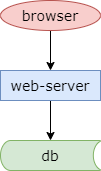
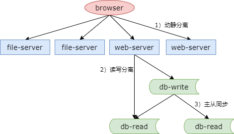
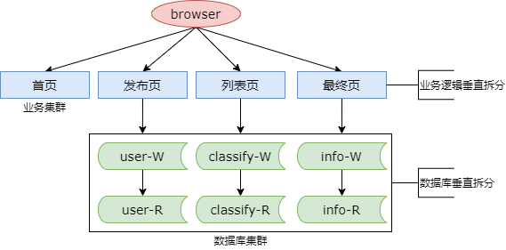

### 5、伪分布式：你以为，多机就是分布式？

多机架构，伪分布式也有益处

#### 创业初期系统的架构特点

（1）单机系统（All in one）

（2）程序耦合（All in one）

（3）逻辑核心是 CURD

此时，系统是一个 All in one 的架构。

业务需求决定架构方案

早期的需求是“demo 上线，快速迭代”，随着业务越来越复杂，用户量/数据量/并发量越来越高，老板的需求有没有变化？

#### 新的需求

访问的人多的时候，系统能够访问快一点（性能问题）

出现问题的时候，不能全部挂掉（耦合问题）

#### 性能问题如何快速解决？

##### 系统特点与瓶颈分析

现象：

* 人多的时候会卡
* 压力会导致宕机
* ...

瓶颈分析：

* 网络带宽
* 内存
* CPU 计算
* 磁盘 IO
* ...

初步结论：

* All in one 导致单机资源成为瓶颈

##### 如何最快速的解决“单机资源瓶颈”问题？

（1）此时最大的成本，是时间问题；

（2）能用“钱”解决的系统问题，往往不是问题；

（3）老板最不愿见到的，是解决一个系统问题，花很长的时间（市场和投资人等不起）；

那用什么方案呢？

最小的成本，最快的速度就是：把单机变多机，来扩充系统的资源。

为了提升性能，这个时候系统的架构就演进了。

**架构演进：伪分布式，提升性能**

上面这个架构图已经是一个由多台机器组成的伪分布式系统了。有些服务器是 file-server，有些服务器是 web-server，数据库也由一台机器扩展为了多台机器，并初步具备了一定的容错性，file-server 挂了，web-server 不受影响，db-read 挂了 db-write 不会受影响。

是如何快速的实现机器的扩展与性能提升的呢？

这就要提，早期三大分离的架构设计方案，能够实现机器的快速扩展与性能的提升。

三大分离：

（1）读写分离（引发读写延时新问题）

为了降低数据库的压力，快速提升数据库的读写性能，将数据库的读写请求分散到不同的数据库机器上。

（2）动静分离

将静态文件和动态站点分离，css，jpg，静态页面被放到了单独的机器上，需要动态生成的站点由专门的服务器来提供。

（3）前台后台分离

什么是前台系统？用户访问的系统。什么是后台系统？运营使用的系统。也通过增加机器的方式来进行分离。

三大分离的架构设计思路：

用最快的速度，增加硬件资源，提升系统性能，增加访问速度

使用三大分离并不需要大量的系统架构改造。

使用问题没有得到解决？

（1）耦合问题：一个子系统挂了，仍然是全站挂

（2）主从延时新问题：读写分离只能提升读写性能，无法降低库数据量

##### 耦合问题，读写延时问题如何解决？

**业务垂直拆分！！！**

以五八同城的早期业务为例，五八同城早期的业务非常简单，和 bbs 业务的结构基本一样，它由首页，所有分类的一个集合，与 bbs 的首页非常像。它有发布页，用户在发布页发布帖子，bbs 也有发布帖子的页面。列表页，从首页点击某一个分类，会进入到这个分类里的帖子列表集合，标题集合，和 bbs 的主题页非常像。以及详情页，列表页点击帖子的标题，能够进入到帖子的详细信息，和 bbs 的详细页也非常像。

这么进行业务的垂直拆分之后，是不是又可以利用增加机器扩充性能呢？而且，也可以实现一个子系统挂了不影响其他子系统。

**架构演进：垂直拆分，解耦**

垂直拆分

（1）业务垂直拆分

增加了机器，分摊了系统的压力，动态页面分成了业务集群，有首页，有发布页，有列表页和最终页，业务逻辑进行了垂直拆分。

（2）代码垂直拆分（子系统解耦）

代码按照业务逻辑，进行了项目的拆分，提升了开发效率。原来的代码越来越多，大家都在一个工程里面写代码，有大量的代码冲突，相互耦合，极其影响开发效率，现在随着业务的垂直划分，代码终于有机会拆分开了。

（3）数据库垂直拆分（数据量降低，延时缓解）

原来所有的数据都放在一个数据库里，数据量很大。现在把数据垂直拆分成了，用户数据的库，分类数据的库，帖子数据的库，也是按照业务进行垂直拆分，单库的数据量降低了，单库的读写量也降低了，主从延时就得到了缓解。

（4）研发团队垂直拆分（专业化，效率提升）

分工越来越细，越来越专业，职责越来越清晰，代码越来越专注，研发效率肯定是持续提升的。

垂直拆分，会随着业务越来越复杂，不断持续的进行。

大家可以看一下京东现在的首页，其实垂直拆分成了非常非常多的系统，有顶部的搜索，有购物车，有导航区，有分类区，有核心运营广告区，登陆区，快报区，九宫格，秒杀区域，特价区域，品牌闪购区域，以及用户的随屏。

垂直拆分的架构设计思路：

用最快的速度，增加硬件资源，解耦

但是它往往需要少量的系统改造。

#### 总结

（1）随着流量的提升，系统最先遇到的两大问题是

* 慢，性能下降
* 一挂全挂，耦合

（2）如何快速提升性能：**伪分布式**，三大分离（读写，动静，前台后台）

（3）如何快速解耦：**垂直拆分**（业务，代码，数据库，研发团队）

（4）垂直拆分，在架构演进的各个阶段，会持续进行

（5）早期解决问题的思路：增加硬件资源（时间短），避免大规模代码重构（时间长）

（6）**早期最大的成本，是时间成本**，能用“钱”解决的系统问题，往往不是问题