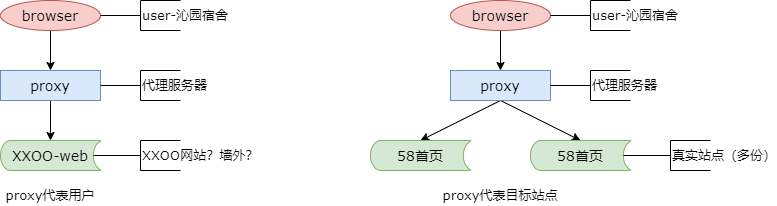
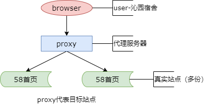
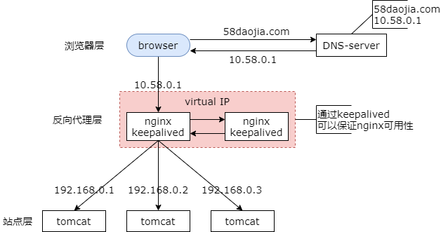
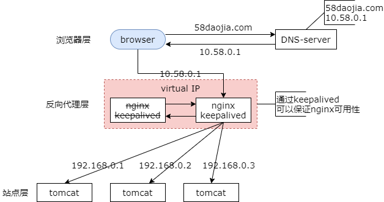

### 6、接入层：反向代理，负载均衡，我有话要说

#### 创业初期，架构特点是什么？

（1）单机系统（All in one）

（2）程序耦合（All in one）

（3）逻辑核心是 CURD

我们先回顾一下，创业初期架构的特点，此时流量处于一个较低的阶段，创业初期系统是一个 All in one 的架构，它是一个单机系统，程序耦合。

#### 架构演进：伪分布式，提升性能

三大分离：

（1）读写分离（引发读写延时新问题）

（2）动静分离

（3）前台后台分离

上一期介绍了架构的演进，系统会变成一个伪分布式的系统来提升性能。此时，系统已经是一个多机的架构了，并初步具备了一些容错性，一台机器挂了不会影响全部。

#### 架构演进：垂直拆分，解耦

垂直拆分

（1）业务垂直拆分

（2）代码垂直拆分（子系统解耦）

（3）数据库垂直拆分（数据量降低，延时缓解）

（4）研发团队垂直拆分（专业化，效率提升）

当然为了解耦，系统还进行了垂直拆分，业务层面进行了垂直拆分，增加了机器，分摊了系统的压力。代码层面进行了垂直拆分，一个工程拆分成了多个工程。数据库层面也进行了垂直拆分，单库的数据量降低了，主从延时也缓解了。研发团队也进行了垂直拆分，分工越来越细，越来越专业，职责越来越清晰，代码越来越专注，效率也逐步的提高。

#### 此时，架构存在什么问题？

那么到了这个阶段，系统架构存在什么问题呢？

**垂直拆分，解除了子系统耦合**

**但，对于同一个垂直站点子系统，仍然是一个“单体架构”**

我们会发现，垂直拆分之后，虽然解除了子系统之间的耦合，但是，对于同一个垂直站点，仍然是一个单体架构。大家发现，首页，发布页，列表页，最终页，虽然它是一个业务集群，但是，每一个子业务仍然是单点，这也就是它为什么称为“伪”分布式的原因。每一个业务，其实它并不是高可用的。伪集群，伪多机，它存在的问题是，子系统的性能仍然受到单机资源的限制，无法扩展。第二，每一个子系统仍然无法做到高可用，只能够做到挂了这个子系统，另外一个子系统不受影响。这个时候怎么办呢？

此时，反向代理技术，就站了出来。

>自己的对伪分布式的一点理解：
>
>首页，发布页，列表页，最终页，各是一套代码，比如各自有一个代码仓库；应用部署在各自的服务器且只有一台，比如首页部署在 ip 为 `192.168.1.1` 的服务器，发布页部署在 ip 为 `192.168.1.2` 的服务器，列表页部署在 ip 为 `192.168.1.3` 的服务器，最终页部署在 ip 为 `192.168.1.4` 的服务器；各自向外暴露访问地址，比如首页暴露的访问地址为 `http://192.168.1.1/index.html`，发布页暴露的访问地址为 `http://192.168.1.2/publish.html`，列表页暴露的访问地址为 `http://192.168.1.3/list.html`，最终页暴露的地址为 `http://192.168.1.4/detail.html`，浏览器分别访问这些地址获取相应的信息。
>
>这里的关键是**应用部署在各自的服务器且只有一台**。

#### 什么是代理？什么是反向代理？

我们先来看一下，什么是反向代理？什么是代理？

对比原来用户和服务器之间加了一层 proxy，访问用户通过 proxy 请求被访问的真实服务器，所以整个访问的过程是：用户 -> proxy -> real server。

什么是代理呢？当 proxy 代表的是用户的时候，此时 proxy 叫做代理。比如，你在家访问 P 站，不希望 P 站 trace 到你的真实 ip，于是就找了一个 proxy，通过 proxy 来访问，此时 proxy 代表的是你，P 站以为 proxy 的 ip 是你的 ip。

那什么是反向代理呢？proxy 代表是被访问的服务器，此时 proxy 是反向代理。例如，web-server 希望对用户屏蔽内部的高可用，屏蔽 web-server 的扩展性，屏蔽 web-server 内网 ip 等细节，于是就找了一个 proxy 隔在中间，此时，proxy 代表的是 web-server 集群，用户以为 proxy 的 ip 是被访问 web-server 的 ip，此时 web-server 是集群，具体内部访问的哪个实际的内网 ip web-server 用户是不知道的。这就是反向代理。

#### 一般，用什么做反向代理？

软件层面：nginx/apache

操作系统层面：LVS

硬件：F5

LVS 和 F5 的细节我就不展开了，感兴趣的同学可以 google 一下去了解一下。

互联网公司绝大部分是使用 nginx 或者 apache 来做反向代理。

#### 反向代理，解决什么问题？

（1）子 web 系统的性能，不再受到单台机器资源限制，可以扩展；

（2）子 web 系统，实现了高可用（伪集群 -> 真集群）；

反向代理它能够解决子 web 系统的性能扩展问题。在有反向代理之前，子系统它的性能仍然受制于单机硬件，但有了反向代理之后，子系统不再受单机资源限制，可以任意的扩展。同时反向代理实现了子 web 系统的高可用，由原来的伪集群变成了真集群。现在就可以通过增加机器来扩充 web 层的性能并且保证系统的高可用。

每一个技术方案都是两面的，反向代理解决了资源扩展以及高可用的问题，那么它带来了什么新的问题呢？

#### 反向代理，带来了什么新的问题？

（1）多个 web 节点，负载如何分配？（负载均衡问题）

（2）反向代理层，如何保证高可用？（反向代理的高可用问题）

我们会发现，当你有了多个 web 节点的时候，反向代理需要进行负载的分配，这就是它会遇到负载均衡的问题。同时反向代理层变成它变成了一个单点，它要解决反向代理层的高可用问题。

首先我们来看一下反向代理层如何解决 web-server 的负载均衡问题。

#### 反向代理，如何实施负载均衡？

负载均衡方法：随机，轮询，静态权重轮询，动态权重轮询（遗留），一致性哈希

负载均衡抓手：四层（转发/交换），七层（转发/交换）

我们可以用很多负载均衡的方法，比如随机分配负载，轮询分配负载，静态权重的分配负载，动态权重的分配负载或一致性哈希。

什么是随机？前端来了一个请求给反向代理，反向代理随机的将请求分配给后端的 server。

什么是轮询？第一个请求给到第一台，第二个请求给到第二台，第三个请求给到第一台，第四个请求给到第二台。

什么是静态权重的轮询？当两台服务器的配置不一样，机器配置不同，两台 web-server 的处理能力不同的时候，我们可以配置一个经验值，比如说第一台的处理能力是第二台的两倍，那我们将第一台的负载权重配置为 2，第二台的权重配置为 1，这样的话就会有 2/3 的流量给到第一台，1/3 的流量给到第二台。这就是静态权重。

当然根据经验配置权重是不靠谱的，有没有一种方法能够根据两台服务器，两台机器的实际处理能力来分配负载呢？这就是动态权重轮询法。由于这个不是本章的重点，作为一个遗留的问题，后续来跟大家介绍。

前面这些方法都有一个问题，有时候业务上其实有 session 的一致性需求，例如业务上希望相同的 ip 或者相同的用户，它的请求落在同一台 web-server 上。那么随机，轮询，静态权重可能就没有办法做到，这个时候需要有一个一致性哈希的方法，它都需要一个业务属性，都需要一个属性来作为负载均衡的抓手，这里的负载均衡抓手又分为四层的抓手和七层的抓手。那什么是四层的转发交换？什么是七层的转发交换呢？

#### 反向代理，什么是四层（转发/交换），什么是七层（转发/交换）？

这个来源于 OSI 七层网络模型（大学《计算机网络》学过）

图片来源：[https://www.cnblogs.com/qishui/p/5428938.html](https://www.cnblogs.com/qishui/p/5428938.html)

最早是使用左侧的七层模型，但新版的教材应该是使用的 tcp/ip 的五层模型，这两个模型有一个对应关系，可以看到四层其实是指传输层，七层其实是指的应用层。更具体的，对应到 nginx 来做反向代理哈希，四层是指根据用户的 ip 和端口来做哈希，七层是根据 http 协议种的某些属性来做哈希，比如说 session id 或者用户 id 等。

那可能大家会问，有四层有七层，中间怎么少了几层呢？osi 的七层模型，应用层，表示层，会话层，合并为了 tcp/ip 的应用层，所以可能没有所谓的五层或六层转发。那有没有二层和三层转发呢？其实是有的，二层，根据数据链路层的 mac 地址来完成数据的交换，它叫二层的转发交换。三层，根据网络层的 ip 地址来完成数据的转发和交换，它叫三层的转发交换。这些可能在路由器等硬件种是使用二层和三层来进行转发交换的，我们的系统，基本上是基于四层或者是七层，传输层应用层来进行转发交换的。

#### 反向代理，如何包装高可用？

实现了负载均衡，那么反向代理它如何实现高可用呢？

大家可以看一下，一个真实 http 请求，从浏览器访问到我们的后端站点的过程。首先第一步，有一个 dns 的步骤，通过域名访问 dns 服务器得到 nginx 的外网 ip，这个 nginx 的外网 ip，最早是一个节点，它没有办法保证高可用，现在它使用了两个节点，这两个节点使用了相同的虚 ip，也就是说这两个节点的外网 ip 都是 dns 返回解析的外网 ip。同时有一个机制来检测对外提供服务的 nginx 的可用性，实际中最常使用的是 keepalived。然后由对外提供服务的 nginx 来做负载均衡，将请求转发给后端实际处理的 web-server，后端你会发现使用的就是内网的 ip 了，内网的 ip 对于用户是透明的。反向代理它代表的是整个 server 集群。

当 nginx 挂了的时候怎么办呢？是如何保证高可用的呢？

当 nginx 挂了的时候 keepalived 能够探测出有一台 nginx 不可服务了，于是它会将请求的流量导入的备用的 nginx 上，由于备用的 nginx 和原 nginx 使用的是相同的虚 ip，也就是外网 ip 仍然是 dns 解析的外网 ip，所以整个过程对于调用方浏览器是透明的。两台 ngnix 的配置完全一样，落到新的 ngnix，新的 ngnix 仍然可以将请求负载均衡转发给后端的真实 server。

这样就解决了反向代理层的高可用问题。这个方案的缺点是，两台 ngnix 实际上只有一台对外提供服务，整个资源的利用率只有 50%。这里留一个作业，有没有办法克服这个缺点，使得两台具备相同虚 ip 的 nginx 都得到利用呢？

#### 总结

（1）单体架构，如何“真集群”，解决扩展与高可用的问题？反向代理。

（2）代理，代表用户；反向代理，代表 web 集群。

（3）最常见的反向代理是 nginx。

（4）引入反向代理，要解决：负载均衡 + 反向代理高可用，两个问题。

（5）负载均衡，利用 nginx 的随机，轮询，静态权重，一致性 hash 解决。

（6）反向代理高可用，用 VIP（Virtual IP） + keepalived 解决。

（7）遗留：

* 如何实现，异构服务器负载均衡？
* 如何提升，高可用 nginx 资源利用率？