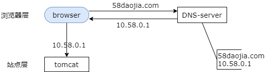
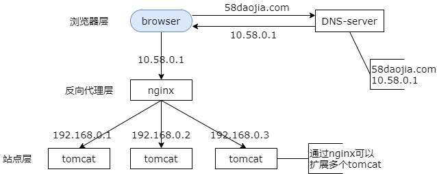
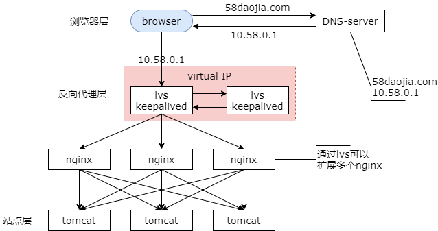

### 7、DNS轮询,以及接入层架构演进

不確定大家知不知道 dns 轮询技术啊，很多朋友可能觉得这是一个过时的技术了，今天就和大家简单来聊一聊。

#### 架构：伪分布式，垂直拆分

**潜在的问题，子系统仍然是单体架构**：

（1）子系统的性能，受到单台机器资源限制，不能扩展；

（2）子系统，不高可用（伪集群）；

先简单回顾一下上一节的内容。伪分布式使得单机 All in one 架构变成了集群架构，垂直拆分解除了子系统的耦合，但是对于同一个垂直站点子系统仍然是一个单体架构。如架构图所示，首页，发布页，列表页和最终页，看上去是业务集群，但此集群是伪集群，伪多机。第一，子系统的性能仍然受到单台机器资源限制，无法扩展。第二，子系统仍然无法做到高可用，只能做到挂了这个子系统另外一个子系统不受影响。此时该怎么办呢？

#### 解决方案：反向代理

（1）子系统集群化，可以多机扩展；

（2）子系统，高可用（伪集群 -> 真集群）

上一节讲了用户通过 proxy 请求被访问的真实服务器，用户 -> proxy -> real server。什么是代理呢？当 proxy 代表用户时，此时 proxy 是代理。什么是反向代理呢？当 proxy 代表被访问的服务器时，此时 proxy 是反向代理。通过反向代理解决了大的问题，现在可以通过增加机器来扩充 web 层的容量了，并且能够保证高可用。

#### 两个问题

（1）nginx 是 2012 年，国内才流行起来的技术，在反向代理之前呢？

（2）nginx 成了系统瓶颈，怎么办？

那么问题来了，在反向代理之前是如何解决接入层的扩容问题的呢？nginx 是 2012 年国内才流行起来的技术，在反向代理之前他们使用的是什么技术方案呢？第二个问题，反向代理虽然可以做到高可用，但是它的资源利用率只有 50%，也就是说只有一台 nginx 对外提供服务，那么 nginx 有没有可能成为系统的瓶颈？如果单台 nginx 的性能扛不住，此时要怎么办呢？

**今天，来讲讲“DNS轮询”，以及接入层架构演进！**

研发工程师可能不太知道这个技术，这个技术不只是运维才需要掌握的技术，在系统的扩展性上是架构师必须掌握的技能。

#### 最初的架构，以及最初的问题

**单体架构**

单体时代，架构图如图所示。浏览器先通过 dns 获取域名对应的外网 ip，然后再通过这个外网 ip 访问对应的 web-server。这样的缺点是，子系统的性能受到单台机器的限制，不能扩展并且不能高可用。这是最初的单体架构。

#### 优化方案（早期，没有反向代理）

**单体架构 -> DNS 轮询**

假设 tomcat 的吞吐量是每秒钟 1000 次，当系统的吞吐量达到 3000 时，扩容是首先需要解决的问题。dns 轮询是一个非常容易想到的方案，可以通过 dns 轮询解决扩展性问题。

那什么是 dns 轮询呢？在进行域名解析的时候，dns-server 可以轮询的返回不同的外网 ip，这就是 dns 轮询。此时的架构图如上。我们部署了很多份 web-server，大家可以看到，此时是没有反向代理的，我们在站点层部署了多台 web-server，对外暴露了多个公网 ip，在解析域名的时候 dns 会轮询的返回这些外网 ip，也就是说对于相同的域名每次会解析到不同的 ip，这就是 dns 轮询技术。

通过 dns 轮询技术来扩展站点层的服务有很多优点。

首先，零成本。站点层集群扩容节点之后只需要在 dns-server 上多配置几个 ip 即可，功能也不收费。

第二，部署简单。多部署几个 web-server 即可，原来的系统架构不需要做任何改造。

第三，负载均衡。变成多机以后，dns 轮询可以保证每个节点的负载是均衡的。

但是 dns 轮询的不足是，系统仍然是非高可用的。dns-server 它只负责域名解析 ip，这个 ip 上的服务是否可用，也就是说站点层的节点如果挂了 dns-server 是不知道的，如果有节点挂了，有一部分的流量会受到影响，整个系统非高可用的。

第二个不足是，它的扩容并不是实时的。是因为 dns 的解析有一个生效周期。

第三个不足是，暴露了太多的外网 ip。可能安全性会受到影响。

这是早期没有反向代理的时候进行站点层的性能扩展所使用的方案，dns 轮询。

**强调一下，如果仅仅使用 DNS 轮询，并没有保障高可用（只是，局部可用）！**

web-server 挂了，部分流量会受到影响，它是局部高可用。

#### 升级优化方案（有了反向代理之后）

**DNS 轮询 -> 反向代理**

在有了反向代理之后这个问题就解决了，tomcat 的性能比较差，（假设）每台是 1000，nginx 作为反向代理的性能就高很多，假设线上能够跑到 1 万，它比 tomcat 提高了十倍，可以利用 nginx 反向代理来做扩容，此时站点的架构如上，站点层与浏览器层中间加了一个反向代理，nginx 将 http 请求分发给后端的多个实际的 web-server。

反向代理的优点是 dns 不需要变化，负载均衡可以通过 nginx 来保证，只暴露一个外网 ip，对外屏蔽内网的 ip，而且它的扩容具备实时性。nginx 后端增加一个站点层的节点，挂上去立刻能够扩容，不像 dns 扩散全网还需要一个时间，并且它能够保证站点的可用性，任何一台 tomcat 挂了，nginx 探测到之后可以立刻的将流量迁移到其他的节点。

但是它的不足是，整个处理的流程时延增加了，因为它中间增加了一层，中间加了一个反向代理层，时延增加了，架构更复杂了，并且反向代理成了单点。

#### 进一步升级架构

**反向代理 -> 高可用反向代理**

反向代理成了单点之后那我们需要通过 keeplived 加冗余 nginx 节点来保证反向代理层的高可用。两台 nginx 组成一个集群，分别部署上 keepalived，设置相同的虚 ip，保证 nginx 的可用。当 nginx 挂了的时候，keepalived 能够探测到并将流量自动迁移到另外一台 nginx 上，这个过程由于它使用的是相同的虚 ip，对调用方是透明的。

这样的话，就解决了反向代理的高可用问题，但是它的不足是，资源利用率只有 50%，两台 nginx 只有一台对线上提供服务，另外一台是 standby 的，仅在主 nginx 出问题的时候才提供服务。

高可用的反向代理在上一节中已经进行了详细的介绍，此处不再展开。那还存在什么问题呢？也就是开篇提到的，nginx 它只有一台对线上提供服务，那如果整个站点的吞吐超过了 nginx 的 1 万每秒，比如说达到了 5 万，那怎么办呢？当然了绝大公司到不了这一步，每秒吞吐量 5 万次。

**高可用反向代理 -> 多层高可用反向代理**

此时系统的架构会从高可用反向代理升级到多层高可用反向代理。nginx 是应用层的软件，性能比 tomcat 好，但总有一个上限，当系统吞吐量超出了 nginx 的上限，还是扛不住。

lvs 就不一样了，它是实施在操作系统层面的。F5 的性能又更好了，它是实施在硬件层面的。它们的性能都比 nginx 高很多，这样的话我们可以利用 lvs 和 F5 来进行扩容，形成多级反向代理，把 lvs 架在 nginx 的上层，它每秒钟可能可以扛 5 万，F5 可能可以扛 10 万，我们依然选用虚 ip 加 keepalived 的方式来保证系统的高可用。多层高可用反向代理。

这里需要强调的是，lvs 作为系统的总人口，做了高可用之后，它下层的反向代理 nginx，和再下层的站点层 tomcat，其实不用再做虚 ip 的。是因为如果 nginx 出了问题，lvs 能够探测到，能够实时的将流量迁移到其他的 nginx；如果 tomcat 出了问题，nginx 也能够探测到，它能够将流量转移到其他的 tomcat。所以 nginx 和 tomcat 下层的反向代理和站点不需要做虚 ip，只有在入口处需要做虚 ip。

99.99% 的公司到这一步基本结束了，它能够解决接入层的高可用，扩展性，负载均衡问题。难道这就完美了吗？还有什么潜在的问题呢？不管是 lvs 还是 F5，这些都是典型的 scale up 的方案。什么是 scale up？根本上 lvs 和 F5 还是会有性能上限的。假设 lvs 每秒钟能够处理十万个请求，那么它一天也就只能处理 80 亿的请求。那么假设有一个系统它的日 pv 超过了 80 亿次，那该怎么办呢？当然很少有公司它的系统日 pv 会超过 80 亿次。

**多层高可用反向代理 -> DNS 轮询**

架构，此时架构需要进一步升级，由多层高可用反向代理再增加一个 dns 轮询，水平扩展才是解决性能的根本方案，它能够通过增加机器的方式扩充系统的性能，像 facebook，google，百度，像这样的一些站点，它的日 pv 肯定是超过 80 亿次的，那么他们的域名只对应一个 ip 吗？终点又是起点。还是得通过 dns 轮询得方式来进行扩容。

此处 dns 轮询解决的是扩展性的问题。架构图里，下面是多次高可用反向代理，通过 dns 轮询可以扩展多个高可用的 lvs。通过 dns 轮询同一个域名返回不同的外网 ip 来扩充接入入口。一组虚 ip 的 lvs 能够每秒扛 10 万，两组能够扛 20 万，三组能够扛 30 万，每秒能够扛 30 万。可以通过增加机器的方式来扩充系统的性能。

入口层通过虚 ip 加 keepalived 保证高可用，通过多层反向代理下层再扩展 nginx，通过 nginx 来做负载均衡，业务七层路由，再下层是实际的站点应用。

**又使用了 DNS 轮询，有没有保障高可用？还是，局部高可用？**

**可以保证高可用！**

（1）DNS 轮询，解决性能扩展问题；

（2）VIP + keepalived，解决高可用问题；

前面说的是，如果仅仅使用 dns 轮询，它不能够保证高可用，但它加上 keepalived，vip，就可以解决这些问题了。最终 dns 轮询解决的是，性能扩展的问题，keepalived 加 vip 解决的是，高可用的问题。

所以这需要 dns 轮询和其他技术配套使用就能够解决高可用和扩展性的问题。

我们会发现

**架构方案，是一步一步演进而来的！**

我们需要

**知历史，知现状，想未来！**

#### 总结：DNS 轮询，并不是过时的技术

（1）单体架构，要解决性能扩展问题，**早期，使用 DNS 轮询架构**；

（2）**现在，可以使用 nginx 反向代理架构**；

（3）反向代理，不高可用，需要进一步升级为**高可用反向代理架构**；

（4）高可用反向代理，扩充性能，可以使用**多级（LVS & F5）反向代理架构**；

（5）多级反向代理架构，扩充到**无限性能，使用 DNS 轮询架构**；

（6）DNS 轮询，解决性能扩展问题；VIP + keepalived，解决高可用问题；