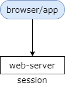
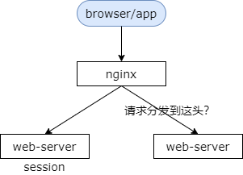
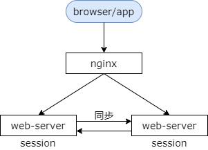
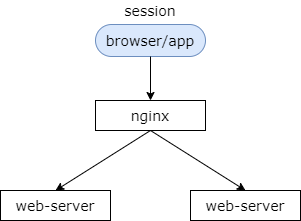
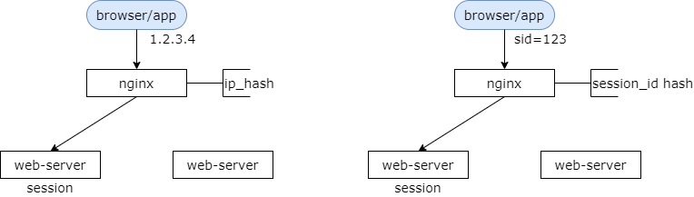
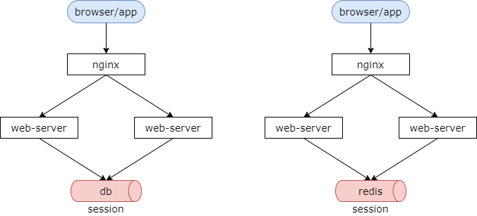

### 8、接入层：session一致性，要如何保证？

#### 什么是 session？

首先来看一下，什么是 session？

服务器会为每个用户创建一个会话，存储用户的相关信息，以便多次请求能够定位到同一个上下文。web 开发中 web-server 可以自动的为同一个浏览器的访问用户自动创建 session，提供数据存储功能。最常见的，会把用户的登录信息，用户信息，存储在 session 中，以保持登录状态。

#### 什么是 session 一致性问题？

那什么是 session 一致性问题呢？

只要用户不重启浏览器，每次 http 短连接请求理论上服务端都能定位到 session，都能够定位到同一台 web-server，以保持会话。这就是所谓的 session 一致性问题。

解决 session 一致性问题有哪样的一些方案呢？

#### All in one 架构，不存在 session 一致性问题

业务早期 All in one 单体架构不存在 session 一致性问题。当只有一台 web-server 提供服务时，每次 http 短连接请求都能够正确路由到存储 session 对应的 web-server，因为只有一台嘛。

此时 web-server 是无法保证高可用的，根据前面小节的介绍，此时会使用反向代理的架构，站点集群化来保证高可用。

#### 反向代理架构，可就出问题了！

中间加了 nginx 反向代理，后端实现了 web 集群化，保证高可用。当使用多台 web-server 来保证高可用时，每次 http 短连接请求就不一定能路由到正确的 session 了。

如上图所示，假设用户包含登录信息的 session 都记录在第一台 web-server 上，如果反向代理将请求路由到另外一台 web-server 上，就可能找不到相关的信息而导致用户需要重新登录。这就是 session 不一致了。那该怎么办呢？

#### 反向代理架构，保证高可用的同时，如何保证 session 路由的一致性呢？

##### 方案一：session 同步法

思路：站点集群 session 同步

多个 web-server 之间相互同步 session，这样每个 web-server 之间都包含全部的 session。

使用这种方法的优点是，这是 web-server 支持的功能，应用程序不需要修改任何代码。但它的不足是，session 同步需要数据传输，它需要占内网带宽。所有的 web-server 都包含所有的 session 数据，所以它的数据量受内存限制，没有办法进行水平扩展。当有两台 web-server 时这种方案还比较可行，当有更多的 web-server 时，这个方案要歇菜，多台 web-server 相互同步性能会急剧指数型下降。

##### 方案二：客户端存储法

思路：session 存储在客户端

服务端存储所有的用户 session，内存占用比较大，可以将 session 数据存储到浏览器的 cookie 里，每个端只要存储一个用户，也就是自己的数据就可以了。

它的优点是，web-server 不需要存储 session。它的缺点是，每次 http 请求都需要携带 session，非常占用外网的带宽。数据存储在端上并在网络进行传输存在：泄露、篡改、窃取等安全隐患。最后，如果你把 session 存储在端上，存储量的大小会受端上 cookie 的限制。

端存储的方案虽然不常用，但确实是一种思路，把海量存储在服务端的数据分散存储到每一个端上。

##### 方案三：反向代理 hash 一致性（四层，七层）

思路：反向代理路由来保障

web-server 为了保证高可用，有多台冗余，反向代理层能不能做一些事情让同一个用户的请求保证落在同一台 web-server 上呢？

左边的方案，四层代理 hash，反向代理层可以使用用户的 ip 来做 hash，以保证同一个 ip 的请求落在同一个 web-server 上。

右边的方案，七层代理 hash，反向代理使用 http 协议中的某些业务属性来做 hash，例如 session id，又或者城市 id，又或者用户 id 等，能够更加灵活的实施 hash 策略，以保证同一个浏览器的用户的请求落在同一台 web-server 上。

这种方案的优点是，只需要修改 nginx 的配置而不需要修改应用程序的代码，并且它的负载是均衡的，只要你的 ip 是随机的，session id 是随机的，多台 web-server 的负载都是均衡的，并且它能够很好的支持 web-server 的水平扩展，也就是说 web-server 你多加多台机器也是没有问题的。

它的缺点是，如果 web-server 重启，一部分 session 会丢失，会对业务有微小的影响。例如触发部分用户重新登录。第二个缺点是，如果 web-server 进行水平扩展，nginx 会进行重新的 hash，session 会重新分布，也会导致一部分用户路由不到正确的 session，从而需要重新登录。

当然 session 一般是有有效期的，上面提到的两点不足可以认为等同于 session 的失效，一般来说对业务影响不大。

对于平时应该实施四层的 hash 还是七层的 hash，个人推荐使用四层的 hash 来保证 session 的一致性。为什么呢？让专业的软件做专业的事情，反向代理负责路由转发，尽量不要引入业务层的业务属性，也就是说 http 协议中的业务属性最后不要让 nginx 来关注。这是我的一个观点。

##### 方案四：后端统一存储法

思路：不存储在站点上，统一存储在后端（数据库，缓存）

将 session 存储在 web-server 后端的存储层，数据库或者缓存。你看左边这个图，可以将 session 统一存储在后端的数据库里。右边这个图，可以将 session 存储在后端统一的缓存里。

它的优点是，首先没有了安全隐患，session 不用在外网上进行传输了。同时它可以实现 web-server 层的任意水平扩展，当数据量增大的时候，数据库或者缓存进行相应的水平切分即可。同时 web-server 扩容或者重启的时候都不会有 session 的丢失，用户都不需要重新登录。

它的不足是，增加了一次网络调用。原来的 session 都存在 web-server 内部，存在本地，不需要跨网进行调用。如果你把它统一存储在后端的数据库或缓存里就需要多进行一次网络调用。同时需要修改应用层的代码，前面提到很多 web-server 它能够自动的生成 session，管理 session，但是如果你把它放在数据库或者是缓存里就需要你的应用代码来管理 session。

对于是数据库存储，还是缓存的存储，个人推荐使用后者。因为 session 的读取频率会比较高，如果用数据库存储，在数据量吞吐量上来的时候，数据库的压力会比较大。使用缓存的话，性能会更好。如果 session 有高可用的要求（一般没有），cache 可以做高可用，但大部分的情况下 session 是可以丢失的，一般也不需要使用高可用，所以使用缓存来说是比较合适的。

#### 总结：如何保证 session 一致性？

（1）**session 同步法**：多台 web-server 相互同步数据；

（2）**客户端存储法**：一个用户只存储自己的数据；

（3）**反向代理 hash 一致性**：四层 hash 和七层 hash 都可以做，保证一个用户的请求落在一台 web-server 上。

（4）**后端统一存储法**：web-server 重启和扩容，session 也不会丢失；

互联网架构实践：（3）和（4）用得最多，个人推荐用（4）。