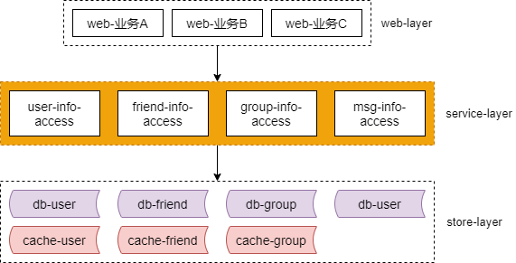
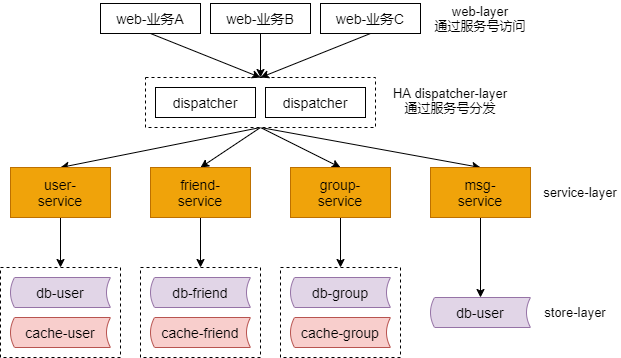
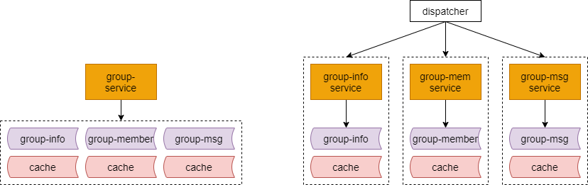
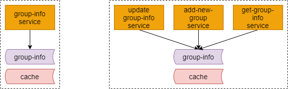

### 15、服务化：微服务架构，粒度多少合适？

#### 服务化有什么好处？

（1）复用性，消除代码拷贝

（2）专注性，防止复杂性扩散

（3）解耦合，消除公共库耦合

（4）高质量，SQL稳定性有保障

（5）易扩展，消除数据库解耦合

（6）高效率，调用方研发效率提升

上一章聊了服务化的好处，服务化究竟能够解决什么问题呢？他能够提升复用性，消除代码的拷贝。能够提升专注性，防止服务底层的复杂性扩散。他能够解除公共库之间的耦合。他能够提高质量，保证数据库访问 SQL 的稳定性。他能够提升扩展性，消除数据库之间的耦合。最重要的是，它能够提高研发效率，调用方就像调用本地函数一样访问远端的数据，增加一个服务层。

微服务，微服务，服务的粒度该如何选择呢？

互联网有这么几种实践。

#### 实践一：统一服务层

第一种实践是，统一整个服务层。一个统一的服务层。这是最粗犷的玩法。所有的基础数据，都通过一个统一的服务层来进行访问。当业务不是特别复杂的时候，这不失为一个快速分层的一个方案。一旦业务变得复杂，服务层会变得非常非常的重，成为耦合的焦点。

我们举一个微信的场景。假设微信他通过一个通用的服务层来访问基础数据。有一个统一的服务层，用户的数据，好友的数据，群组的数据，消息的数据，都通过这个服务层来访问，向调用方屏蔽底层的复杂性，分库分表啊，缓存啊，通过 rpc 接口来调用底层的数据。

#### 实践二：一个子业务一个服务

第二个实践，一个子业务一个服务。如果整个数据的访问都通过一个服务层来访问的话，一旦代码出故障，就将影响整个服务，所以更合理的做法应该是，在服务层进行垂直拆分。服务层如何进行垂直拆分呢？

还是以微信的场景为例。一个子业务抽象出一个服务。那么抽象之后可能变成下面这个样子。

用户相关的基础数据，访问用户服务。好友相关的基础数据，访问好友服务。群组相关的基础数据，服务群组服务。消息相关的基础数据，访问消息服务。每一个子业务的服务，对调用方屏蔽底层的复杂性。一个服务出问题也不会影响其他的服务。与此同时，数据层也会按照子业务进行垂直拆分。所以它是一个很好的方案。

如果按照子业务进行垂直拆分，你会发现服务的粒度变细了，会出现一个新的问题，业务与服务的连接关系变得复杂了，有没有什么更好的优化方案呢？

大家会看到每个业务它会调用多个服务，业务与服务之间的依赖关系变成了类似于蜘蛛网这样的的概念。有没有什么优化方案？

最常见的一个方案是加入一个网关分发层，来消除业务与子服务之间的这个网状关系。Service Mesh 也就是这么干的。并在协议设计的时候加入一个协议号，服务号。调用层统一的调用分发层的网关，分发层的网关通过统一的协议号，服务号来将请求路由到相关的子业务服务。调用方依赖分发层，传递入服务号，分发层依赖服务层，通过服务号进行分发。它是一种常见的消除网状依赖结构的方案。加入一个分发层。

#### 实践三：一个数据库一个服务

实践三，一个数据库（表）对应一个服务。你会发现粒度越来越细了。

数据访问层最初其实是从 DAO/ORM 演化过来的。最早没有服务之前是通过 DAO/ORM 去访问数据库嘛。所以有些公司他也有一个数据库（表）一个服务的一个玩法。左边这个图他对应的是群组服务，群组服务的底层可能有群组基础信息的库（表），群组成员的库（表），群组消息的库（表），有多个数据库（表）。那么按照这种玩法的话，他可以拆分成三个服务，每一个服务对应一个数据库（表）。那群组基础信息的库（表）就对应群组基础信息的服务，群组成员的库（表）对应群组成员服务，群组消息的库（表）就对应群组消息服务。拆分成一个数据库（表）一个服务，架构会变成右边这个样子。库之间也相互垂直拆分，服务的粒度又变细了。

还有没有可能粒度再细呢？是可以的。

#### 实践四：一个接口一个服务

最极端的，更极端的微服务架构中，甚至可以一个接口对应一个微服务。左边的这个图它是一个库（表）对应一个微服务，群组信息服务。群组信息他可能有那样的一些接口呢？有修改群组信息，有新增群，有获取群组信息，他可能三个接口对应三个微服务。这样的话，他多个服务就可能操纵一个数据库，如何接口出问题不会影响其他的接口。如果数据库出问题，多个接口可能会被影响。

这种微服务的拆分方式粒度太细了，一般来说，他与开发语言都是结合的比较紧密的。比如说 go 语言，这种比较轻量级进程的一种语言，那他才可以做这种接口微服务的方式，其他语言用这种方式会比较少。

#### 不同的粒度，各有什么优缺点？

我们将微服务设计成了不同的粒度，每种方案，或者是方案越粗，方案越细，各有什么优缺点呢？

总的来说，细粒度拆分，他有这样一些优点。

他的服务他都能够独立的部署，扩容和缩容就相对比较方便，能够更有效的提高资源的利用率。

拆的越细，耦合度会相对减小，因为一个服务出问题，他就影响的范围更少。

拆的越细，容错性也相对会更好。扩展性也会比较好。

但是拆分粒度越细，他也有一些明显的不足。比如说服务的数量会变多。系统复杂性会增加。依赖关系的复杂性，或许也会增加。运维的复杂性当然也会提升，维护的进程个数多了嘛。监控会更复杂。定位问题会更复杂。如果没有上一章说的微服务体系的各种基础设施和平台配套的话，可能会搞得痛不欲生。

**互联网公司，最佳实践：以“子业务”作为微服务的粒度：**

**用户服务**

**订单服务**

**支付服务**

**...**

那哪一种方法，哪一种粒度的拆分方案，是互联网公司中最常见的呢？

第二种方案是互联网公司的最佳实践。以子业务这个粒度，做为微服务的拆分粒度。比如说，用户一个子业务，他会有用户的服务。有订单的服务，有支付的服务，等等等等。

#### 总结，微服务的粒度

（1）统一服务层

（2）一个子业务一个服务

（3）一个库一个服务

（4）一个接口一个服务

互联网最佳实践：一个子业务一个服务

