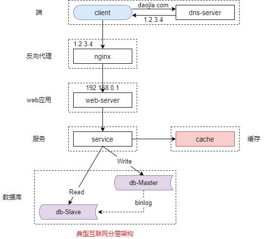

### 16、服务化：微服务架构，必须搞定高可用！

#### 微服务的粒度

（1）统一服务层

（2）一个子业务一个服务

（3）一个库一个服务

（4）一个接口一个服务

互联网最佳实践：一个子业务一个服务

之前聊了微服务的粒度。我们可以统一一个服务层，服务化初期我们可以那么做。也可以实现一个子业务一个服务，按照业务垂直拆分。也可以一个库一个服务，按照数据库进行垂直拆分。极限的情况下可以一个接口一个服务，按照接口垂直拆分，这往往需要结合一些语言特性，比如说 go 语言。其中第二种方式是互联网的最佳实践，一个子业务一个服务，按照业务来进行垂直拆分。

微服务分层，架构上需要考虑哪些点呢？首当其冲的，我们考虑的是高可用。

#### 什么是高可用？怎么知道系统是不是高可用呢？

什么是高可用呢？高可用，ha，high availability，是分布式系统架构中必须考虑的因素。他通常是指减少系统不能提供服务的时间。

假设一个系统他一直能够提供服务，我们就说系统的可用性是 100%。如果每运行 100 个时间单位，有一个单位没有办法提供服务，我们就说系统的可用性是 99%。

百度的搜索首页是行业内公认的高可用保障做的非常好的一个系统。早期的时候甚至很多人通过打开百度首页来判断网络能不能连通，如果打不开，他可能不会去想说是不是百度挂了，而会去想是不是网络连不上。这其实是对百度高可用的一个褒奖。

这么判断自己的系统是不是高可用的呢？我们可以随机的关停线上的一台服务器，如果对用户的服务不受影响，那么系统就是 100% 高可用的。那如果系统受影响了，异常了，那就不是高可用了。这个方法是不是比较简单？

#### 如何保障系统的高可用？

（1）集群化（冗余）

（2）故障自动转移

我们都知道，单点系统是高可用的大敌，应该尽量在系统设计的过程中避免单点。方法论上高可用保证的原则是：集群化冗余。只有一个单点的话，挂了服务会受影响，如果有冗余备份，是集群的话，挂了的话，还能有其他备份能够顶上。

所以保证系统高可用架构设计的核心是冗余。光有冗余还不够，每次出现故障的时候，如果需要人工介入来恢复故障，那势必会增加系统不可服务的时间，所以我们又往往是通过自动的故障转移来实现系统的高可用的。

接下来，我们看一下典型的互联网架构中是如何通过冗余加上自动的故障转移来保证系统的高可用的。

#### 常见微服务分层架构

一个典型的分层的微服务的架构，如图所示，最上游是端，浏览器或者 app。然后是反向代理层。然后是站点应用层。然后是服务层，对上游屏蔽底层的复杂性，提供统一的 rpc 接口。然后是缓存层和数据层，数据做了读写分离，做了分组。整个系统的高可用又是通过每一层的冗余加上故障的自动转移来综合实现的。

#### 第一部分：“端”到“反向代理”的高可用

端到反向代理的高可用是通过反向代理层的集群冗余加上故障的自动转移来实现的。

以 nginx 为例。两台 nginx，一台对线上提供服务，另一台用于保证高可用，是通过虚 ip 加 keepalived 存活探测去实现的。当 nginx 挂了的时候，keepalived 能够探测到会自动的进行故障转移，将流量迁移到另外一个备份的 nginx。由于使用了相同的 vip，所以整个切换过程对于调用方是透明的。这是端到反向代理的高可用。

#### 第二部分：“反向代理”到“站点应用”的高可用

反向代理到站点应用的高可用是通过站点层的冗余来实现的。站点层我们会做集群。

反向代理他在配置文件里会配置多个站点后端并且反向代理能够探测到多个后端的存活性。当有后端挂了的时候，反向代理能够探测到，会自动的进行流量的迁移，将流量迁移到其他可用的站点应用。整个过程是由 nginx 来完成的。这是反向代理到站点应用层的高可用的保证。也是通过集群化，将故障自动转移去实现的。

#### 第三部分：“站点应用”到“微服务”的高可用

站点应用到微服务他是通过服务层的集群冗余来实现的。

他的上游调用方，是服务连接池，rcp-client 里面有一个组件是服务连接池，他会建立与下游多个服务的连接，每次请求会用随机，轮询，一致性哈希等等方式来选取连接池中的连接来访问下游的服务。当有下游挂掉的时候，连接池是能够探测到的，他会进行自动的故障转移，将流量迁移到其他可用的微服务上去。整个过程是由连接池完成的，对于调用方也是透明的。这个连接池是 rpc-client 中非常非常重要的一个基础组件。

#### 第三部分：“微服务”到“缓存”的高可用（memcache）

因为 memcache 他天然不支持集群，如果我们要实现高可用，那我们要自己部署 memcache 的集群来进行数据的冗余。我们可用封装一个 memcache 访问的客户端，每一次利用双读或者双写的方式来进行数据的冗余来保证 memcache 的高可用。

#### 第三部分：“微服务”到“缓存”的高可用（redis）

redis 也是用的非常多的缓存。redis 他天然支持集群，那我们可用用 redis 官方的 sentinel 哨兵机制来做 redis 集群的存活性探测。

比如说集群中有节点挂掉的时候，sentinel 哨兵集群他能够探测到，能够自动的通知 redis 的客户端，某一个节点挂了，你应该访问另外一个节点。整个过程是由哨兵集群和 redis 客户端反向通知配合完成的，对于调用方也是透明的，代码不需要修改，人工不需要介入。你会发现他的本质也是集群冗余，加上故障自动转移去实现微服务到缓存的访问的高可用的。

**缓存，真的有高可用需求么？**

**更多的时候，只要不“雪崩”压垮数据库，就 OK 了！**

但是缓存这一边要多说一句，很多时候缓存是不需要保证高可用的。缓存更多的使用场景是用来加速数据访问的，把一部分热数据放到缓存里能够降低数据库的访问量。如果缓存挂了，或者缓存没有命中，可以去后端的数据库里面再取数据，只要你保证所有的缓存流量压到数据库，数据库不会雪崩，设计上这么做就 ok 了。

**缓存架构，避免“雪崩”压垮数据库即可**

那此时我们可以这么做，我们可以将缓存进行水平切分，他也是一个集群，但是这个集群他只是用来做分片并不是用来做数据的冗余。在上游设置一个代理，对于调用方而言，代理就是整个进行完水平切分的缓存的入口。当有一个 key，访问代理的时候，由代理对 key 进行水平切分，具体访问哪一个水平切分的 cache 节点，对于调用层是透明的。当其中有一个节点挂掉的时候，访问这个节点上的 key，这个代理集群统一的返回 cache miss，对于其他没有挂掉的节点，key 的访问依然能够返回相应的数据。这样的话，即使有节点挂掉，也不会所有的流量都打到数据库，造成雪崩，把数据库压垮，只有一部分的流量会打到数据库。这种通过代理来屏蔽缓存水平切分的复杂性的一种方案在行业内也是用的比较多的。这个代理节点也有一些开源的方案，比如说 one cache，大家可以去调研和了解一下。

**第四部分：“微服务”到“数据库”的高可用，如果做了读写分离，必须保证**

**（1）读高可用**

**（2）写高可用**

#### 第四部分：“微服务”到“读库”的高可用

微服务到读库的高可用，是通过读库的冗余集群化来实现的。大家在做读写分离，分组集群的时候，一般来说，会有两个从库或者三个从库。

数据库的读连接池会建立与多个从库的连接，每一次会将请求路由到这些从库。当有从库挂了的时候，数据库的读连接池，能够探测到，会自动的将流量转移到可用的从库节点。也就是说你的服务层通过连接池拿数据库的连接的时候他会返回可用的从库的连接，整个过程是由连接池自动完成的，对于调用方是透明的。所以说数据库的连接池其实也是一个非常非常重要的基础组件。

#### 第四部分：“微服务”到“写库”的高可用

微服务到写库的高可用，也是通过写库的冗余来实现的。

以 MySQL 为例。我们可用设置两个 MySQL 双主相互同步，其中有一台对线上提供服务，另外一台来保证高可用。最常见的实践也是 vip 和 keepalived 保活探测。两台相互同步的 MySQL 主库，一台对线上提供服务，另外一台做备份，keepalived 探测存活性。当对线上服务的 MySQL 主库挂掉的时候 keepalived 会探测到，流量会自动迁移到另外一台主库上。由于他设置的是两台相互同步，所以另外一台主库上也具备全部的数据。又因为他对上游提供的是相同的虚 ip，所以整个过程对于调用方是无感知的，切换过程对于调用方是透明的。这个方案是不是很熟悉，nginx 的高可用的方案也是这样的一个方案。大家如果有使用阿里云的高可用的 rds 主库服务，他也是用的类似的方式去保证高可用的。

#### 总结：高可用，是分布式系统架构设计必须考虑的因素

方法论：集群冗余 + 故障自动转移

细节：

（1）“端”到“反向代理”

（2）“反向代理”到“站点应用”

（3）“站点应用”到“微服务”

（4）“微服务”到“缓存”

（5）“微服务”到“读库”

（6）“微服务”到“写库”