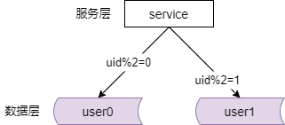

### 17、服务化：微服务架构，必须搞定高并发！

#### 高可用，是分布式系统架构设计必须考虑的因素

方法论：集群冗余 + 故障自动转移

细节：

（1）“端”到“反向代理”

（2）“反向代理”到“站点应用”

（3）“站点应用”到“微服务”

（4）“微服务”到“缓存”

（5）“微服务”到“读库”

（6）“微服务”到“写库”

上一章分享了微服务架构必须要保证高可用。

保证高可用他的设计方法论是集群冗余加上故障的自动转移。

你为了保证全系统的高可用，你的每一层都必须保证高可用。端到 nginx 必须保证高可用，nginx 要实现冗余。nginx 到站点应用，站点应用要实现冗余。站点应用到服务，服务要实现冗余。服务到 cache 大部分情况没有高可用的需求，你要保证不雪崩，如果你有高可用的需求，那么 cache 要冗余。微服务到主库，你想保证高可用，主库要集群冗余。微服务到从库，你从库要集群冗余。没有错都是通过集群冗余加上故障自动转移去实现高可用的。

那么除了高可用以外，高并发也是互联网分布式系统架构必须要考虑的因素。今天我们这一章就来聊高并发。

#### 什么是高并发？

那么什么是高并发呢？高并发，是互联网分布式系统架构设计中必须考虑的因素之一，他通常是指，通过一些设计方案保证系统能够同时并行的处理很多用户的很多请求。

#### 高并发相关的常见指标有哪些？

（1）响应时间（Response Time）

（2）吞吐量（Throughput）

（3）每秒查询率 QPS（Query Per Second）

（4）并发用户数

响应时间，比如说系统处理一个 http 请求，从请求进来到返回，是 200 毫秒，那我们就说，系统的响应时间是 200 毫秒。

吞吐量，是系统在单位时间里处理的请求数量。

qps 是每秒响应的请求数。其实很多时候我们对于查询还是读写区分的没有那么清楚。

并发用户数，是同时承载正常使用系统功能的用户的数量。比如说，一个即时通讯系统可能他的同时在线量就代表了系统的并发用户数。。一个 web 系统，可能 nginx 上同时的 http 连接的数，他就是系统的并发用户数。

#### 提升系统并发处理能力的方法论？

（1）垂直扩展（Scale Up）

（2）水平扩展（Scale Out）

对于提升系统并发处理能力的方法论主要有两条。一条是垂直扩展 scale up，一条是水平扩展 scale out。

#### 垂直扩展（Scale Up）

（1）增强单机硬件性

（2）提升单机架构性能

什么是垂直扩展呢？垂直扩展是指通过提升单机的处理能力来提升系统的并发量。

垂直扩展的方式又主要分为两种。

第一种是，增强单机的硬件性能。比如说你的 cpu 核数是 32 核，你升级到 64 核。比如说你的网卡是千兆，你升级到万兆。比如说你升级为更好的 ssd 硬盘。比如说你扩充硬盘的存储量，扩充内存的存储量。这些都是通过提升单机硬件性能来增加系统性能，提高并发量的方法。

除了硬件层面，当然还有软件层面，你能够提升单机的性能。比如说，你通过 cache 来减少 io 的次数。你可以使用异步来增加单服务的吞吐量。你可以使用无锁的数据结构来减少响应时间。

在互联网业务发展非常迅猛的早期，我之前提到，如果预算不是问题，强烈的建议，使用增加单机硬件的方式去提升系统的并发能力。因为在这个阶段，公司的战略往往是发展业务抢时间。而增加单机硬件是最快的提升效率的方法。

不管是提升单机的硬件性能，还是提升单机的软件架构性能，垂直扩展有一个瓶颈，就是单机的硬件和单机的软件性能总是有极限的，他不可能做到理论上的性能无限，那么此时怎么办呢？

**如何突破单机极限，达成理论上的“无限性能”？**

**水平扩展（Scale Out）**

**只要增加机器数量，就能线性扩充系统性能！**

#### 常见微服务分层架构

具体我们如何做到系统性能无限呢？这个图已经放过很多次了啊。互联网典型的一个分层微服务的架构。你想要做到整体的性能无限，你又必须做到每一层都能够实现水平扩展性能无限。反向代理层，站点应用层，微服务层，缓存和数据层，每一层都必须支持水平扩展才能够做到整体的性能无限。

#### 第一部分：反向代理的水平扩展

第一部分反向代理层如何实施水平扩展呢？

之前介绍过多层反向代理的方案。nging 升级为 lvs 或者 F5，这都是典型的垂直扩展的方案，他并不能够做到理论上的无限性能，是因为 lvs 和 F5 也是有性能上限的嘛。

反向代理进行水平扩展的方案之前其实有简单的介绍过，是通过 dns 轮询实现的。dns-server 对于同一个域名配置不同的 nginx 外网 ip，每次域名解析的时候，轮询的返回不同的外网 ip。这样的话，你的 nginx 他就可以扩展多个节点了。当 nginx 成为瓶颈的时候，你只要增加机器，增加 nginx 服务的数量，在 dns 层多配置上一些外网 ip 就能够扩充反向代理层的性能并做到理论上的无限并发。

#### 第二部分：站点应用层的水平扩展

第二部分，站点应用层的水平扩展是通过反向代理层去实现的。

你可以站点应用层设置集群多个节点，并在 nginx 反向代理的配置文件上配置多个站点应用的后端。当站点应用后端成为瓶颈的时候增加服务器的数量，增加站点应用的节点个数，在 nginx 的配置中配置上新的后端就能够扩展站点的性能并做到理论上的无限并发。

#### 第三部分：微服务的水平扩展

微服务也需要做集群，通过做集群来保证高可用。通过服务连接池保证高可用。对于扩展性也是相同的道理。

微服务层的水平扩展是通过服务连接池去实现的。站点层通过 rpc client 调用下游的服务层 rpc server。rpc client 会建立多个与 server 的连接。当服务成为瓶颈的时候只要增加服务器的数量，增加服务节点的数量，rpc client 会建立新的连接，这样的话就扩展了服务层的性能，并理论上做到无限的的并发。

当然此处如果你要做到优雅的进行服务层的自动扩容，可能需要实现配置中心哪，服务发现哪，等等等等功能，来做到优雅的，平滑的，自动的，这个服务层水平扩展。

#### 第四部分：数据层（缓存，数据库）的水平扩展

（1）存储容量的扩展，无限容量

（2）处理能力的扩展，无限读性能，无限写性能

互联网数据层常见的水平切分方案有那么几种。

**数据层水平扩展：范围水平切分**

第一种，通过数据的范围来进行水平切分。比如说你有一个用户的服务，那么你的每一个节点水平切分之后，存储一定范围内的数据，不管是缓存还是数据库都是相同的道理。比如说第一个节点，你存储的是 1 到 1000 万的用户的数据，第二个节点，你存储的是 1000 万到 2000 万的用户的数据。

通过范围进行水平切分的好处是，首先他的规则简单。微服务只要判断一下 id 的范围就能够路由到正确的节点。第二，他的数据的均衡性是比较好的。第三个，他的优点是比较容易扩展。如果你的容量不够了，你再加一个节点，他就可用存储 2000 万到 3000 万的数据。数据层就扩展了。

但他的不足是，虽然保证了数据层的（数据量）的负载是均衡的，但是他的读写请求不一定是均衡的。因为一般来说，我们新注册的用户，他的活跃度会比老用户高。所以即使他的数据的分配范围是相同的，但是他的请求压力其实是不均衡的。

**数据层水平扩展：哈希水平切分**

还有一种很常见的方案是按照 hash 来进行水平切分的方式。我们的服务层通过存储 key 的 hash，将请求路由到不同的数据层的水平切分的分片。比如说，第一个节点存储偶数的用户数据，第二个节点存储奇数的用户数据。这样的话就将数据水平切分到了多个节点。

hash 水平切分方案的好处是。首先他的规则也非常非常的简单。微服务只需要对这个业务 id 进行 hash 就能够路由到相关的节点。同时它的数据均衡性也非常非常的好，请求均衡性也非常非常的好。只要你的这个 id 是完全随机的，是完全均衡的，数据的分布和请求的分布都非常非常的均衡。

但是它的不足是，它不太容易扩展。比如说你的两个节点要扩展到三个节点，可能你需要进行重新的 hash。这个时候你可能需要进行数据的迁移。那如何平滑的进行数据迁移，那又成为我们需要解决的一个新的问题。

**数据库“水平切分”架构，和“读写分离”架构（分组），有什么本质不同？**

水平切分他主要是扩充数据库的存储量和读写量的。此时每个服务器上存储的数据量是总量的 1/n。单机的性能也会提升。每个服务器的数据是没有交集的，所有服务器上的数据的并集是全量数据。水平切分将数据分到 n 给数据库的节点，理论上读性能提升了 n 倍，写性能也提升了 n 倍。因为提供读写数据库实例的个数提升了 n 倍。其实性能是不止 n 倍的，因为单机的数据量变为了原来的 1/n，所以这个读写性能提升的量会更大一些。

而主从同步，读写分离的分组架构，它主要是提升从库的读性能的。此时每个服务器上存储的数据的量是相同的，主库和从库之间有一种机制进行数据同步，每一个服务器上都存储了数据的全集。读性能扩充了 n 倍，但其实读写分离分组的架构写性能仍然是单点写，写性能是不变的。

这个是水平切分和读写分离架构的一个差异。

#### 总结：高并发，是分布式系统架构设计必须考虑的因素

方法：垂直扩展，水平扩展（无限性能）

细节：

（1）反向代理层

（2）站点应用层

（3）微服务层

（4）数据层