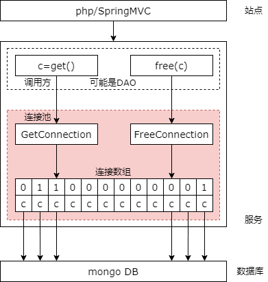

## 19、服务化：连接池，微服务架构基础组件

### 负载均衡，是分布式系统架构设计必须考虑的因素

（1）反向代理层，站点应用层，微服务层，数据层如何实施负载均衡

（2）**连接池**很重要，高可用/扩展性/负载均衡，都和它有关

（3）**过载保护**不掉底，静态权重， 动态权重

上一章说的是负载均衡，我们稍微回顾一下。负载均衡是分布式系统架构设计中必须要考虑的因素之一，他通常是指将请求和数据均匀的分摊到多个操作单元上执行，他的关键在于均匀。反向代理层，通过 dns 轮询。站点层，通过反向代理层的均匀分配。微服务层，通过微服务上游的连接池的均匀分配。数据层通过水平切分，按照范围，按照 hash，来进行数据和负载的平均分配。在这个过程中，连接池他是一个非常非常重要的组件。

上一章还介绍了过载保护，为了实现服务的不掉底，外部持续加压，但是服务的能力不会降为零，我们要实施过载保护。当时介绍了静态权重与动态权重的方法。动态权重法通过一个分值去代表一个服务的处理能力。当成功处理一个请求的时候加一个小分，失败或超时处理一个请求的时候扣一个大分，达到临界值时会休息一小会，但如果连续的超时会休息一段时间。通过这种方式去保护一个节点，转移流量的方式去保护一个节点，但是对于整个集群而言，如果外部的压力超过了整个集群的处理能力，此时我们应该丢弃请求，以保护整个集群。所以单节点的过载保护与集群的过载保护的策略是不一样的。前者是转移流量，后者是抛弃流量。

**高可用，高性能（水平切分无限扩展），负载均衡都离不开一个基础组件：连接池**

那我们今天就简单的跟大家聊一聊连接池底层的一些细节。

### 在有连接池之前，怎么访问下游？

（1）建立连接

（2）通过连接，收发请求

（3）关闭连接

```cpp
DBClientConnection* c = new DBClientConnection();
c->connect("127.0.0.1:8888");
c->insert("db.s", BSON("shenjian"));
c->close();
```

我们先来看在有连接池之前我们是如何访问系统的下游的。工程架构中很多访问下游的需求，包含但不限于：服务，数据库，缓存，其通信步骤基本为：

第一步，与下游建立一个连接。

第二步，通过这个连接收发请求。

第三步，交互结束的时候关闭连接释放资源。

不管是服务，数据库，缓存，官方通常会提供不同的 driver，document 和 demo code 来指导使用者建立连接与调用接口。这边举了一个 mongodb C++ 官方 driver API 的例子。我们会先 new 一个 mongodb 的 db client connection 得到一个连接。然后连接 ip 和端口，连接 mongodb 服务器。然后执行 mongodb 的，你可以理解为这个 SQL 语句吧。最后我们会关闭这个连接。建立连接，发送请求，关闭连接。通过这个连接用户可以实现对 mongodb 的增删查改，从而实现不同的业务逻辑。这是有连接池之前是那么访问数据库的。

### 提前建立连接池之后，怎么访问下游？

（1）拿一个连接

（2）通过连接，收发请求

（3）放回连接

```cpp
DBClientConnection* c = ConnectionPool::GetConnection();
c->insert("db.s", BSON("shenjian"));
ConnectionPool::FreeConnection(c);
```

为什么需要连接池呢？但当吞吐量达到几百几千的时候，建立连接 connect 和销毁连接 close 就会成为系统的瓶颈，此时我们要如何优化呢？当服务启动的时候，我们可以先建立好若干条连接，当请求到达的时候，再从若干个已经建立好的连接中取出一个执行下游的操作，执行完的时候放回。从而避免反复的建立和销毁连接，提升系统的性能。而对这个连接数组进行维护的数据结构，就是我们说的连接池。

我们的代码会升级为，先从连接池组件中 get connection 拿到一个连接，中间依然是执行各种 SQL 语句，最后是将连接放回连接池，connection pool free connection，他其实是没有真正的释放，而是把他放回连接池。与之前的建立连接，执行 SQL，关闭连接相比，有了连接池之后代码升级为拿取连接，执行 SQL，和放回连接。整个逻辑也是非常非常的清晰的。

### 连接池的核心接口

（1）Init

（2）GetConnection

（3）FreeConnection

那么连接池核心的原理与实现是怎样的呢？首先我们可以看到连接池他三个非常核心的接口。第一个接口是初始化，也就是在服务启动的时候，初始化好与下游数据库、缓存或者是服务的连接数组。第二个核心接口是 get connection，每当你要请求访问下游数据库、缓存或者是服务的时候，不是去每次都 connect 他，建立一个新的连接，而是通过连接池的 get connection 来拿一个接口（连接）。free connection，第三个接口，每次请求完数据库、缓存或者是服务的时候，不是 close 一个连接，而是把这个连接放回连接池。这是连接池组件需要提供的至少必须要有这三个核心接口。

### 连接池的核心数据结构

（1）Array DBClientConnection[N]

（2）Array lock[N]

那么连接池的核心数据结构是什么呢？前面提到了我们要一个（连接数组），如果你多个请求并发的使用可能会出问题，我们还需要一个锁数组，来做互斥。

### 连接池核心接口伪代码？

前面简单的介绍了连接池的核心接口与核心的底层的数据结构，那么连接池是如何通过核心数据结构的操纵实现连接池的各个接口的呢？

### 初始化

```
Init() {
    for i = 1 to N {
        Array DBClientConnection[i] = new();
        Array DBClientConnection[i] -> connect();
        Array lock[i] = 0;
    }
}
```

首先是初始化，假设连接池中有 n 个连接，连接池数组中的每一个连接都 new 一个并且和下游的数据库、缓存、微服务进行真正的连接，然后同时把锁数组中的每一个锁置为可用的状态。我这边的锁直接用 0 和 1 去做伪代码了，实际的代码中你不能用 0 和 1（要用锁）。

### 拿连接

```
GetConnection() {
    for i = 1 to N {
        if (Array lock[i] == 0) {
            Array lock[i] = 1;
            return Array DBDBClientConnection[i];
        }
    }
}
```

对于拿连接 get connection 的接口，如果上游调用 get connection 的接口，你其实是返回一个可用的连接，那么我们其实先遍历的是锁数组，锁数组与连接数组是一一对应的，有多少个连接就有多少个锁。如果我们在遍历的过程中发现某一个锁元素是 0，也就是说该连接没有被使用，锁是一个未锁状态，那么我们就将这个锁锁住并把这个锁对应的连接返回给调用方，让他去操纵下游的数据库、缓存或者是微服务。你把他锁住以后，下一个来拿连接的线程，因为这个锁被锁住了就不会返回对应的这个连接。可以简单的理解为一个找可用连接，锁住并返回连接的一个过程。

### 放回连接

```
FreeConnection() {
    for i = 1 to N {
        if (Array DBDBClientConnection[i] == c) {
            Array lock[i] = 0;
        }
    }
}
```

如果调用方用完了这个连接要把这个连接放回，那么我们要把这个连接所对应的锁恢复，以便他给其他的线程去使用这个连接。那我们会遍历连接的数组去找连接数组中的哪一个单元是放回的这个连接，把对应的这个锁置为可用状态，让这个连接能够被后续的工作线程复用。所以放回连接他是一个找到连接并把锁释放的过程。

我这边的伪代码是一个简单的介绍，是一个原理的介绍，但是对于找连接和放回连接在算法上其实都有更高效的方法。

### 是不是并不复杂？



你会发现连接池管理并没有想象中的那么复杂，对于我们的一个微服务的架构中简单的三层分层。调用层，下游被连接层，和中间的连接池层。那么连接池中间有三个核心的接口，除了在服务或者是站点启动的时候初始化你的连接池数组里的每一个连接之外，还要初始化每个连接对应的锁，锁数组，这个锁数组和连接数组是两个核心的数据结构。他对调用方提供的是 get 连接的接口，通过连接池中的 get connection 去找数组中未被加锁的连接，找到了一个未被加锁的连接，返回对应的连接，供调用方使用，同时把这个锁锁住。在调用方用完了之后，他会把这个连接放回，他会找到刚刚是找到哪个连接，是这个逻辑，放回的话我把他的锁然后释放开，让这个连接能够给其他的线程复用。他其实并没有我们想象的那么复杂。

### 还需要考虑那些因素呢？

刚刚提到我们伪代码中其实是通过遍历这个锁数组去找可用连接的，在实际情况中我们可以通过 free connection 数组（链表），我们可以建立一个 free connection 的链表来用 O(1) 的方法快速的找到一个可用的连接。在放回连接的时候伪代码是通过遍历连接数组去找到放回连接对应的锁的位置，我们可以通过 connection map 记录连接与数组下标的一个方法，让放回连接的时候也可以达到 O(1) 级别的时间复杂度。

如果大家有兴趣的话可以找一个比如说第三方的数据库或者是缓存或者是微服务的底层连接池去研究一下代码，其实并不复杂，估计也就是几百行级别就能够实现基础的功能。

但是我们前面的三节其实讲了微服务架构中高可用，如果有连接失效，可能需要连接的重建。如果有下游故障的时候连接时必须剔除失效的连接，实现故障的自动转移。

包括高性能的一章，我们其实讲了扩展性其实也是通过连接池去实现的，如果下游有节点新增，我们需要动态的扩充连接池实现服务的自动发现。

对于负载均衡，微服务层的负载均衡，我们也是通过微服务上游的连接池去实现的，我们可能需要控制每条连接被取到的概率的均等的，来实现同构服务器的负载均衡，那么如果下游是异构的服务器，那我们可能每条连接还需要有一个权重，超时处理或者是成功处理的时候需要减分或者加分来调节访问到下游服务的概率，也是实施在连接池上的。如果有机会后续跟大家来进行一个讲解。

### 总结，连接池

（1）为什么要连接池

（2）两个核心数据结构

（3）三个核心接口

