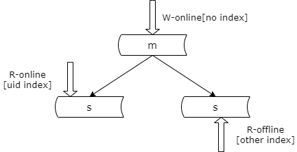

### 21、数据库：读性能要如何提升？

#### 连接池，高可用 + 扩展性 + 负载均衡，的核心

（1）高可用，故障自动转移

（2）扩展性，服务发现：自动载入新服务节点配置 + 动态连接池

（3）负载均衡：轮询，随机，静态权重，动态权重

先做一期上节的回顾，高可用，扩展性，负载均衡，都和连接池有关。连接池可以通过连接的故障转移来实现高可用。连接池可以通过自动载入新服务节点的配置和动态连接池实现微服务的扩展性与服务发现。连接池可以通过轮询，随机，静态权重，动态权重等方式实现负载均衡。

在数据量逐步增加，吞吐量逐步增加的时候，数据库有大量的的磁盘 io，最容易成为系统的瓶颈，然后做好数据库架构，突破系统的瓶颈，是今天要讲的内容。

#### 数据库工程架构，要设计些什么呢？

（1）库表结构

（2）索引结构

我们在做数据库的工程架构设计时需要设计些什么内容呢？我们需要设计库表的结构，我们需要设计索引的结构。

#### 库表结构，索引结构，设计依据？

任何脱离业务的架构设计，都是耍流氓：

（1）依据“业务模式”设计库表结构

（2）依据“访问模式”设计索引结构

库表的结构，索引的结构，我们的设计依据是什么呢？我经常说的一句话是任何脱离业务的架构设计都是耍流氓，我们应该根据业务的模式设计数据库的表结构，我们应该根据数据的访问模式设计索引的结构。

以用户中心为例，我们根据用户的属性来设计用户表的字段，我们根据访问这些字段的模式来设计索引的结构。比如说，登录的过程中需要用登录名来访问，登录名上有 where 条件的查询，索引我们需要在登录名建立索引。登录之后我们通过 uid 来访问，uid 上有 where 查询条件，所以需要在 uid 上建立索引（主键除外）。

没有一成不变的库表设计，没有一成不变的索引设计，所以库表设计和索引设计都必须紧密的结合业务。

除此之外呢？数据库工程架构，还需要考虑什么问题？

大家可以仔细的想想看自己在除了设计库表结构，索引结构的时候，在架构上还设计了哪样的一些点？

#### 以下几个方面，是数据库工程架构设计，必须考虑的：

（1）读性能提升

（2）高可用

（3）一致性保障

（4）扩展性

（5）垂直拆分

如何提升数据库的读性能，如何保证数据库的高可用，如何保证数据的一致性，如何实施数据的扩展性，如何进行垂直拆分。接下来我们会逐一的细致的介绍这几方面的内容，数据库架构设计方方面面的细节。

#### 从数据库读性能提升讲起，如何提升查询性能？

我们首先从数据库读性能的提升说起，如何来提升数据的查询性能呢？

#### 方案一：建立索引

最常见的方法是建立索引。这是我们最常见，也最容易想到的方法。建立索引能够迅速的提升读性能。

**建立索引，存在什么潜在的问题？**

（1）写性能降低

（2）索引占用内存大，buffer 命中率降低，读性能降低

首先，建立了索引之后，数据的写性能会显著的降低。每一次建立索引，我们都会实施一棵新的 B+ 树，在数据进行写入的时候会修改这些 B+ 树。所以 B+ 树越多，树的旋转越多，写性能就会越低。

建立索引除了影响写性能之外，他还可能影响读性能。索引会占用大量的内存，在内存有些的情况下，如果存放了过多的索引，那么内存 buffer 存放数据的空间就减少了，内存 buffer 能够缓冲的磁盘上的数据的量也就减少了，可能导致内存 buffer 的命中率降低，从而在一定程度上影响读取的性能。

**一个实践：可以为不同实例，建立不同的索引**

这里的另外一个实践是，可以为不同的数据库实例建立不同的索引。仍然以用户中心为例。

用户中心我们实施了一主两从，读写分离的架构。主库我们只为线上提供写服务，没有读取，因此我们可以在主库的节点不建立索引以求达到写入性能的最大化。一个从库我们提供线上的查询，那么我们就可以只建立线上查询的索引，例如登录名的索引，uid 的索引。另外一个从库我们提供后台查询，所以我们可以只建立后台查询的索引，比如说一些分页的查询，一些运营需求的查询，可以只建立这样的一些索引。

对于一个数据库集群中的不同实例我们可以建立不同的索引来响应不同的业务需求，以提升性能。但是他潜在的问题是，可能会带来运维层面的复杂性。毕竟同一个数据库集群不同的节点建立索引的 SQL 语句不同，可能会给 dba，给运维的同学带来麻烦。

#### 方案二：增加从库

提升读性能最常用的另外一个方法是，增加从库。

**分组架构，主要解决的，就是读性能提升的问题**

我们之前介绍过数据库的分组架构，一主多从，读写分离，建立一个分组集群。我们通常将一个分组称为 group，它是通过数据的复制，replication 实现的。分组他解决的是读性能扩展，以及读高可用的问题。

每当引入一个新的架构我们都要问自己他究竟解决什么问题，他究竟没有解决什么问题，他会带来什么新的问题。

就以数据库分组架构来说，他究竟解决什么问题呢？他解决的是读性能线性扩展，以及读高可用的问题。他冗余了读库，所以能够实现读的高可用。

他没有解决什么问题呢？他没有解决数据容量的扩展，以及写高可用的问题。一个分组集群中每个节点的数据量是相同的，他没有解决数据容量的扩展问题。同时一个分组集群中写入仍然是单点，所以他没有解决写高可用和写扩展性的问题。

分组会带来什么新的问题呢？他会引发主从的一致性问题。同时从库越多他的数据同步越慢，主从一致性的问题就越严重。

那有一些什么样的优化方案呢？具体的优化方案等后续数据库一致性的章节会跟大家细致的讲解。

#### 方案三：增加缓存

除此之外，增加缓存也是我们用得最多的提升数据库读性能，提升系统读性能的方法。

**缓存，是万金油，不管是否微服务分层，都可以使用缓存**

左边的一个图，是系统进行了服务化之前缓存的使用方案。右边的一个图，是系统实施了服务化之后，缓存的常见方案。

系统实施了服务化之前，由站点应用程序直接读写缓存和数据库。数据库实施了分组架构，写入节点是数据库的主库，读取节点会优先读取缓存，如果缓存没有命中，会读取数据库，并将数据库中读取的数据放入缓存中，以便下一次访问能够命中缓存。

实施了微服务架构之后，微服务向上游站点应用层提供帅气的 rpc 接口，向上游屏蔽底层的缓存复杂性，数据库分组复杂性，数据库高可用复杂性。右图的数据库集群没有实施主从同步分组架构，而实施的是双主高可用的架构，他在写入时写入的是数据库提供服务的主节点，读取时也是先读取缓存，如果缓存命中则直接返回，如果缓存没有命中，则读取数据库，并将数据库中读取的数据放入缓存中，以便下一次读取能够命中缓存。整个复杂性服务层会向站点应用层屏蔽。

在使用缓存提升数据库集群读性能的过程中我们需要注意的是，我们要防止缓存挂掉，数据库会引起雪崩。为了避免相关的雪崩，我们要么实施缓存的高可用，要么对缓存进行水平切分，将缓存分为多个分片，每次缓存只挂掉一个分片，即使该分片的流量全部打到数据库上，数据库也必须承接得住。这是实施缓存的过程中需要考虑的一个问题，防止雪崩，要么做缓存的高可用，要么做缓存的分片。

增加了缓存之后会带来什么新的问题呢？首先业务的读流程会升级。原来直接读取数据库，现在要先读取缓存，命中则返回，没有命中还要读取数据库，并将数据放入缓存中。业务的写流程也需要升级，原来直接写入数据库，现在要先淘汰缓存，再写入数据库。并且还可能出现缓存与数据库之间的一致性问题。总之业务流程变得复杂了。任何一个技术方案解决一个问题，一定会带来其他的复杂性。

#### 总结

**数据库要设计什么？**

（1）依据“业务模式”设计库表结构

（2）依据“访问模式”设计索引结构

**数据库工程架构设计，必须考虑什么？**

（1）读性能提升

（2）高可用

（3）一致性保障

（4）扩展性

（5）垂直拆分

**读性能提升，常见方法与实践？**

（1）**增加索引**，不同实例不同索引

（2）**增加从库**，使用数据库分组架构

（3）**增加缓存**，注意防止雪崩