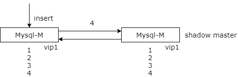

### 23、数据库：主从一致性，主主一致性如何保障？

#### 回顾

**垂直拆分？**尽量把：

（1）长度较短；

（2）访问频率较高；

（3）经常一起访问；

的属性放在主表里；

**高可用，冗余 + 故障自动转移**。

**数据库有状态，冗余一定会引发一致性问题**。

**数据库工程架构设计，必须考虑什么？**

（1）读性能提升

（2）高可用

（3）一致性保障

（4）扩展性

（5）垂直拆分

简单的对上一节进行一个回顾，上一节主要介绍了数据库的垂直拆分与高可用。

垂直拆分，方法论上我们要把长度较短，访问频度较高，经常一起访问的一些属性放在主表里，以提升缓冲池的命中率，让缓冲池能够存储更多的行记录。

高可用，我的核心方法论是数据冗余加故障自动转移。数据库他是有状态的，数据冗余一定会引发一致性的问题。主从的冗余会引发主从一致性的问题。主库与主库的冗余会引发写写一致性的问题。

上一章主要介绍了高可用和垂直拆分。这一章主要跟大家来介绍数据库的一致性保障。

#### 方法论：数据冗余，一定会引发一致性问题

这是为什么呢？多份冗余的数据一定不能在同一时间内修改。多个数据之间的变更会有时间差，这个时间差就可能造成数据的不一致。主从是数据冗余，主从可能不一致。主主是数据冗余，主主可能不一致。除此之外，数据库，缓存，也是数据的冗余，所以数据库缓存也可能不一致。我们一个一个来看。

#### 情况一：主从数据冗余，主从数据不一致

首先是主从数据冗余会引发主从的数据不一致。

**主从不一致，为什么会出现？**

主从的数据不一致为什么会出现呢？我们来看一下这个访问流程。

分组集群主库和从库之间有数据同步。上游的访问读从库，写主库。主从有延时。当服务发起一个写请求之后，服务又立刻发起了一个读请求，此时主从同步未完成，就读到了一个脏数据，从而引发主从的不一致。

然后来解决这种情况呢？通常有三种方案。

**方案一：忽略不计**

第一种叫做忽略不计。因为主从不一致的时间非常非常的短，可能也就几百毫秒，绝大部分业务，例如百度，淘宝订单访问，qq 消息访问，五八同城帖子访问，他其实都允许很短的一个时延，比如说 500 毫秒之内，他读到一个旧数据，500 毫秒之后从库中就是最新的数据了，就能够读到一致的数据了。所以很多业务他都可以对于这种情况进行忽略。任何脱离业务的架构设计都是耍流氓。我们来结合业务，业务如果能够接受就不要把系统搞的太复杂。

**方案二：强制读主**

第二种方案是强制读主。强制读主也非常好理解。我们所有的读请求和写请求都落到主库就避免了主从延时。但是他放弃了读写分离，一主多从的分组架构。分组架构根本上我们是希望通过增加从库来提升系统的读性能，多个从库读性能能够提升。那么你放弃了分组架构，通过从库来提升读性能，你就必须使用缓存的方式来提升读性能。但此时又会引入新的问题，缓存与数据库中的数据不一致。因为它们两个中的数据修改也是有先有后的。

**方案三：选择性读主（需要缓存协助）**

写操作过程

第三种方式是一个折中方案，是一个非常非常有意思的方案，叫做选择性读主。什么叫选择性读主呢？选择性读主的过程是怎样的呢？

它分为写操作流程和读操作流程，并且需要引入一个缓存来协助。

在写请求发生的时候，我们的服务层当然是写主库。同时第二步他要记录在哪一个库哪一个表哪一个主键，这三个信息拼装一个 key，设置到缓存里，并将这个 key 的超时时间记录为主从同步的时延。

再重复一遍，假设主从同步的时延为一秒钟，也就是说一秒钟之内写请求发生了，如果有读请求来访问从库，会读到一个旧数据，他主从同步的时延是一秒钟。那么我将哪一个库哪一个表哪一个主键上发生了写操作的一个 key 设置到缓存里，并将缓存这个 key 的超时时间也设置为一秒钟。

这是写操作的升级过程。

读操作过程

那读操作，当有读发起的时候，他会先去查询缓存，去查询我想读的这个记录是哪个库哪个表哪个主键，我要读的这个记录在缓存里有没有。

如果在缓存里没有，说明这条记录在最近的一秒钟之内没有发生过写请求，那么此时从库中就是最新的数据，我们就直接读从库。

如果这个库这个表这个主键拼装的 key 查询缓存有这条数据，说明这条数据在最近的一秒钟之内发生过写请求，那么很有可能主从同步还没有完成，此时我们就应该将这条读请求路由到主库。

以此来保证所有的读，读到的一定是最新的数据。方法是不是非常的巧妙？

什么时候会发生不一致？写请求发生之后，一秒钟之内的读请求立刻读到从库会发生不一致。

整个方案的思路就是在这一秒钟之间（key）的读请求我们就读主库。那么需要通过缓存来记录在这一秒钟之内主库发生的写操作一秒钟之后如果缓存里没有相关的记录（key），那就无所谓了，那说明主从同步已经完成，我们读从库就好了。通过增加一个缓存，通过增加记录哪个库哪个表哪个主键上最近刚刚发生了写操作来保证读也是读到一个最新的数据。有选择性的读主库或者是读从库，来保证主从之间的数据一致性，不会读到脏数据。

这是主从数据不一致的几种解决方案。

#### 情况二：主主数据冗余，主主数据不一致

接下来我们来看一看主主的数据冗余，主主的数据不一致，有一些什么好的解决方案。

**主主不一致，为什么会出现？**

首先来看一下 MySQL 的主主架构会存在什么问题。首先主主架构他是为了保证主库冗余的高可用。如果 MySQL 使用了主主架构并且同时对外提供服务，那么数据的同步有一个时间差，并发的写入很可能导致数据的同步失败。

这个数据的同步失败会比主从同步的时延要严重非常多。主从同步的时延大不了一秒钟之内读到一个旧数据，一秒钟之后就会读到新数据。

主主的双写冲突他会引起数据的丢失，不是一个短暂时间的不一致，是一个永久的数据丢失，所以他会非常非常的严重。

这边举了一个例子，假设我们的主库使用了 auto increment id 来作为自增主键，两个主库设置了双向同步保证主库的高可用。假设数据库现在的记录是 1 2 3，主库一插入了一条记录，有了 4，并且向另外一个主库发生同步。同步完成之前主库二也插入了一条记录，也有了一个 4，也向另外一个主库同步。那么相互同步 4 的这条记录会失败，数据会不一致，数据会丢失。

如何解决这种主主数据容易引发的不一致问题呢？常见的有这么几种方案。

**方案一：数据库层面解决，不同初始值，相同递增步长**

方案一，我们思考能不能在数据库层面解决这个问题呢，其实是可以的。我们可以通过为多个主库的实例设置，不同的初始值，相同的增长步长，来解决这个冲突的问题。

如上图所示，两个 MySQL 主库设置双向同步，我们将自增键的初始值一个主库设置为 1，一个主库设置为 2，双方的增长步长也都设置为 2。那么此时往第一个主库中插入的记录他就会变成 1 3 5 7，如此来增长。另外一个主库中插入的记录会是 2 4 6 8。两边不会有因为双写导致的数据不一致。当然两边的数据会双向的同步。最终两个数据库中都将拥有 1 2 3 4 5 6 7 8 全部的数据。

你要保证高可用，你要进行数据冗余，两边必须拥有全部的数据。此时一个库挂了，流量自动转移，另外一个库有全部的数据，依然可以对外提供服务。

这是在数据库层面解决双主数据冲突的一种方法。

**方案二：数据库上层应用程序控制 id 生成**

除此之外我们可以在数据库的上层应用层来控制这个 id 的生成，来保证 id 的生成不冲突。

在调用方插入数据时不要依赖数据库生成的自增主键，带入一个全局的 id，也能够解决这个问题。应用层来控制这个 id，保证这个 id 生成不冲突，此时 id 生成我们可以使用分布式的 id 生成器，比如说像雪花算法等等。

这种方法是扩展性比较好的方法。如果你用前一种方法依赖于数据库的配置，可能带来数据库运维上的复杂性。两个数据库节点同时对外提供写服务，数据库配置却不一样，运维特别容易搞错。

**方案三：主主同时服务，升级为单主服务，影子主不服务**

前面两种方案都是为了提升数据库的资源利用率，两个节点同时对外提供服务。

当然常见的 keepalived 加 vip 的方式它是可以升级为一个主节点提供服务，另外一个影子主他只做高可用，不对外提供服务。那么此时只有一个节点进行写入，当然也就不存在说生成了不同的主键，同步相互冲突的问题。

此时带来的问题，资源利用率只有 50% 了。当然这是一个数据一致性与资源利用率的一个设计折衷。

#### 情况三：数据库缓存数据冗余，数据库缓存数据不一致

第三种情况，数据库和缓存他的本质也是数据冗余，一部分数据放在数据库里，相同的数据放在缓存里，通过冗余的方式来提升系统的性能，它们的数据修改也不是同时进行的，一定有一个时间差，会在缓存里或在数据库里有不一致的数据。

今天的内容差不多超过 15 分钟了，这个问题我们在后续放在缓存的章节和大家进行详细的介绍。

#### 总结

**主从数据冗余，主从不一致**：

（1）忽略

（2）强制读主

（3）借助缓存，选择性读主

**主主数据冗余，主主不一致**：

（1）数据库不同初始值，相同增长步长

（2）应用层生成不冲突 ID

（3）一个主库提供服务

**数据库工程架构设计，必须考虑什么？**

（1）读性能提升

（2）高可用

（3）一致性保障

（4）扩展性

（5）垂直拆分