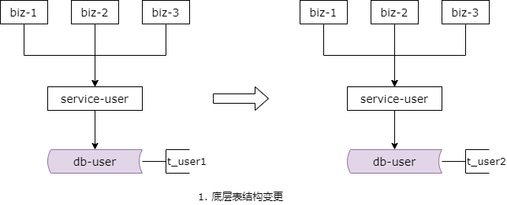
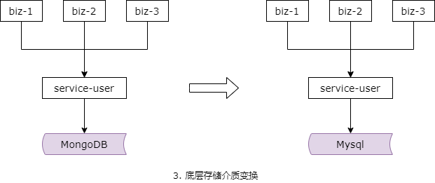
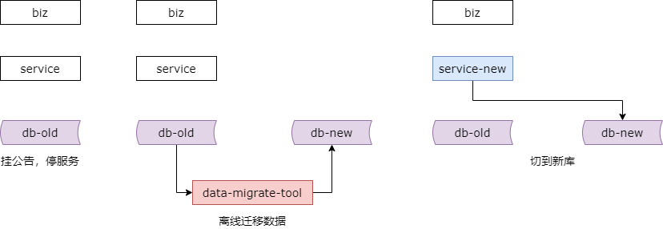
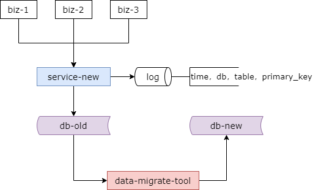
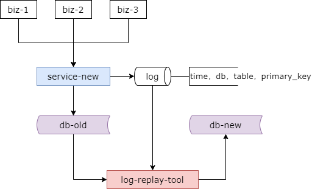
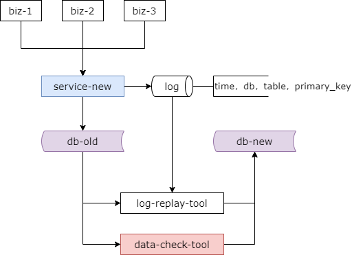

### 24、数据库：扩展性，要如何解决？

#### 回顾

**主从数据冗余，主从不一致**：

（1）忽略

（2）强制读主

（3）借助缓存，选择性读主

**主主数据冗余，主主不一致**：

（1）数据库不同初始值，相同增长步长

（2）应用层生成不冲突 ID

（3）一个主库提供服务

**数据库工程架构设计，必须考虑什么？**

（1）读性能提升

（2）高可用

（3）<span style="color:#FA6800;">一致性保障</span>

（4）扩展性

（5）垂直拆分

首先，来对上一节做一个简要的回顾。上一节主要讲了数据库主从一致性以及主主一致性的解决方案。

数据库主从数据冗余，主从数据不一致的解决方案，主要介绍了三种。第一种是忽略。有一些业务可以忽略主从的一个几百毫秒的延时。第二种是强制读主。读请求和写请求都路由到主库，不存在不一致。第三种是借助缓存，选择性读主。

主主的数据冗余，主主不一致，也介绍了三种方案。第一种是在数据库层面解决。为自增 id 设置不同的初始值，相同的增长步长，避免冲突。第二种是在应用层生成不冲突的 id。第三种是用一个主库提供服务。

这节和大家介绍数据库的扩展性。

#### 数据库的扩展性，有哪些典型的场景？

**潜在场景一：底层表结构变更**



在数据量非常大的情况下，数据表增加了一些属性，原来是 t_user1，增加了一些属性变成 t_user2，或者删除了一些属性，修改了一些属性，此时是不能够直接 alter table 的，因为数据量非常大，并发量非常大，如果 alter table，相当于会锁住表，会对外拒绝服务。

底层表结构变更是数据库扩展性要解决的问题之一。

**潜在场景二：水平扩展，分库个数变化**


当数据量非常大的时候，之前介绍了我们需要进行水平切分，由于数据量的持续增加，底层的分库可能由两个库变成三个库。

这也是数据库扩展性需要解决的问题。

**潜在场景三：底层存储介质变化**



比如说原来是 mongodb，现在要升级为 mysql。

这也是数据库扩展性需要解决的问题。

如何了满足这些数据库扩展性的需求呢？常见的方案有这么几种。

#### 方案一：停服扩展



停机方案是我们最容易想到的方案。不管是表结构变更，水平切分，分库个数的增加，还是底层存储介质的扩展都可以使用停服方案。

停服方案有这么几个步骤。

步骤一，挂公告停服务。挂一个类似于为了给广大用户提供更好的服务，服务器会在凌晨进入停机维护的公告。并在此阶段停止流量进行停机。

停机之后。

步骤二，研发一个离线的数据迁移工具，对数据进行迁移。针对前面说的三类需求，分别开发不同的数据迁移工具。底层表结构扩展，那么我们就研发旧表导新表的工具。分库个数发生变化，我们就开发两个库导三个库的工具。底层存储介质的变化，我们就开发 mongodb 导 MySQL 的数据工具。

那么在这个过程中，可能服务需要配合升级。

步骤三，恢复服务并将流量迁移到新的库。

总的来说停机方案相对于直观和简单的，但是对于服务的可用性有影响。许多游戏公司进行服务升级，游戏分区或者是合区，都会采用类似的的方案。除了影响服务的可用性这个方案还有一个很大的缺点就是必须在指定的时间完成升级，这个对研发，测试，运维的同学来说压力会非常大。一旦出现问题，比如说数据不一致，必须在规定的时间内解决，否则只能回滚。根据我们的经验人的压力越大越容易出错，所以这个缺点在一定程度上是致命的。

那有没有不停止服务在线扩展性的方案呢？

#### 方案二：online schema change

```sql
user(uid, name, passwd)
```

要扩展到：

```sql
user(uid, name, passwd, age, sex)
```

在线的表结构变更，onlie schema change，他解决什么问题呢？

比如说原来有一个用户表，他有三个属性，现在要扩展到五个属性。

对于 MySQL 而言，这是目前比较成熟的方案，很多公司都会使用 online schema change 的工具来扩展 MySQL 的表结构。

这个工具的内核是如何做到在线表结构扩展的呢？他大概分为这么几个步骤。

第一步，这个工具会创建一个扩展字段后的新表，比如说叫 user_new，他的属性是扩展后的新表。

第二步，他会在原表上创建三个触发器，对原表进行的所有写操作，也就是 insert delete update 的操作都会对新表进行完全相同的操作。

第三步，工具会分批的将原表中的数据分段的导入到新表。

第四步，会删除掉触发器，并将原表移走。

第五步，会将新建的新表 user_new 重命名，rename 为原表 user。

整个过程中是不需要锁表的，可以持续对外提供服务。在 renew 之前旧表对外提供服务，renew 之后新表对外提供服务。

操作的过程中有这么几个点需要注意。

第一点，变更过程中最重要的是处理冲突。我们有一条原则，以触发器的最新数据为准。这也就要求被迁移的表必须有主键。这个要求基本上所有的业务都满足。

第二点，在变更的过程中由于写操作要新建触发器，所以如果原表已经有非常非常多的触发器，这个方案可能就不行。互联网大数据量，高并发量的在线业务，一般都禁止使用触发器，所以这个要求基本上也满足。

第三点，触发器的建立会影响原表的性能。所以这个操作必须在流量的低峰期进行。

使用 online schema change 进行在线表结构变更不影响服务需要注意这么几点。

这个工具是 dba 必备的利器，相对比较成熟，在互联网公司使用比较广泛，大家如果想要了解更详细的细节，可以 Google 一下，整个过程基本上如我刚刚所说的五个步骤。

这种方案只适合于 MySQL，也只适用于表结构变更，那么对于分库个数的变化还有没有其他不影响服务的平滑方案呢？

#### 方案三：追日志方案（步骤一）


追日志方案是一个高可用的平滑迁移方案，这个方案主要分为五个步骤。

在新表新库迁移流量之前，整个业务依然通过旧库的访问提供服务。

步骤一，我们需要对服务进行一次升级。这一次升级我们记录对旧库上数据修改的日志。这里的修改主要是对数据 insert delete update 的访问接口需要升级记日志。这个日志不需要记录详细的数据，只需要记录哪一个库，哪一个表，哪一个主键，在什么时间被修改就可以了。所以日志的格式是相对标准化的，这样才能保证方案的通用性。这个服务的升级风险是非常非常小的。第一，写接口的数量非常的有限，所以改动点会相对比较少。第二，升级过程只是增加了一些日志，对业务功能没有任何的影响。

#### 方案三：追日志方案（步骤二）



第二个步骤，我们需要研发一个数据迁移工具，将数据从旧库迁移到新库。比如说你要进行水平切分的迁移，那么旧库可能是两个库，新库可能是三个库。这个小工具的风险依然非常的小。因为整个过程中依然是旧库对线上提供服务，而且这个小工具的复杂度非常的低，数据读取进来插入进去，任何时间我们发现问题，可以把新库中的数据干掉重来，所以它是一个可以缓慢迁移的过程，技术同学没有时间上的压力。

工具研发完，数据迁移完之后，这个时候我们的服务就能够切新库了吗？答案是否定的，因为在整个数据迁移的过程中，旧库依然对线上提供着服务，旧库中的数据随时可能变化，而这个变化其实没有反应到新库中来，于是新库和旧库中的数据并不一致，所以并不能直接切库，我们需要将这些变化追平。

#### 方案三：追日志方案（步骤三）



我们来看一下第三步，叫做追日志。

哪样的一些数据发生了变化呢？这些变化其实我们已经记录在了步骤一中的日志里，哪一个时间，哪一个库，哪一个表，哪一个主键发生了写操作。于是第三步我们要研发一个读取日志，发现哪些库哪些表哪些 key发生了变化，并将这些 key 从旧库中再次覆盖到新库中，来对步骤二中迁移数据过程里产生的数据差异进行追平。

无论如何，当发生冲突的时候以旧库中的数据为准，因为旧库中的数据在实时的更新。

这个工具的风险也非常非常的小，小工具的复杂度也非常的低，读日志，读 key，覆盖。任何时间发现问题，大不了从第二步重新开始，可以慢慢的限速的重放日志，对技术的同学其实并没有压力。

日志重放完之后我们是不是就能够切新库了呢？答案依然是否定的。因为在日志重放的过程中，旧库中的数据可能又发生了变化，导致数据不一致，所以还是不能切库，需要进一步的读取新增的日志并追平记录。可以看到重放数据追平数据它其实是一个 while(1) 或者叫死循环的一个过程。不断的读取新增的日志，这个追平，是一个无限逼近的过程。

#### 方案三：追日志方案（步骤四）



什么时候数据会完全一致呢？在持续 while(1) 重放数据的过程中，我们要研发一个数据比对的小工具，将旧库中的数据和新库中的数据进行比对，直到数据完全一致我们才能够进行修改配置迁库。

这个数据校验的小工具风险也非常非常的小，整个过程旧库对外提供服务，小工具比对数据的这个复杂度非常的低，任何时间发现问题，比如说数据有大量的不一致，我们可以将前面的所有步骤推倒重来，可以限速，慢慢的进行数据比对，技术的同学也没有压力。

#### 方案三：追日志方案（步骤五）


最后一个步骤就是迁移流量了。在数据比对完全一致之后，我们需要将服务对数据库的流量从旧库迁移到新库，由新库提供服务。此时我们对数据库进行一个秒级的 read only，等日志重放程序完全追上之后，秒级的进行一个流量的切换。

至此整个数据扩展升级完毕。整个过程持续的对线上提供服务，不影响服务的可用性，底层的数据结构可能由旧表变成了新表，也可能由少量的几个分库变成了大量的几个分库，完成了数据库的扩展。方案是不是挺有意思的。

#### 总结

**扩展性，解决什么问题？**

（1）底层表结构变更

（2）水平扩展，分库个数变化

（3）底层存储介质变化

**方案一，停服扩展（离线，非高可用）**

（1）挂公告，暂停服务

（2）离线迁移数据

（2）恢复服务

**方案二，pt-online-schema-change（平滑）**

**方案三，追日志方案（平滑）**

（1）升级服务，记录日志

（2）离线迁移数据

（3）追日志，补充增量

（4）校验数据

（5）迁移流量

**数据库工程架构设计，必须考虑什么？**

（1）读性能提升

（2）高可用

（3）一致性保障

（4）<span style="color:#FA6800;">扩展性</span>

（5）垂直拆分